# BÁO CÁO ĐỒ ÁN TỐT NGHIỆP

## HỆ THỐNG TUYỂN DỤNG THÔNG MINH
### (Smart Recruitment Platform)

---

**Sinh viên thực hiện:** [Họ và tên sinh viên]  
**Mã sinh viên:** [Mã số sinh viên]  
**Lớp:** [Tên lớp]  
**Giảng viên hướng dẫn:** [Họ và tên GVHD]  
**Năm học:** 2025 - 2026

---

## MỤC LỤC

- [MỞ ĐẦU](#mở-đầu)
  - [1. Lý do chọn đề tài](#1-lý-do-chọn-đề-tài)
  - [2. Mục tiêu đề tài](#2-mục-tiêu-đề-tài)
  - [3. Phạm vi đề tài](#3-phạm-vi-đề-tài)
  - [4. Phương pháp nghiên cứu](#4-phương-pháp-nghiên-cứu)
- [CHƯƠNG 1: TỔNG QUAN VỀ ĐỀ TÀI](#chương-1-tổng-quan-về-đề-tài)
  - [1.1. Giới thiệu bài toán](#11-giới-thiệu-bài-toán)
  - [1.2. Phân tích thị trường và đối thủ cạnh tranh](#12-phân-tích-thị-trường-và-đối-thủ-cạnh-tranh)
  - [1.3. Phân tích yêu cầu](#13-phân-tích-yêu-cầu)
  - [1.4. Các tác nhân trong hệ thống](#14-các-tác-nhân-trong-hệ-thống)
  - [1.5. Use Case Diagram](#15-use-case-diagram)
  - [1.6. Sequence Diagram](#16-sequence-diagram)
  - [1.7. Activity Diagram](#17-activity-diagram)
- [CHƯƠNG 2: CƠ SỞ LÝ THUYẾT VÀ CÔNG NGHỆ SỬ DỤNG](#chương-2-cơ-sở-lý-thuyết-và-công-nghệ-sử-dụng)
  - [2.1. Kiến trúc Client-Server](#21-kiến-trúc-client-server)
  - [2.2. RESTful API](#22-restful-api)
  - [2.3. Công nghệ Backend](#23-công-nghệ-backend)
  - [2.4. Công nghệ Frontend](#24-công-nghệ-frontend)
  - [2.5. Cơ sở dữ liệu](#25-cơ-sở-dữ-liệu)
  - [2.6. Bảo mật](#26-bảo-mật)
  - [2.7. Design Patterns](#27-design-patterns)
  - [2.8. Error Handling Strategy](#28-error-handling-strategy)
  - [2.9. Logging và Monitoring](#29-logging-và-monitoring)
  - [2.10. Security Best Practices](#210-security-best-practices)
  - [2.11. Testing Methodology](#211-testing-methodology)
  - [2.12. API Documentation với Swagger](#212-api-documentation-với-swagger)
- [CHƯƠNG 3: THIẾT KẾ HỆ THỐNG](#chương-3-thiết-kế-hệ-thống)
  - [3.1. Kiến trúc tổng quan hệ thống](#31-kiến-trúc-tổng-quan-hệ-thống)
  - [3.2. Sơ đồ kiến trúc C4](#32-sơ-đồ-kiến-trúc-c4)
  - [3.3. Thiết kế cơ sở dữ liệu](#33-thiết-kế-cơ-sở-dữ-liệu)
  - [3.4. Class Diagram](#34-class-diagram)
  - [3.5. Thiết kế API](#35-thiết-kế-api)
  - [3.6. Thiết kế giao diện](#36-thiết-kế-giao-diện)
- [CHƯƠNG 4: TRIỂN KHAI VÀ KẾT QUẢ](#chương-4-triển-khai-và-kết-quả)
  - [4.1. Cấu trúc thư mục dự án](#41-cấu-trúc-thư-mục-dự-án)
  - [4.2. Triển khai các module](#42-triển-khai-các-module)
  - [4.3. Kết quả đạt được](#43-kết-quả-đạt-được)
  - [4.4. Kiểm thử](#44-kiểm-thử)
  - [4.5. Performance Optimization](#45-performance-optimization)
  - [4.6. Deployment Architecture](#46-deployment-architecture)
- [KẾT LUẬN VÀ HƯỚNG PHÁT TRIỂN](#kết-luận-và-hướng-phát-triển)
  - [1. Kết luận](#1-kết-luận)
  - [2. Hạn chế](#2-hạn-chế)
  - [3. Hướng phát triển](#3-hướng-phát-triển)
- [TÀI LIỆU THAM KHẢO](#tài-liệu-tham-khảo)
- [PHỤ LỤC](#phụ-lục)

---

## MỞ ĐẦU

### 1. Lý do chọn đề tài

Trong bối cảnh thị trường lao động Việt Nam ngày càng phát triển và cạnh tranh, việc tuyển dụng nhân sự trở thành một trong những hoạt động quan trọng nhất của các doanh nghiệp. Theo thống kê, mỗi năm có hàng triệu lượt tìm kiếm việc làm và hàng trăm nghìn tin tuyển dụng được đăng tải trên các nền tảng khác nhau.

**Thực trạng hiện tại:**
- Quy trình tuyển dụng truyền thống tốn nhiều thời gian và chi phí
- Khó khăn trong việc quản lý lượng lớn hồ sơ ứng viên
- Thiếu công cụ hỗ trợ sàng lọc và đánh giá ứng viên hiệu quả
- Ứng viên gặp khó khăn trong việc tìm kiếm công việc phù hợp

**Giải pháp đề xuất:**
Xây dựng một hệ thống tuyển dụng thông minh (Smart Recruitment Platform) giúp:
- Tự động hóa quy trình tuyển dụng
- Kết nối hiệu quả giữa nhà tuyển dụng và ứng viên
- Quản lý hồ sơ ứng viên và tin tuyển dụng một cách có hệ thống
- Cung cấp giao diện thân thiện, dễ sử dụng

### 2. Mục tiêu đề tài

**Mục tiêu chung:**
Xây dựng hệ thống web tuyển dụng thông minh hoàn chỉnh, đáp ứng nhu cầu của cả nhà tuyển dụng và ứng viên.

**Mục tiêu cụ thể:**
1. Phân tích và thiết kế hệ thống tuyển dụng với đầy đủ các chức năng cần thiết
2. Xây dựng backend RESTful API với Node.js và Express
3. Phát triển frontend SPA với React và TypeScript
4. Thiết kế cơ sở dữ liệu MySQL tối ưu cho việc lưu trữ và truy vấn
5. Triển khai hệ thống xác thực và phân quyền người dùng
6. Tích hợp Swagger documentation cho API

### 3. Phạm vi đề tài

**Đối tượng sử dụng:**
- **Ứng viên (Candidate):** Tìm kiếm việc làm, quản lý hồ sơ, ứng tuyển
- **Nhà tuyển dụng (Recruiter):** Đăng tin tuyển dụng, quản lý ứng viên
- **Quản trị viên (Admin):** Quản lý toàn bộ hệ thống

**Phạm vi chức năng:**
- Quản lý người dùng và xác thực
- Quản lý tin tuyển dụng
- Quản lý hồ sơ/CV
- Quản lý đơn ứng tuyển
- Dashboard và báo cáo thống kê

### 4. Phương pháp nghiên cứu

**Phương pháp nghiên cứu lý thuyết:**
- Nghiên cứu tài liệu về kiến trúc microservices, RESTful API
- Tìm hiểu các công nghệ web hiện đại: React, Node.js, TypeScript
- Nghiên cứu các mô hình thiết kế phần mềm

**Phương pháp nghiên cứu thực nghiệm:**
- Phân tích và thiết kế hệ thống theo mô hình UML
- Triển khai và kiểm thử từng module
- Đánh giá hiệu năng và bảo mật hệ thống

---

## CHƯƠNG 1: TỔNG QUAN VỀ ĐỀ TÀI

### 1.1. Giới thiệu bài toán

Hệ thống Tuyển dụng Thông minh (Smart Recruitment Platform) là một nền tảng web cho phép:

1. **Ứng viên** có thể:
   - Đăng ký tài khoản và quản lý hồ sơ cá nhân
   - Tải lên và quản lý nhiều CV (hồ sơ xin việc)
   - Tìm kiếm công việc theo nhiều tiêu chí (vị trí, lĩnh vực, mức lương, etc.)
   - Ứng tuyển vào các vị trí phù hợp
   - Theo dõi trạng thái các đơn ứng tuyển

2. **Nhà tuyển dụng** có thể:
   - Đăng tin tuyển dụng với đầy đủ thông tin
   - Quản lý danh sách các tin đã đăng
   - Xem và sàng lọc hồ sơ ứng viên
   - Cập nhật trạng thái đơn ứng tuyển
   - Xem thống kê về các tin tuyển dụng

3. **Quản trị viên** có thể:
   - Quản lý toàn bộ người dùng (kích hoạt/vô hiệu hóa, phân quyền)
   - Quản lý tất cả tin tuyển dụng
   - Quản lý đơn ứng tuyển
   - Xem báo cáo thống kê tổng quan hệ thống

### 1.2. Phân tích thị trường và đối thủ cạnh tranh

#### 1.2.1. Tổng quan thị trường tuyển dụng trực tuyến

Thị trường tuyển dụng trực tuyến tại Việt Nam đang phát triển mạnh mẽ với tốc độ tăng trưởng khoảng 15-20% mỗi năm. Theo thống kê, có hơn 70% doanh nghiệp sử dụng các nền tảng tuyển dụng trực tuyến để tìm kiếm nhân sự.

**Các yếu tố thúc đẩy thị trường:**
- Sự phát triển của Internet và thiết bị di động
- Xu hướng số hóa trong quản trị nhân sự
- Nhu cầu tiết kiệm chi phí và thời gian tuyển dụng
- Pandemic COVID-19 đẩy nhanh quá trình chuyển đổi số

#### 1.2.2. Phân tích các nền tảng tuyển dụng hiện có

| Nền tảng | Ưu điểm | Nhược điểm |
|----------|---------|------------|
| **VietnamWorks** | Thương hiệu lâu đời, database ứng viên lớn | Chi phí cao, giao diện cũ |
| **TopCV** | Miễn phí cho ứng viên, AI matching | Nhiều spam, chất lượng không đồng đều |
| **LinkedIn** | Chuyên nghiệp, network rộng | Tập trung cấp quản lý, ít việc entry-level |
| **ITviec** | Chuyên IT, chất lượng cao | Chỉ phục vụ ngành IT |
| **CareerBuilder** | Nhiều tính năng | Phức tạp, khó sử dụng |

#### 1.2.3. Định vị sản phẩm

**Smart Recruitment Platform** được định vị là một nền tảng tuyển dụng:

| Tiêu chí | Định vị |
|----------|--------|
| **Đối tượng mục tiêu** | SMEs và startups, fresh graduates |
| **Giá trị cốt lõi** | Đơn giản, dễ sử dụng, miễn phí cơ bản |
| **Điểm khác biệt** | Giao diện hiện đại, tốc độ nhanh, open-source |
| **Chiến lược** | Freemium model, upsell premium features |

**Ma trận SWOT:**

```
┌─────────────────────────────────┬─────────────────────────────────┐
│           STRENGTHS             │          WEAKNESSES             │
│  • Công nghệ hiện đại           │  • Mới, chưa có thương hiệu     │
│  • Giao diện thân thiện         │  • Database ứng viên còn ít    │
│  • Tốc độ phát triển nhanh      │  • Chưa có mobile app          │
│  • Chi phí vận hành thấp        │  • Thiếu AI/ML features        │
├─────────────────────────────────┼─────────────────────────────────┤
│         OPPORTUNITIES           │            THREATS              │
│  • Thị trường đang tăng trưởng  │  • Cạnh tranh khốc liệt        │
│  • Nhu cầu số hóa cao           │  • Đối thủ có vốn lớn          │
│  • Có thể mở rộng sang SEA      │  • Thay đổi quy định pháp luật │
│  • Tích hợp AI trong tương lai  │  • Economic downturn            │
└─────────────────────────────────┴─────────────────────────────────┘
```

### 1.3. Phân tích yêu cầu

#### 1.3.1. Yêu cầu chức năng

| STT | Module | Mô tả | Đối tượng |
|-----|--------|-------|-----------|
| 1 | **Xác thực** | Đăng ký, đăng nhập, quản lý profile, đổi mật khẩu | Tất cả |
| 2 | **Quản lý việc làm** | CRUD tin tuyển dụng, tìm kiếm, lọc | Recruiter, Admin |
| 3 | **Quản lý CV** | Upload, xem, xóa, đặt CV chính | Candidate |
| 4 | **Ứng tuyển** | Nộp đơn, theo dõi trạng thái, rút đơn | Candidate |
| 5 | **Sàng lọc ứng viên** | Xem đơn, cập nhật trạng thái, ghi chú | Recruiter |
| 6 | **Quản trị** | Quản lý user, job, application, thống kê | Admin |

#### 1.3.2. Yêu cầu phi chức năng

| STT | Yêu cầu | Mô tả | Metric |
|-----|---------|-------|--------|
| 1 | **Hiệu năng** | Thời gian phản hồi API nhanh | < 500ms cho 95% requests |
| 2 | **Bảo mật** | Bảo vệ dữ liệu người dùng | Mã hóa bcrypt, JWT, HTTPS |
| 3 | **Khả năng mở rộng** | Dễ thêm tính năng mới | Kiến trúc modular |
| 4 | **Tương thích** | Hoạt động đa nền tảng | Chrome, Firefox, Safari, Edge |
| 5 | **Khả dụng** | Hệ thống hoạt động ổn định | Uptime ≥ 99% |
| 6 | **Khả năng bảo trì** | Code dễ đọc, dễ sửa | ESLint, TypeScript strict mode |
| 7 | **Khả năng kiểm thử** | Có thể test tự động | Jest, React Testing Library |

#### 1.3.3. Yêu cầu về giao diện người dùng

| STT | Yêu cầu | Chi tiết |
|-----|---------|----------|
| 1 | **Responsive Design** | Giao diện tự động điều chỉnh theo kích thước màn hình (mobile, tablet, desktop) |
| 2 | **Accessibility** | Hỗ trợ screen reader, keyboard navigation, color contrast đạt chuẩn WCAG 2.1 |
| 3 | **Loading States** | Hiển thị skeleton loading, spinner khi đang tải dữ liệu |
| 4 | **Error States** | Thông báo lỗi rõ ràng, hướng dẫn khắc phục |
| 5 | **Empty States** | Giao diện thân thiện khi không có dữ liệu |
| 6 | **Internationalization** | Hỗ trợ tiếng Việt, sẵn sàng mở rộng đa ngôn ngữ |

#### 1.3.4. Yêu cầu về dữ liệu

| Loại dữ liệu | Yêu cầu |
|--------------|--------|
| **Dữ liệu cá nhân** | Mã hóa khi lưu trữ, tuân thủ quy định bảo vệ dữ liệu |
| **Mật khẩu** | Hash với bcrypt, salt rounds ≥ 10 |
| **Files (CV)** | Giới hạn 5MB, chỉ cho phép PDF |
| **Logs** | Lưu trữ tối thiểu 90 ngày, có thể audit |
| **Backup** | Daily backup, retention 30 ngày |

### 1.4. Các tác nhân trong hệ thống

```
┌─────────────────────────────────────────────────────────────────┐
│                    SMART RECRUITMENT PLATFORM                    │
├─────────────────────────────────────────────────────────────────┤
│                                                                  │
│  ┌──────────────┐  ┌──────────────┐  ┌──────────────┐           │
│  │              │  │              │  │              │           │
│  │  CANDIDATE   │  │  RECRUITER   │  │    ADMIN     │           │
│  │  (Ứng viên)  │  │ (Nhà tuyển   │  │  (Quản trị   │           │
│  │              │  │    dụng)     │  │    viên)     │           │
│  └──────┬───────┘  └──────┬───────┘  └──────┬───────┘           │
│         │                 │                 │                    │
│         ▼                 ▼                 ▼                    │
│  ┌─────────────────────────────────────────────────────────┐    │
│  │                    WEB APPLICATION                       │    │
│  │  • Tìm việc          • Đăng tuyển     • Quản lý user    │    │
│  │  • Ứng tuyển         • Sàng lọc       • Quản lý job     │    │
│  │  • Quản lý CV        • Thống kê       • Báo cáo         │    │
│  └─────────────────────────────────────────────────────────┘    │
│                                                                  │
└─────────────────────────────────────────────────────────────────┘
```

**Chi tiết các tác nhân:**

| Tác nhân | Vai trò | Quyền hạn chính |
|----------|---------|-----------------|
| **Candidate** | Người tìm việc | Quản lý CV, tìm kiếm việc làm, ứng tuyển |
| **Recruiter** | Nhà tuyển dụng | Đăng tin, quản lý tin tuyển dụng, sàng lọc ứng viên |
| **Admin** | Quản trị viên | Toàn quyền quản lý hệ thống |

### 1.5. Use Case Diagram

```mermaid
graph TB
    subgraph "Smart Recruitment Platform"
        subgraph "Authentication Module"
            UC1[Đăng ký tài khoản]
            UC2[Đăng nhập]
            UC3[Quản lý profile]
            UC4[Đổi mật khẩu]
        end
        
        subgraph "Job Module"
            UC5[Tìm kiếm việc làm]
            UC6[Xem chi tiết việc làm]
            UC7[Đăng tin tuyển dụng]
            UC8[Cập nhật tin tuyển dụng]
            UC9[Đóng/Mở tin tuyển dụng]
        end
        
        subgraph "Resume Module"
            UC10[Upload CV]
            UC11[Quản lý CV]
            UC12[Đặt CV chính]
        end
        
        subgraph "Application Module"
            UC13[Ứng tuyển]
            UC14[Theo dõi đơn ứng tuyển]
            UC15[Rút đơn ứng tuyển]
            UC16[Xem danh sách ứng viên]
            UC17[Cập nhật trạng thái đơn]
        end
        
        subgraph "Admin Module"
            UC18[Quản lý người dùng]
            UC19[Quản lý việc làm]
            UC20[Xem thống kê]
        end
    end
    
    Candidate((Candidate))
    Recruiter((Recruiter))
    Admin((Admin))
    
    Candidate --> UC1
    Candidate --> UC2
    Candidate --> UC3
    Candidate --> UC4
    Candidate --> UC5
    Candidate --> UC6
    Candidate --> UC10
    Candidate --> UC11
    Candidate --> UC12
    Candidate --> UC13
    Candidate --> UC14
    Candidate --> UC15
    
    Recruiter --> UC2
    Recruiter --> UC3
    Recruiter --> UC4
    Recruiter --> UC7
    Recruiter --> UC8
    Recruiter --> UC9
    Recruiter --> UC16
    Recruiter --> UC17
    
    Admin --> UC2
    Admin --> UC18
    Admin --> UC19
    Admin --> UC20
```

**Bảng mô tả Use Case:**

| Use Case ID | Tên Use Case | Mô tả | Actor |
|-------------|--------------|-------|-------|
| UC1 | Đăng ký tài khoản | Tạo tài khoản mới với role candidate hoặc recruiter | Candidate, Recruiter |
| UC2 | Đăng nhập | Xác thực và lấy JWT token | Tất cả |
| UC3 | Quản lý profile | Xem và cập nhật thông tin cá nhân | Tất cả |
| UC4 | Đổi mật khẩu | Thay đổi mật khẩu hiện tại | Tất cả |
| UC5 | Tìm kiếm việc làm | Tìm kiếm theo keywords, filters | Candidate |
| UC6 | Xem chi tiết việc làm | Xem thông tin đầy đủ của tin tuyển dụng | Candidate |
| UC7 | Đăng tin tuyển dụng | Tạo mới tin tuyển dụng | Recruiter |
| UC8 | Cập nhật tin tuyển dụng | Sửa đổi thông tin tin tuyển dụng | Recruiter |
| UC9 | Đóng/Mở tin | Thay đổi trạng thái tin (open/closed/draft) | Recruiter |
| UC10 | Upload CV | Tải lên file CV (PDF) | Candidate |
| UC11 | Quản lý CV | Xem danh sách, xóa CV | Candidate |
| UC12 | Đặt CV chính | Chọn CV mặc định khi ứng tuyển | Candidate |
| UC13 | Ứng tuyển | Nộp đơn ứng tuyển vào vị trí | Candidate |
| UC14 | Theo dõi đơn | Xem trạng thái các đơn đã nộp | Candidate |
| UC15 | Rút đơn ứng tuyển | Hủy đơn ứng tuyển đã nộp | Candidate |
| UC16 | Xem ứng viên | Xem danh sách ứng viên theo job | Recruiter |
| UC17 | Cập nhật trạng thái | Thay đổi trạng thái đơn ứng tuyển | Recruiter |
| UC18 | Quản lý người dùng | CRUD users, phân quyền | Admin |
| UC19 | Quản lý việc làm | Quản lý tất cả jobs trong hệ thống | Admin |
| UC20 | Xem thống kê | Dashboard tổng quan hệ thống | Admin |

### 1.6. Sequence Diagram

#### 1.6.1. Sequence Diagram - Đăng nhập

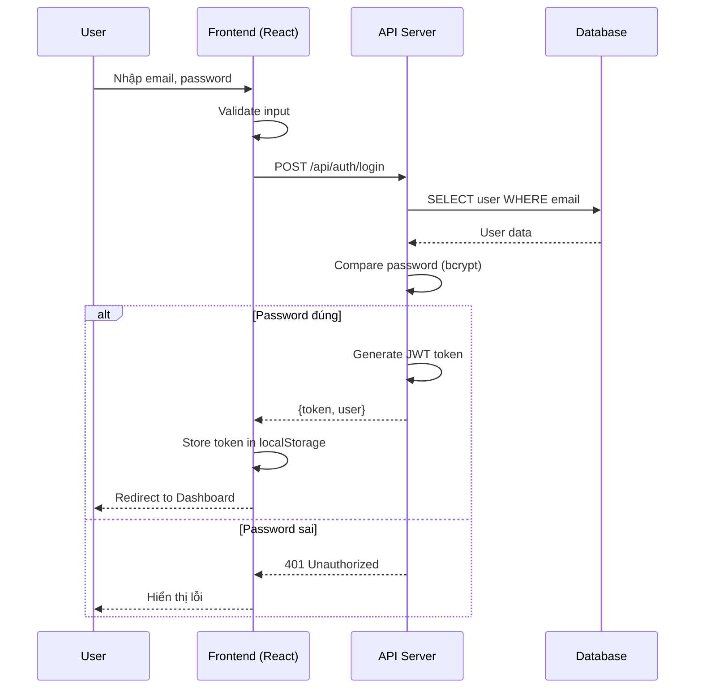

#### 1.6.2. Sequence Diagram - Ứng tuyển công việc

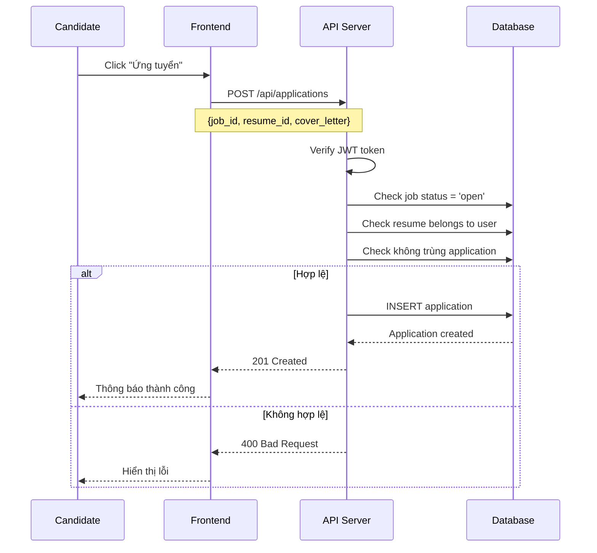

#### 1.6.3. Sequence Diagram - Tìm kiếm việc làm

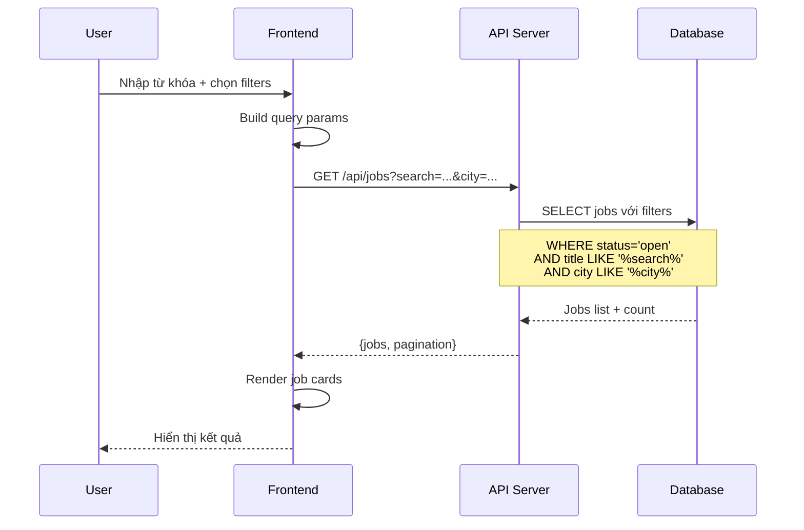

### 1.7. Activity Diagram

#### 1.7.1. Activity Diagram - Quy trình ứng tuyển

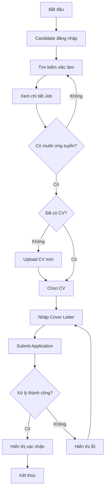

#### 1.7.2. Activity Diagram - Quy trình tuyển dụng

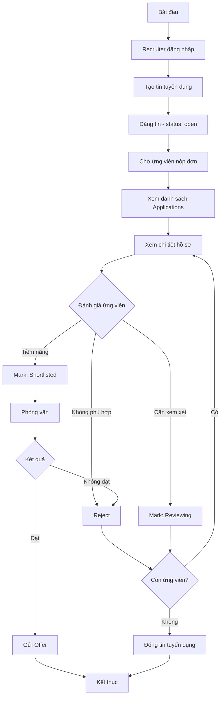

---

## CHƯƠNG 2: CƠ SỞ LÝ THUYẾT VÀ CÔNG NGHỆ SỬ DỤNG

### 2.1. Kiến trúc Client-Server

Hệ thống được xây dựng theo mô hình **Client-Server** với sự tách biệt rõ ràng giữa:

- **Client (Frontend):** Chịu trách nhiệm hiển thị giao diện người dùng, xử lý tương tác
- **Server (Backend):** Xử lý logic nghiệp vụ, tương tác với database, cung cấp API

```
┌─────────────────┐         HTTP/HTTPS         ┌─────────────────┐
│                 │ ◄─────────────────────────► │                 │
│     CLIENT      │      REST API (JSON)        │     SERVER      │
│   (React SPA)   │                             │  (Node.js API)  │
│                 │                             │                 │
└─────────────────┘                             └────────┬────────┘
                                                         │
                                                         │ Sequelize ORM
                                                         │
                                                ┌────────▼────────┐
                                                │                 │
                                                │     DATABASE    │
                                                │     (MySQL)     │
                                                │                 │
                                                └─────────────────┘
```

**Ưu điểm của kiến trúc này:**
- Tách biệt trách nhiệm (Separation of Concerns)
- Dễ dàng scale từng phần độc lập
- Cho phép phát triển song song frontend và backend
- Tái sử dụng API cho nhiều loại client khác nhau (web, mobile)

### 2.2. RESTful API

#### 2.2.1. REST là gì?

**REST (Representational State Transfer)** là một kiến trúc phần mềm dùng để thiết kế các hệ thống phân tán, đặc biệt là các dịch vụ web. REST được Roy Fielding giới thiệu lần đầu trong luận án tiến sĩ của ông vào năm 2000.

REST không phải là một giao thức hay tiêu chuẩn, mà là một **tập hợp các ràng buộc kiến trúc (architectural constraints)** mà khi được áp dụng sẽ tạo ra một hệ thống có các đặc tính như scalability, simplicity, và reliability.

#### 2.2.2. Các nguyên tắc của REST

**6 nguyên tắc cơ bản của REST:**

| Nguyên tắc | Mô tả | Áp dụng trong hệ thống |
|------------|-------|---------------------|
| **Client-Server** | Tách biệt giao diện người dùng (client) và lưu trữ dữ liệu (server). Cho phép phát triển độc lập hai phía | React frontend hoàn toàn độc lập với Express backend |
| **Stateless** | Server không lưu trạng thái của client. Mỗi request phải chứa đầy đủ thông tin để xử lý | Sử dụng JWT token trong header, server không lưu session |
| **Cacheable** | Responses phải định nghĩa rõ có thể cache hay không để tối ưu hiệu năng | HTTP cache headers cho static resources |
| **Uniform Interface** | Giao diện thống nhất giữa các components, sử dụng các HTTP methods chuẩn | GET, POST, PUT, PATCH, DELETE với URL patterns nhất quán |
| **Layered System** | Hệ thống có thể được chia thành nhiều lớp, mỗi lớp chỉ biết về lớp kế tiếp | Routes → Controllers → Services → Models |
| **Code on Demand** | (Optional) Server có thể gửi executable code về client | Không áp dụng trong dự án |

#### 2.2.3. HTTP Methods trong RESTful API

**HTTP Methods** (hay còn gọi là HTTP Verbs) định nghĩa loại hành động cần thực hiện trên resource:

| Method | Mục đích | CRUD Operation | Idempotent | Safe |
|--------|----------|----------------|------------|------|
| **GET** | Lấy dữ liệu | Read | ✅ Có | ✅ Có |
| **POST** | Tạo mới resource | Create | ❌ Không | ❌ Không |
| **PUT** | Cập nhật toàn bộ resource | Update (full) | ✅ Có | ❌ Không |
| **PATCH** | Cập nhật một phần resource | Update (partial) | ✅ Có | ❌ Không |
| **DELETE** | Xóa resource | Delete | ✅ Có | ❌ Không |

**Giải thích:**
- **Idempotent:** Gọi nhiều lần cho kết quả giống nhau (PUT cùng data 10 lần = 1 lần)
- **Safe:** Không thay đổi trạng thái server (chỉ GET là safe)

#### 2.2.4. RESTful URL Design

Thiết kế URL trong RESTful API tuân theo các quy tắc:

| Quy tắc | Ví dụ Đúng | Ví dụ Sai |
|---------|------------|-----------|
| Sử dụng danh từ số nhiều | `/api/jobs` | `/api/getJobs` |
| Dùng ID để chỉ định resource | `/api/jobs/123` | `/api/job?id=123` |
| Nested resources cho relationships | `/api/jobs/123/applications` | `/api/applications?jobId=123` |
| Query params cho filtering | `/api/jobs?city=HCM&type=fulltime` | `/api/jobs/HCM/fulltime` |
| Kebab-case cho multi-word | `/api/job-categories` | `/api/jobCategories` |

**Ví dụ trong hệ thống:**

```
GET    /api/jobs                    → Lấy danh sách jobs (có filter, pagination)
GET    /api/jobs/123                → Lấy chi tiết job có id=123
POST   /api/jobs                    → Tạo job mới
PUT    /api/jobs/123                → Cập nhật toàn bộ job 123
PATCH  /api/jobs/123/status         → Chỉ cập nhật status của job 123
DELETE /api/jobs/123                → Xóa job 123
GET    /api/jobs/123/applications   → Lấy danh sách applications của job 123
```

#### 2.2.5. HTTP Status Codes

RESTful API sử dụng HTTP status codes để thông báo kết quả:

| Code | Ý nghĩa | Sử dụng khi |
|------|---------|-------------|
| **200 OK** | Thành công | GET, PUT, PATCH thành công |
| **201 Created** | Tạo thành công | POST tạo resource mới |
| **204 No Content** | Thành công, không có body | DELETE thành công |
| **400 Bad Request** | Request không hợp lệ | Validation failed |
| **401 Unauthorized** | Chưa xác thực | Thiếu hoặc sai token |
| **403 Forbidden** | Không có quyền | Không đủ permission |
| **404 Not Found** | Không tìm thấy | Resource không tồn tại |
| **500 Internal Server Error** | Lỗi server | Exception trong server |

### 2.3. Công nghệ Backend

#### 2.3.1. Node.js

**a) Node.js là gì?**

**Node.js** là một môi trường runtime JavaScript được xây dựng trên engine V8 của Google Chrome. Trước khi có Node.js, JavaScript chỉ có thể chạy trong trình duyệt web. Node.js cho phép JavaScript chạy ở phía server, mở ra khả năng phát triển ứng dụng full-stack bằng một ngôn ngữ duy nhất.

Node.js được tạo ra bởi Ryan Dahl vào năm 2009 và hiện được duy trì bởi OpenJS Foundation. Nó đã trở thành một trong những công nghệ phổ biến nhất cho việc xây dựng ứng dụng web server-side.

**b) Kiến trúc Event-driven và Non-blocking I/O**

Node.js sử dụng mô hình **Event-driven** (hướng sự kiện) và **Non-blocking I/O** (không chặn I/O), cho phép xử lý hàng nghìn kết nối đồng thời trên một single thread. Đây là điểm khác biệt quan trọng so với các server truyền thống như Apache hay Tomcat sử dụng multi-threading.

**Nguyên lý hoạt động:**

1. **Event Loop:** Node.js chạy một vòng lặp sự kiện vô hạn, liên tục kiểm tra và xử lý các events
2. **Non-blocking I/O:** Khi có tác vụ I/O (đọc file, query database), Node.js không chờ đợi mà tiếp tục xử lý requests khác
3. **Callback Queue:** Khi I/O hoàn thành, callback được đưa vào hàng đợi để Event Loop xử lý

```
┌─────────────────────────────────────────────────────────────────┐
│                     NODE.JS EVENT LOOP                           │
├─────────────────────────────────────────────────────────────────┤
│                                                                  │
│    ┌──────────┐    ┌──────────┐    ┌──────────┐                 │
│    │ Request 1│    │ Request 2│    │ Request 3│  ...            │
│    └────┬─────┘    └────┬─────┘    └────┬─────┘                 │
│         │               │               │                        │
│         ▼               ▼               ▼                        │
│    ┌─────────────────────────────────────────────────────┐      │
│    │              EVENT QUEUE                             │      │
│    │  (Hàng đợi các sự kiện chờ xử lý)                   │      │
│    └─────────────────────┬───────────────────────────────┘      │
│                          │                                       │
│                          ▼                                       │
│    ┌─────────────────────────────────────────────────────┐      │
│    │         SINGLE THREAD EVENT LOOP                     │      │
│    │   (Xử lý tuần tự, không blocking)                   │      │
│    └─────────────────────┬───────────────────────────────┘      │
│                          │                                       │
│         ┌────────────────┼────────────────┐                     │
│         ▼                ▼                ▼                     │
│    ┌─────────┐    ┌───────────┐    ┌───────────┐               │
│    │Database │    │File System│    │  Network  │               │
│    │  I/O    │    │    I/O    │    │    I/O    │               │
│    └─────────┘    └───────────┘    └───────────┘               │
│      (Async)        (Async)          (Async)                    │
└─────────────────────────────────────────────────────────────────┘
```

**c) NPM (Node Package Manager)**

**NPM** là trình quản lý package lớn nhất thế giới với hơn 2 triệu packages. NPM cho phép developers:

- **Cài đặt dependencies:** `npm install express`
- **Quản lý versions:** Sử dụng semantic versioning (semver)
- **Scripts automation:** Định nghĩa scripts trong package.json
- **Chia sẻ code:** Publish packages cho cộng đồng

**d) Ưu điểm của Node.js:**

| Ưu điểm | Giải thích |
|---------|------------|
| **High Performance** | V8 engine biên dịch JavaScript thành machine code, đạt tốc độ gần với C++ |
| **Scalability** | Xử lý hàng nghìn connections đồng thời với ít resources |
| **JavaScript everywhere** | Dùng chung ngôn ngữ cho frontend và backend, giảm context switching |
| **Rich Ecosystem** | NPM cung cấp packages cho mọi nhu cầu development |
| **Active Community** | Cộng đồng lớn, nhiều tài liệu và support |
| **Cross-platform** | Chạy trên Windows, Linux, macOS |

**Phiên bản sử dụng:** Node.js LTS (Long Term Support)

#### 2.3.2. Express.js

**a) Express.js là gì?**

**Express.js** là một web application framework tối giản (minimal) và linh hoạt (flexible) cho Node.js. Express cung cấp một tập hợp các tính năng mạnh mẽ để xây dựng web applications và APIs một cách nhanh chóng và dễ dàng.

Express.js được xem là **de facto standard** cho việc xây dựng web applications với Node.js, được sử dụng bởi các công ty lớn như IBM, Uber, Netflix, và PayPal.

**b) Kiến trúc Middleware của Express**

**Middleware** là trái tim của Express.js. Nó là các hàm có quyền truy cập vào request object (req), response object (res), và hàm next() trong chu trình request-response.

**Middleware có thể:**
- Thực thi bất kỳ code nào
- Thay đổi request và response objects
- Kết thúc chu trình request-response
- Gọi middleware tiếp theo trong stack

```
┌───────────────────────────────────────────────────────────────────┐
│                    EXPRESS MIDDLEWARE PIPELINE                     │
├───────────────────────────────────────────────────────────────────┤
│                                                                    │
│   REQUEST                                                          │
│      │                                                             │
│      ▼                                                             │
│   ┌──────────────────┐                                            │
│   │  Body Parser     │  → Parse JSON/URL-encoded body             │
│   └────────┬─────────┘                                            │
│            ▼                                                       │
│   ┌──────────────────┐                                            │
│   │  CORS Middleware │  → Handle Cross-Origin requests            │
│   └────────┬─────────┘                                            │
│            ▼                                                       │
│   ┌──────────────────┐                                            │
│   │  Auth Middleware │  → Verify JWT token                        │
│   └────────┬─────────┘                                            │
│            ▼                                                       │
│   ┌──────────────────┐                                            │
│   │  Validation      │  → Validate input data                     │
│   └────────┬─────────┘                                            │
│            ▼                                                       │
│   ┌──────────────────┐                                            │
│   │  Route Handler   │  → Process business logic                  │
│   └────────┬─────────┘                                            │
│            ▼                                                       │
│   ┌──────────────────┐                                            │
│   │  Error Handler   │  → Handle errors globally                  │
│   └────────┬─────────┘                                            │
│            ▼                                                       │
│   RESPONSE                                                         │
│                                                                    │
└───────────────────────────────────────────────────────────────────┘
```

**c) Các tính năng chính của Express.js:**

| Tính năng | Mô tả |
|-----------|-------|
| **Routing** | Định nghĩa endpoints và xử lý HTTP methods một cách rõ ràng |
| **Middleware** | Pipeline xử lý request/response với khả năng mở rộng cao |
| **Template Engines** | Hỗ trợ Pug, EJS, Handlebars cho server-side rendering |
| **Static Files** | Phục vụ files tĩnh (CSS, JS, images) với một dòng code |
| **Error Handling** | Xử lý lỗi tập trung, dễ dàng debug và logging |

**d) Ví dụ cấu hình Express trong dự án:**

```javascript
// Middleware pipeline
app.use(cors());              // Cross-Origin Resource Sharing
app.use(express.json());      // Parse JSON body
app.use(express.urlencoded()); // Parse URL-encoded body

// Routing
app.use("/api/auth", authRoutes);
app.use("/api/jobs", jobRoutes);
app.use("/api/resumes", resumeRoutes);
app.use("/api/applications", applicationRoutes);
app.use("/api/admin", adminRoutes);

// Error handling
app.use(errorHandler);
```

> **Source:** [backend/src/app.js](../smart-recruitment-platform/backend/src/app.js#L1-L45)

#### 2.3.3. Sequelize ORM

**a) ORM (Object-Relational Mapping) là gì?**

**ORM (Object-Relational Mapping)** là một kỹ thuật lập trình cho phép chuyển đổi dữ liệu giữa các hệ thống không tương thích trong các ngôn ngữ lập trình hướng đối tượng. Cụ thể, ORM tạo ra một "cầu nối" giữa cơ sở dữ liệu quan hệ (relational database) và các đối tượng trong ngôn ngữ lập trình.

**Nguyên lý hoạt động của ORM:**

1. **Mapping (Ánh xạ):** ORM ánh xạ các bảng (tables) trong database thành các lớp (classes) trong code, các cột (columns) thành các thuộc tính (properties), và các hàng (rows) thành các đối tượng (objects).

2. **Abstraction (Trừu tượng hóa):** Thay vì viết trực tiếp câu lệnh SQL, lập trình viên làm việc với các đối tượng và phương thức. ORM sẽ tự động chuyển đổi các thao tác này thành các câu lệnh SQL tương ứng.

3. **Data Synchronization:** ORM đảm bảo dữ liệu trong objects luôn đồng bộ với dữ liệu trong database thông qua các cơ chế như lazy loading, eager loading.

**Ví dụ minh họa ánh xạ ORM:**

```
┌─────────────────────────┐         ┌─────────────────────────┐
│   DATABASE (MySQL)       │         │   APPLICATION CODE      │
├─────────────────────────┤   ORM   ├─────────────────────────┤
│ Table: users            │ ◄─────► │ Class: User             │
│   - id (INT)            │         │   - id: number          │
│   - email (VARCHAR)     │         │   - email: string       │
│   - password (VARCHAR)  │         │   - password: string    │
│   - full_name (VARCHAR) │         │   - fullName: string    │
└─────────────────────────┘         └─────────────────────────┘
```

**So sánh: SQL thuần vs ORM**

| Tiêu chí | SQL thuần | ORM (Sequelize) |
|----------|-----------|-----------------|
| Tìm user | `SELECT * FROM users WHERE id = 1` | `User.findByPk(1)` |
| Tạo user | `INSERT INTO users (email, name) VALUES (...)` | `User.create({email, name})` |
| Cập nhật | `UPDATE users SET name = '...' WHERE id = 1` | `user.update({name: '...'})` |
| Xóa | `DELETE FROM users WHERE id = 1` | `user.destroy()` |

**Lợi ích của ORM:**

| Lợi ích | Giải thích |
|---------|------------|
| **Tăng năng suất phát triển** | Giảm thiểu việc viết SQL thủ công, tập trung vào business logic |
| **Bảo mật cao hơn** | Tự động escape input, phòng chống SQL Injection |
| **Code dễ đọc và bảo trì** | Làm việc với objects thay vì strings SQL |
| **Database agnostic** | Dễ dàng chuyển đổi giữa các loại database (MySQL → PostgreSQL) |
| **Type safety** | Khi kết hợp với TypeScript, đảm bảo kiểu dữ liệu chính xác |
| **Relationships** | Xử lý quan hệ giữa các bảng một cách trực quan |

**b) Sequelize - ORM cho Node.js**

**Sequelize** là một ORM dựa trên Promise cho Node.js, hỗ trợ các hệ quản trị cơ sở dữ liệu quan hệ phổ biến như PostgreSQL, MySQL, MariaDB, SQLite và SQL Server.

**Các tính năng chính của Sequelize:**

| Tính năng | Mô tả |
|-----------|-------|
| **Model Definitions** | Định nghĩa cấu trúc bảng bằng JavaScript objects |
| **Associations** | Hỗ trợ các quan hệ: HasOne, HasMany, BelongsTo, BelongsToMany |
| **Migrations** | Quản lý phiên bản database schema, dễ dàng rollback |
| **Seeders** | Tạo dữ liệu mẫu cho database |
| **Transactions** | Đảm bảo tính toàn vẹn dữ liệu với ACID |
| **Query Builder** | Xây dựng truy vấn phức tạp một cách trực quan |
| **Hooks/Lifecycle** | Thực thi logic trước/sau các thao tác CRUD |
| **Validation** | Validate dữ liệu trước khi lưu vào database |

**c) Ví dụ định nghĩa Model với Sequelize:**

```javascript
const User = sequelize.define("User", {
  id: {
    type: DataTypes.INTEGER,
    primaryKey: true,
    autoIncrement: true,
  },
  email: {
    type: DataTypes.STRING(255),
    allowNull: false,
    unique: true,
    validate: { isEmail: true },
  },
  password: {
    type: DataTypes.STRING(255),
    allowNull: false,
  },
  role: {
    type: DataTypes.ENUM("candidate", "recruiter", "admin"),
    allowNull: false,
    defaultValue: "candidate",
  },
}, {
  tableName: "users",
  timestamps: true,
  underscored: true,
});
```

> **Source:** [backend/src/models/User.js](../smart-recruitment-platform/backend/src/models/User.js#L1-L55)

### 2.4. Công nghệ Frontend

#### 2.4.1. React 19

**a) React là gì?**

**React** là một thư viện JavaScript mã nguồn mở cho việc xây dựng giao diện người dùng (User Interface), được phát triển và duy trì bởi Meta (Facebook) cùng cộng đồng developers.

React ra đời năm 2013 và nhanh chóng trở thành một trong những thư viện frontend phổ biến nhất thế giới, được sử dụng bởi các công ty lớn như Facebook, Instagram, Netflix, Airbnb, Uber, và nhiều công ty khác.

**b) Single Page Application (SPA) là gì?**

**SPA (Single Page Application)** là kiến trúc web application trong đó toàn bộ ứng dụng được tải một lần duy nhất, sau đó các tương tác của người dùng chỉ cập nhật một phần của trang mà không cần reload toàn bộ.

**So sánh SPA vs Traditional Web App:**

| Tiêu chí | Traditional Web App | SPA (React) |
|----------|---------------------|-------------|
| **Page Load** | Mỗi click tải lại toàn bộ trang | Chỉ cập nhật phần thay đổi |
| **User Experience** | Có thời gian chờ giữa các trang | Mượt mà như ứng dụng native |
| **Server Load** | Server render HTML | Server chỉ cung cấp API/data |
| **SEO** | Tốt hơn tự nhiên | Cần kỹ thuật đặc biệt (SSR, pre-rendering) |
| **Bandwidth** | Tải nhiều HTML/CSS lặp lại | Tải lần đầu lớn, sau đó chỉ JSON |

**Luồng hoạt động của SPA:**

```
┌─────────────────────────────────────────────────────────────────┐
│                    SPA ARCHITECTURE                              │
├─────────────────────────────────────────────────────────────────┤
│                                                                  │
│   1. Initial Load:                                               │
│   ┌──────────┐    GET /           ┌──────────┐                  │
│   │  Browser │ ─────────────────► │  Server  │                  │
│   │          │ ◄───────────────── │          │                  │
│   └──────────┘  index.html +      └──────────┘                  │
│                 bundle.js + CSS                                  │
│                                                                  │
│   2. Subsequent Interactions:                                    │
│   ┌──────────┐    GET /api/data   ┌──────────┐                  │
│   │  React   │ ─────────────────► │  API     │                  │
│   │   App    │ ◄───────────────── │  Server  │                  │
│   └──────────┘    JSON response   └──────────┘                  │
│        │                                                         │
│        │ Client-side routing                                     │
│        │ (No page reload)                                        │
│        ▼                                                         │
│   ┌──────────┐                                                   │
│   │  Update  │ → Only re-render changed components              │
│   │   DOM    │                                                   │
│   └──────────┘                                                   │
│                                                                  │
└─────────────────────────────────────────────────────────────────┘
```

**c) Virtual DOM - Điểm mạnh của React**

**Virtual DOM** là một bản sao nhẹ của Real DOM được giữ trong bộ nhớ. Khi state thay đổi, React sẽ:

1. Tạo Virtual DOM mới
2. So sánh (Diffing) với Virtual DOM cũ
3. Tính toán thay đổi tối thiểu cần thiết
4. Cập nhật Real DOM chỉ những phần thay đổi

Quá trình này gọi là **Reconciliation**, giúp React đạt hiệu năng cao ngay cả với UI phức tạp.

**d) Các tính năng React được sử dụng trong dự án:**

| Tính năng | Mô tả | Áp dụng trong dự án |
|-----------|-------|---------------------|
| **Functional Components** | Components dạng hàm, đơn giản hơn class | Toàn bộ components |
| **Hooks** | useState, useEffect, useCallback, useMemo | State management, side effects |
| **Context API** | Global state không cần Redux | AuthContext cho authentication |
| **Lazy Loading** | Tải components khi cần (code splitting) | Lazy load pages |
| **Suspense** | Hiển thị fallback khi đang tải | Loading states |
| **React Router** | Client-side routing | Điều hướng giữa các trang |

**e) Ví dụ cấu trúc component trong dự án:**

```tsx
// Lazy loading pages - Chỉ tải khi người dùng truy cập
const CandidateDashboard = lazy(() => import("./pages/candidate/CandidateDashboard"));
const JobSearchPage = lazy(() => import("./pages/candidate/JobSearchPage"));

// Protected routes với role-based access
<ProtectedRoute allowedRoles={["candidate"]}>
  <CandidateDashboard />
</ProtectedRoute>
```

> **Source:** [frontend/src/App.tsx](../smart-recruitment-platform/frontend/src/App.tsx#L1-L100)

#### 2.4.2. TypeScript

**a) TypeScript là gì?**

**TypeScript** là một ngôn ngữ lập trình mã nguồn mở được phát triển bởi Microsoft. Nó là một **superset của JavaScript**, có nghĩa là mọi code JavaScript hợp lệ cũng là code TypeScript hợp lệ, nhưng TypeScript bổ sung thêm **static typing** (kiểu tĩnh).

**b) Tại sao sử dụng TypeScript?**

| Lợi ích | Giải thích |
|---------|------------|
| **Phát hiện lỗi sớm** | Lỗi type được phát hiện tại compile-time, không phải runtime |
| **IntelliSense tốt hơn** | IDE có thể gợi ý code chính xác dựa trên types |
| **Code dễ maintain** | Types giúp code tự document, người khác dễ hiểu hơn |
| **Refactoring an toàn** | IDE có thể rename, move với độ tin cậy cao |
| **Làm việc nhóm hiệu quả** | Interface định nghĩa rõ ràng "contract" giữa các module |

**c) Ví dụ type definitions trong dự án:**

```typescript
// Định nghĩa kiểu cho User
interface User {
  id: number;
  email: string;
  full_name: string;
  role: 'candidate' | 'recruiter' | 'admin';  // Union type - chỉ cho phép 3 giá trị
  phone?: string;           // Optional property
  company?: string;
  avatar?: string;
  is_active: boolean;
}

// Định nghĩa kiểu cho Authentication Context
interface AuthContextType {
  user: User | null;                                    // User hoặc null
  loading: boolean;
  login: (email: string, password: string) => Promise<void>;
  logout: () => void;
  register: (data: RegisterData) => Promise<void>;
  updateProfile: (data: UpdateProfileData) => Promise<void>;
}
```

> **Source:** [frontend/src/types/](../smart-recruitment-platform/frontend/src/types/)

#### 2.4.3. Material-UI (MUI)

**a) Material-UI là gì?**

**Material-UI (MUI)** là một thư viện React component phổ biến nhất, triển khai **Material Design** - ngôn ngữ thiết kế được Google phát triển.

MUI cung cấp một bộ components đẹp, có tính nhất quán cao, và dễ dàng customize theo brand của từng dự án.

**b) Tại sao chọn Material-UI?**

| Lý do | Chi tiết |
|-------|----------|
| **Design nhất quán** | Tuân theo Material Design guidelines |
| **Responsive sẵn** | Tự động thích ứng với mọi kích thước màn hình |
| **Accessibility** | Hỗ trợ screen readers và keyboard navigation |
| **Theming** | Dễ dàng customize colors, typography, spacing |
| **Rich components** | 50+ components sẵn có cho mọi nhu cầu |

**c) Các components sử dụng trong dự án:**

| Nhóm | Components |
|------|------------|
| **Layout** | Container, Grid, Box, Stack |
| **Navigation** | AppBar, Drawer, Tabs, Breadcrumbs |
| **Inputs** | TextField, Select, Autocomplete, Button, Checkbox |
| **Data Display** | Table, DataGrid, Card, Chip, Avatar, Typography |
| **Feedback** | Alert, Snackbar, Dialog, Skeleton, CircularProgress |
| **Surfaces** | Paper, Accordion, Card |

#### 2.4.4. Vite

**a) Vite là gì?**

**Vite** (phát âm /vit/, tiếng Pháp nghĩa là "nhanh") là một build tool thế hệ mới cho frontend development, được tạo bởi Evan You (tác giả Vue.js).

**b) Vite vs Webpack:**

| Tiêu chí | Webpack | Vite |
|----------|---------|------|
| **Dev Server Start** | 10-30 giây | < 1 giây |
| **HMR (Hot Module Replacement)** | 1-5 giây | Gần như tức thì |
| **Bundling approach** | Bundle toàn bộ trước khi serve | Native ES modules (không bundle trong dev) |
| **Production build** | Webpack | Rollup (optimized) |

**c) Tại sao Vite nhanh?**

1. **Native ES Modules:** Vite tận dụng ES modules của browser, không cần bundle trong development
2. **esbuild:** Sử dụng esbuild (viết bằng Go) cho transpiling, nhanh hơn 10-100x so với JavaScript-based bundlers
3. **Pre-bundling:** Chỉ pre-bundle dependencies (node_modules), source code serve trực tiếp

**d) Cấu hình Vite trong dự án:**

```typescript
// vite.config.ts
import { defineConfig } from 'vite';
import react from '@vitejs/plugin-react';

export default defineConfig({
  plugins: [react()],
  server: {
    port: 5173,
    proxy: {
      '/api': 'http://localhost:5000'  // Proxy API requests to backend
    }
  },
  build: {
    outDir: 'dist',
    sourcemap: true
  }
});
```

### 2.5. Cơ sở dữ liệu

#### 2.5.1. MySQL

**a) Hệ quản trị cơ sở dữ liệu quan hệ (RDBMS) là gì?**

**RDBMS (Relational Database Management System)** là hệ thống quản lý cơ sở dữ liệu dựa trên mô hình quan hệ. Trong RDBMS:

- Dữ liệu được tổ chức thành **bảng (tables)** với các hàng (rows) và cột (columns)
- Các bảng có thể liên kết với nhau thông qua **khóa ngoại (foreign keys)**
- Sử dụng **SQL (Structured Query Language)** để truy vấn và thao tác dữ liệu
- Tuân thủ **ACID properties** đảm bảo tính toàn vẹn dữ liệu

**ACID Properties:**

| Property | Ý nghĩa | Giải thích |
|----------|---------|------------|
| **Atomicity** | Tính nguyên tử | Transaction hoàn thành toàn bộ hoặc rollback toàn bộ |
| **Consistency** | Tính nhất quán | Database luôn ở trạng thái hợp lệ sau mỗi transaction |
| **Isolation** | Tính độc lập | Các transactions không ảnh hưởng lẫn nhau |
| **Durability** | Tính bền vững | Dữ liệu đã commit được lưu vĩnh viễn |

**b) MySQL là gì?**

**MySQL** là hệ quản trị cơ sở dữ liệu quan hệ mã nguồn mở phổ biến nhất thế giới, được phát triển bởi Oracle Corporation. MySQL được sử dụng bởi nhiều công ty lớn như Facebook, Twitter, YouTube, Netflix, và Uber.

**c) Lý do chọn MySQL cho dự án:**

| Tiêu chí | Giải thích |
|----------|------------|
| **Ổn định và đáng tin cậy** | Đã được kiểm chứng qua hàng triệu ứng dụng production |
| **Hiệu năng cao** | Tối ưu cho read-heavy workloads |
| **Miễn phí** | Community Edition miễn phí, phù hợp với dự án học tập |
| **Tài liệu phong phú** | Documentation chi tiết, community lớn |
| **Hỗ trợ tốt bởi Sequelize** | Full support cho tất cả features |
| **Phù hợp với dữ liệu có cấu trúc** | Users, Jobs, Applications có schema rõ ràng |

**d) Cấu hình database trong dự án:**

| Cấu hình | Giá trị | Mục đích |
|----------|---------|----------|
| **Database name** | `smart_recruitment` | Tên database |
| **Character set** | `utf8mb4` | Hỗ trợ Unicode đầy đủ (bao gồm emoji) |
| **Collation** | `utf8mb4_0900_ai_ci` | Case-insensitive, accent-insensitive |
| **Storage Engine** | InnoDB | Hỗ trợ transactions, foreign keys |
| **Port** | 3306 | Port mặc định của MySQL |

**e) Mối quan hệ giữa các bảng:**

```
┌─────────────────┐       ┌─────────────────┐
│     users       │       │      jobs       │
├─────────────────┤       ├─────────────────┤
│ id (PK)         │       │ id (PK)         │
│ email           │       │ recruiter_id (FK)────┐
│ password        │       │ job_title       │    │
│ full_name       │       │ description     │    │
│ role            │◄──────│                 │    │
│ ...             │  1:N  │ ...             │    │
└────────┬────────┘       └─────────────────┘    │
         │                                       │
         │ 1:N                                   │
         │                                       │
┌────────▼────────┐       ┌─────────────────┐    │
│    resumes      │       │  applications   │    │
├─────────────────┤       ├─────────────────┤    │
│ id (PK)         │       │ id (PK)         │    │
│ user_id (FK)────┼──────►│ candidate_id (FK)    │
│ title           │       │ job_id (FK)─────┼────┘
│ file_path       │       │ resume_id (FK)──┘
│ ...             │       │ status          │
└─────────────────┘       │ ...             │
                          └─────────────────┘
```

### 2.6. Bảo mật

#### 2.6.1. JWT (JSON Web Token)

**a) JWT là gì?**

**JWT (JSON Web Token)** là một tiêu chuẩn mở (RFC 7519) định nghĩa cách truyền thông tin một cách an toàn giữa các bên dưới dạng JSON object. Thông tin này có thể được xác minh và tin cậy vì nó được ký điện tử (digitally signed).

JWT được sử dụng phổ biến cho:
- **Authentication:** Sau khi đăng nhập, mỗi request tiếp theo sẽ bao gồm JWT
- **Information Exchange:** Trao đổi thông tin an toàn giữa các parties

**b) Cấu trúc của JWT:**

JWT gồm 3 phần, phân tách bởi dấu chấm (.):

```
xxxxx.yyyyy.zzzzz
  │      │      │
  │      │      └─── Signature (Chữ ký)
  │      └────────── Payload (Dữ liệu)
  └───────────────── Header (Tiêu đề)
```

**Chi tiết từng phần:**

| Phần | Nội dung | Ví dụ |
|------|----------|-------|
| **Header** | Loại token và thuật toán mã hóa | `{"alg": "HS256", "typ": "JWT"}` |
| **Payload** | Dữ liệu claims (userId, role, exp...) | `{"userId": 123, "role": "candidate", "exp": 1234567890}` |
| **Signature** | Chữ ký xác minh tính toàn vẹn | HMACSHA256(base64(header) + "." + base64(payload), secret) |

**c) Luồng xác thực JWT trong hệ thống:**

```
┌─────────────┐                           ┌─────────────┐
│   Client    │                           │   Server    │
└──────┬──────┘                           └──────┬──────┘
       │                                         │
       │  1. POST /api/auth/login               │
       │  {email, password}                     │
       │ ─────────────────────────────────────► │
       │                                         │
       │                    2. Validate credentials
       │                       Query database    │
       │                       Compare password hash
       │                                         │
       │                    3. Generate JWT      │
       │                       Sign with secret  │
       │                                         │
       │  4. Response: {token, user}            │
       │ ◄───────────────────────────────────── │
       │                                         │
       │  5. Store token                         │
       │     (localStorage/memory)               │
       │                                         │
       │  6. GET /api/protected                 │
       │  Header: Authorization: Bearer <token> │
       │ ─────────────────────────────────────► │
       │                                         │
       │                    7. Verify token      │
       │                       Check signature   │
       │                       Check expiration  │
       │                       Extract userId    │
       │                                         │
       │                    8. Process request   │
       │                       Return data       │
       │                                         │
       │  9. Response: {data}                   │
       │ ◄───────────────────────────────────── │
       │                                         │
```

**d) Ưu điểm của JWT:**

| Ưu điểm | Giải thích |
|---------|------------|
| **Stateless** | Server không cần lưu session, dễ scale |
| **Self-contained** | Chứa đủ thông tin cần thiết trong token |
| **Cross-domain** | Hoạt động tốt với CORS |
| **Compact** | Kích thước nhỏ, truyền qua URL, header dễ dàng |
| **Secure** | Chữ ký đảm bảo token không bị tamper |

> **Source:** [backend/src/utils/jwt.util.js](../smart-recruitment-platform/backend/src/utils/jwt.util.js)

#### 2.6.2. Bcrypt Password Hashing

**a) Tại sao không lưu mật khẩu dạng plain text?**

Lưu mật khẩu dạng plain text là một trong những sai lầm bảo mật nghiêm trọng nhất:
- Nếu database bị leak, attacker có ngay mật khẩu của tất cả users
- Users thường dùng chung mật khẩu cho nhiều trang web
- Vi phạm quy định bảo mật (GDPR, PCI-DSS, ...)

**b) Bcrypt là gì?**

**Bcrypt** là một hàm hash mật khẩu được thiết kế đặc biệt cho việc lưu trữ mật khẩu an toàn. Bcrypt được tạo ra năm 1999 và vẫn được coi là một trong những phương pháp hash password tốt nhất.

**c) Cách Bcrypt hoạt động:**

```
┌─────────────────────────────────────────────────────────────────┐
│                    BCRYPT HASHING PROCESS                        │
├─────────────────────────────────────────────────────────────────┤
│                                                                  │
│   Input: "mypassword123"                                         │
│                                                                  │
│   Step 1: Generate random salt                                   │
│   ┌─────────────────────────────────────┐                       │
│   │ Salt: $2b$10$N9qo8uLOickgx2ZMRZoMye │                       │
│   └─────────────────────────────────────┘                       │
│           │                                                      │
│           │  Cost factor = 10                                    │
│           │  (2^10 = 1024 iterations)                           │
│           ▼                                                      │
│   Step 2: Hash password with salt                                │
│   ┌─────────────────────────────────────────────────────────┐   │
│   │ password + salt ──► Blowfish cipher ──► 24-byte hash    │   │
│   │                    (1024 iterations)                     │   │
│   └─────────────────────────────────────────────────────────┘   │
│           │                                                      │
│           ▼                                                      │
│   Step 3: Combine into final hash                               │
│   ┌─────────────────────────────────────────────────────────┐   │
│   │ $2b$10$N9qo8uLOickgx2ZMRZoMye.IjqKBbWvKJEr4ZosBVp5q6F.y │   │
│   │  │  │   └─────────────────────┘└────────────────────────┘   │
│   │  │  │          Salt (22 chars)        Hash (31 chars)       │
│   │  │  └─ Cost factor (10)                                     │
│   │  └──── Version (2b)                                         │
│   └──────── Prefix ($)                                          │
│   └─────────────────────────────────────────────────────────┘   │
│                                                                  │
└─────────────────────────────────────────────────────────────────┘
```

**d) Tại sao Bcrypt an toàn?**

| Đặc điểm | Giải thích |
|----------|------------|
| **Salt** | Mỗi password có salt riêng, hash giống nhau cho password khác nhau |
| **Adaptive** | Cost factor có thể tăng theo thời gian để chống brute force |
| **Slow by design** | Chậm có chủ đích, khiến brute force attack tốn kém |
| **Built-in salt storage** | Salt được lưu trong hash, không cần column riêng |

**e) Implementation trong dự án:**

```javascript
// Hash password trước khi lưu
const hashPassword = async (password) => {
  const saltRounds = 10;  // Cost factor
  const salt = await bcrypt.genSalt(saltRounds);
  return await bcrypt.hash(password, salt);
};

// So sánh password khi đăng nhập
const comparePassword = async (password, hashedPassword) => {
  return await bcrypt.compare(password, hashedPassword);
};
```

> **Source:** [backend/src/utils/password.util.js](../smart-recruitment-platform/backend/src/utils/password.util.js)

#### 2.6.3. Input Validation

**a) Tại sao cần Input Validation?**

Input Validation là tuyến phòng thủ đầu tiên chống lại các cuộc tấn công:

| Loại tấn công | Mô tả | Phòng chống |
|---------------|-------|-------------|
| **SQL Injection** | Chèn SQL độc hại | Validate + ORM parameterized queries |
| **XSS** | Chèn script độc hại | Sanitize + escape output |
| **Invalid Data** | Dữ liệu không hợp lệ | Type checking + format validation |

**b) Express-validator:**

**Express-validator** là middleware validation phổ biến nhất cho Express.js, cung cấp:

```javascript
const registerValidator = [
  body('email').isEmail().normalizeEmail(),
  body('password').isLength({ min: 6 }),
  body('full_name').notEmpty().trim(),
  body('role').isIn(['candidate', 'recruiter'])
];
```

> **Source:** [backend/src/validators/auth.validator.js](../smart-recruitment-platform/backend/src/validators/auth.validator.js)

### 2.7. Design Patterns sử dụng trong dự án

#### 2.7.1. MVC Pattern (Model-View-Controller)

**MVC** là pattern kiến trúc phân chia ứng dụng thành 3 thành phần có trách nhiệm riêng biệt:

```
┌─────────────────────────────────────────────────────────────────┐
│                        MVC PATTERN                               │
├─────────────────────────────────────────────────────────────────┤
│                                                                  │
│   ┌─────────────┐      ┌─────────────┐      ┌─────────────┐     │
│   │             │      │             │      │             │     │
│   │    VIEW     │◄────►│ CONTROLLER  │◄────►│    MODEL    │     │
│   │  (React)    │      │ (Express)   │      │ (Sequelize) │     │
│   │             │      │             │      │             │     │
│   └─────────────┘      └─────────────┘      └─────────────┘     │
│         │                    │                    │              │
│         │                    │                    │              │
│    Hiển thị UI         Xử lý logic          Quản lý data        │
│    User input          Routing              Database             │
│    Render data         Validation           Relationships        │
│                                                                  │
└─────────────────────────────────────────────────────────────────┘
```

**Áp dụng trong dự án:**

| Component | Vai trò | Files |
|-----------|---------|-------|
| **Model** | Định nghĩa cấu trúc dữ liệu, quan hệ | `models/User.js`, `models/Job.js`, ... |
| **View** | Hiển thị giao diện | `frontend/src/pages/`, `frontend/src/components/` |
| **Controller** | Xử lý request, điều phối logic | `controllers/auth.controller.js`, ... |

#### 2.7.2. Service Layer Pattern

**Service Layer** tách biệt business logic ra khỏi controllers, giúp code dễ test và tái sử dụng:

```
┌───────────────────────────────────────────────────────────────────┐
│                      SERVICE LAYER PATTERN                         │
├───────────────────────────────────────────────────────────────────┤
│                                                                    │
│   REQUEST                                                          │
│      │                                                             │
│      ▼                                                             │
│   ┌──────────────────┐                                            │
│   │     ROUTES       │  → Định nghĩa endpoints                    │
│   └────────┬─────────┘                                            │
│            ▼                                                       │
│   ┌──────────────────┐                                            │
│   │   CONTROLLER     │  → Validate input, gọi service             │
│   └────────┬─────────┘                                            │
│            ▼                                                       │
│   ┌──────────────────┐                                            │
│   │    SERVICE       │  → Business logic, gọi model               │
│   └────────┬─────────┘    (Có thể unit test độc lập)              │
│            ▼                                                       │
│   ┌──────────────────┐                                            │
│   │     MODEL        │  → Database operations                     │
│   └────────┬─────────┘                                            │
│            ▼                                                       │
│   RESPONSE                                                         │
│                                                                    │
└───────────────────────────────────────────────────────────────────┘
```

**Ví dụ Service trong dự án:**

```javascript
// services/auth.service.js - Chỉ chứa business logic
const register = async (userData) => {
  // 1. Check if email exists
  const existingUser = await User.findOne({ where: { email } });
  if (existingUser) throw new Error("Email already registered");
  
  // 2. Hash password
  const hashedPassword = await hashPassword(password);
  
  // 3. Create user
  const user = await User.create({ ...userData, password: hashedPassword });
  
  // 4. Generate token
  const token = generateToken({ userId: user.id, role: user.role });
  
  return { user, token };
};
```

#### 2.7.3. Repository Pattern (qua Sequelize Models)

**Repository Pattern** trừu tượng hóa data access logic. Trong dự án, Sequelize Models đóng vai trò như repositories:

| Operation | Sequelize Method | SQL Equivalent |
|-----------|------------------|----------------|
| Create | `Model.create(data)` | INSERT INTO |
| Read one | `Model.findByPk(id)` | SELECT WHERE id = |
| Read many | `Model.findAll(options)` | SELECT với conditions |
| Update | `instance.update(data)` | UPDATE SET |
| Delete | `instance.destroy()` | DELETE FROM |

#### 2.7.4. Singleton Pattern

**Singleton** đảm bảo chỉ có một instance của class trong toàn bộ ứng dụng:

```javascript
// config/database.js - Database connection là Singleton
const { Sequelize } = require("sequelize");

let sequelize = null;

const getConnection = () => {
  if (!sequelize) {
    sequelize = new Sequelize(/* config */);
  }
  return sequelize;
};

module.exports = { getConnection };
```

#### 2.7.5. Middleware Pattern

**Middleware Pattern** cho phép xử lý request theo pipeline, mỗi middleware thực hiện một nhiệm vụ:

```javascript
// Chuỗi middleware cho protected route
router.post(
  "/jobs",
  authenticate,        // 1. Verify JWT token
  authorize("recruiter"), // 2. Check role
  validateJob,         // 3. Validate input
  jobController.create // 4. Handle request
);
```

#### 2.7.6. Factory Pattern

**Factory Pattern** được sử dụng để tạo responses thống nhất:

```javascript
// utils/response.util.js
const createResponse = (success, message, data = null) => ({
  success,
  message,
  data,
  timestamp: new Date().toISOString()
});

const successResponse = (res, message, data, statusCode = 200) => {
  return res.status(statusCode).json(createResponse(true, message, data));
};

const errorResponse = (res, message, statusCode = 400) => {
  return res.status(statusCode).json(createResponse(false, message));
};
```

### 2.8. Error Handling Strategy

#### 2.8.1. Phân loại lỗi

| Loại lỗi | HTTP Status | Ví dụ |
|----------|-------------|-------|
| **Validation Error** | 400 | Email không hợp lệ |
| **Authentication Error** | 401 | Token hết hạn |
| **Authorization Error** | 403 | Không có quyền truy cập |
| **Not Found Error** | 404 | Job không tồn tại |
| **Conflict Error** | 409 | Email đã được đăng ký |
| **Server Error** | 500 | Database connection failed |

#### 2.8.2. Centralized Error Handling

Hệ thống sử dụng **Global Error Handler** để xử lý tất cả các lỗi tập trung:

```javascript
// middleware/error.middleware.js
const errorHandler = (err, req, res, next) => {
  // Log error
  logger.error({
    message: err.message,
    stack: err.stack,
    url: req.url,
    method: req.method,
    userId: req.user?.id
  });

  // Determine status code
  const statusCode = err.statusCode || 500;
  
  // Send response
  res.status(statusCode).json({
    success: false,
    message: statusCode === 500 ? "Internal Server Error" : err.message,
    ...(process.env.NODE_ENV === "development" && { stack: err.stack })
  });
};
```

#### 2.8.3. Custom Error Classes

```javascript
// Tạo custom error classes cho từng loại lỗi
class AppError extends Error {
  constructor(message, statusCode) {
    super(message);
    this.statusCode = statusCode;
    this.isOperational = true;
  }
}

class NotFoundError extends AppError {
  constructor(resource) {
    super(`${resource} not found`, 404);
  }
}

class ValidationError extends AppError {
  constructor(message) {
    super(message, 400);
  }
}
```

### 2.9. Logging và Monitoring

#### 2.9.1. Winston Logger

**Winston** là logging library phổ biến cho Node.js với các tính năng:

| Feature | Mô tả |
|---------|-------|
| **Multiple Transports** | Log ra console, file, database, external services |
| **Log Levels** | error, warn, info, http, verbose, debug, silly |
| **Formatting** | JSON, pretty print, custom formats |
| **Rotation** | Tự động rotate log files theo kích thước/thời gian |

**Cấu hình trong dự án:**

```javascript
// utils/logger.js
const winston = require("winston");

const logger = winston.createLogger({
  level: process.env.LOG_LEVEL || "info",
  format: winston.format.combine(
    winston.format.timestamp(),
    winston.format.json()
  ),
  transports: [
    // Console output
    new winston.transports.Console({
      format: winston.format.combine(
        winston.format.colorize(),
        winston.format.simple()
      )
    }),
    // File output
    new winston.transports.File({ 
      filename: "logs/error.log", 
      level: "error" 
    }),
    new winston.transports.File({ 
      filename: "logs/combined.log" 
    })
  ]
});
```

#### 2.9.2. Các loại log trong hệ thống

| Log Type | Level | Khi nào log |
|----------|-------|-------------|
| **API Request** | info | Mỗi request đến server |
| **Authentication** | info | Login, logout, register |
| **Error** | error | Exceptions, failures |
| **Database** | debug | SQL queries (dev mode) |
| **Security** | warn | Failed login attempts, suspicious activity |

### 2.10. Security Best Practices

#### 2.10.1. OWASP Top 10 và cách phòng chống

Hệ thống được thiết kế với sự chú trọng đặc biệt đến bảo mật, tuân thủ các khuyến nghị từ OWASP (Open Web Application Security Project):

| Lỗ hổng OWASP | Mô tả | Giải pháp trong hệ thống |
|---------------|-------|--------------------------|
| **A01 - Broken Access Control** | Người dùng truy cập tài nguyên không được phép | Role-based middleware, kiểm tra ownership của resources |
| **A02 - Cryptographic Failures** | Dữ liệu nhạy cảm không được mã hóa | Bcrypt cho passwords, HTTPS, JWT với secret mạnh |
| **A03 - Injection** | SQL, NoSQL, Command injection | Sequelize ORM parameterized queries, input validation |
| **A04 - Insecure Design** | Thiếu security controls trong thiết kế | Defense in depth, fail-safe defaults, least privilege |
| **A05 - Security Misconfiguration** | Cấu hình không an toàn | Environment variables, disable debug in production |
| **A06 - Vulnerable Components** | Sử dụng thư viện có lỗ hổng | npm audit, cập nhật dependencies thường xuyên |
| **A07 - Authentication Failures** | Lỗi xác thực | JWT expiration, rate limiting, strong password policy |
| **A08 - Data Integrity Failures** | Không verify dữ liệu từ bên ngoài | Input validation, signature verification |
| **A09 - Security Logging** | Thiếu logging và monitoring | Winston logger, log security events |
| **A10 - SSRF** | Server-side request forgery | Không cho phép user input URLs để fetch |

#### 2.10.2. Input Validation Strategy

**a) Validation tại nhiều tầng:**

```
┌─────────────────────────────────────────────────────────────────────┐
│                        Client (Browser)                             │
│  ┌──────────────────────────────────────────────────────────────┐  │
│  │  HTML5 Validation: required, type="email", minlength, etc.   │  │
│  │  React Form Validation: Custom validation functions          │  │
│  └──────────────────────────────────────────────────────────────┘  │
└───────────────────────────────────┬─────────────────────────────────┘
                                    │ HTTP Request
                                    ▼
┌─────────────────────────────────────────────────────────────────────┐
│                        Server (Express)                             │
│  ┌──────────────────────────────────────────────────────────────┐  │
│  │  express-validator: Schema-based validation middleware       │  │
│  │  - sanitizeBody(), check(), validationResult()               │  │
│  └──────────────────────────────────────────────────────────────┘  │
│                                    │                               │
│  ┌──────────────────────────────────────────────────────────────┐  │
│  │  Sequelize Model Validation: @Column validators             │  │
│  │  - allowNull, validate: { isEmail, len, isIn }              │  │
│  └──────────────────────────────────────────────────────────────┘  │
└───────────────────────────────────┬─────────────────────────────────┘
                                    │ SQL Query (sanitized)
                                    ▼
┌─────────────────────────────────────────────────────────────────────┐
│                        Database (MySQL)                             │
│  ┌──────────────────────────────────────────────────────────────┐  │
│  │  Column Constraints: NOT NULL, UNIQUE, CHECK, FOREIGN KEY   │  │
│  │  Data Types: ENUM, INT, VARCHAR(length)                     │  │
│  └──────────────────────────────────────────────────────────────┘  │
└─────────────────────────────────────────────────────────────────────┘
```

**b) Validation Rules cho từng field:**

| Field | Validation Rules | Error Message |
|-------|------------------|---------------|
| `email` | Required, isEmail, normalizeEmail | "Email không hợp lệ" |
| `password` | Required, minLength(6), maxLength(50) | "Mật khẩu phải từ 6-50 ký tự" |
| `full_name` | Required, minLength(2), maxLength(100) | "Họ tên phải từ 2-100 ký tự" |
| `phone` | Optional, matches(phone regex) | "Số điện thoại không hợp lệ" |
| `job_title` | Required, minLength(3), maxLength(200) | "Tiêu đề phải từ 3-200 ký tự" |
| `salary_min/max` | Optional, isNumeric, min(0) | "Mức lương phải là số dương" |
| `cover_letter` | Optional, maxLength(5000) | "Thư xin việc không quá 5000 ký tự" |

#### 2.10.3. Rate Limiting và DoS Protection

**a) Rate Limiting Strategy:**

| Endpoint | Rate Limit | Window | Mục đích |
|----------|------------|--------|----------|
| `/api/auth/login` | 5 requests | 15 phút | Chống brute force |
| `/api/auth/register` | 3 requests | 1 giờ | Chống spam accounts |
| `/api/*` (authenticated) | 100 requests | 1 phút | General API protection |
| `/api/*` (anonymous) | 30 requests | 1 phút | Stricter for anonymous |

**b) Implementation:**

```javascript
const rateLimit = require("express-rate-limit");

// General limiter
const apiLimiter = rateLimit({
  windowMs: 60 * 1000, // 1 minute
  max: 100,
  message: { success: false, message: "Too many requests, please try again later" },
  standardHeaders: true,
  legacyHeaders: false,
});

// Strict limiter for auth routes
const authLimiter = rateLimit({
  windowMs: 15 * 60 * 1000, // 15 minutes
  max: 5,
  message: { success: false, message: "Too many login attempts" },
  skipSuccessfulRequests: true,
});

app.use("/api", apiLimiter);
app.use("/api/auth/login", authLimiter);
```

#### 2.10.4. CORS Configuration

**CORS (Cross-Origin Resource Sharing)** được cấu hình chặt chẽ để chỉ cho phép requests từ frontend domain:

```javascript
const cors = require("cors");

const corsOptions = {
  origin: process.env.FRONTEND_URL || "http://localhost:5173",
  methods: ["GET", "POST", "PUT", "PATCH", "DELETE"],
  allowedHeaders: ["Content-Type", "Authorization"],
  credentials: true,
  maxAge: 86400, // 24 hours
};

app.use(cors(corsOptions));
```

| Option | Giá trị | Giải thích |
|--------|---------|------------|
| `origin` | Frontend URL | Chỉ cho phép requests từ frontend |
| `methods` | HTTP methods | Giới hạn các HTTP methods được phép |
| `allowedHeaders` | Headers | Chỉ cho phép headers cần thiết |
| `credentials` | true | Cho phép gửi cookies (nếu cần) |
| `maxAge` | 86400 | Cache preflight request 24h |

#### 2.10.5. HTTP Security Headers

Sử dụng **Helmet.js** để thiết lập các security headers:

```javascript
const helmet = require("helmet");

app.use(helmet({
  contentSecurityPolicy: {
    directives: {
      defaultSrc: ["'self'"],
      styleSrc: ["'self'", "'unsafe-inline'", "fonts.googleapis.com"],
      fontSrc: ["'self'", "fonts.gstatic.com"],
      imgSrc: ["'self'", "data:", "https:"],
      scriptSrc: ["'self'"],
    },
  },
  crossOriginEmbedderPolicy: false,
  crossOriginResourcePolicy: { policy: "cross-origin" },
}));
```

| Header | Mục đích |
|--------|----------|
| **X-Content-Type-Options** | Ngăn MIME type sniffing |
| **X-Frame-Options** | Ngăn clickjacking |
| **X-XSS-Protection** | Kích hoạt XSS filter |
| **Strict-Transport-Security** | Enforce HTTPS |
| **Content-Security-Policy** | Kiểm soát resource loading |

### 2.11. Testing Methodology

#### 2.11.1. Testing Pyramid

Hệ thống áp dụng **Testing Pyramid** với tỷ lệ:

```
                    ╱╲
                   ╱  ╲
                  ╱ E2E╲        (~10%) - End-to-End Tests
                 ╱──────╲       - Full user flows
                ╱        ╲
               ╱Integration╲    (~30%) - API Integration Tests
              ╱────────────╲    - Controller + Service + DB
             ╱              ╲
            ╱   Unit Tests   ╲  (~60%) - Unit Tests
           ╱──────────────────╲ - Services, Utils, Validators
          ╱                    ╲
         ────────────────────────
```

#### 2.11.2. Test Types và Coverage

| Test Type | Scope | Tools | Coverage Target |
|-----------|-------|-------|-----------------|
| **Unit Tests** | Individual functions/methods | Jest, mock functions | >80% |
| **Integration Tests** | API endpoints with real DB | Supertest, test DB | >70% |
| **E2E Tests** | Full user workflows | Cypress/Playwright | Critical paths |
| **Security Tests** | Vulnerabilities | npm audit, manual | Periodic |
| **Performance Tests** | Load & stress | Artillery, k6 | On demand |

#### 2.11.3. Test Data Management

**a) Test Database:**
- Sử dụng database riêng cho testing: `smart_recruitment_test`
- Truncate tables trước mỗi test suite
- Seed data cho specific test cases

**b) Test Fixtures:**

```javascript
// tests/helpers/testHelpers.js
const testUsers = {
  admin: {
    email: "admin@test.com",
    password: "password123",
    role: "admin",
    full_name: "Test Admin",
  },
  recruiter: {
    email: "recruiter@test.com",
    password: "password123",
    role: "recruiter",
    full_name: "Test Recruiter",
    company: "Test Company",
  },
  candidate: {
    email: "candidate@test.com",
    password: "password123",
    role: "candidate",
    full_name: "Test Candidate",
  },
};
```

### 2.12. API Documentation với Swagger

#### 2.12.1. Swagger/OpenAPI Specification

Hệ thống sử dụng **Swagger UI** để tự động generate và hiển thị API documentation:

```javascript
// config/swagger.js
const swaggerJSDoc = require("swagger-jsdoc");

const options = {
  definition: {
    openapi: "3.0.0",
    info: {
      title: "Smart Recruitment Platform API",
      version: "1.0.0",
      description: "API documentation for Smart Recruitment Platform",
      contact: {
        name: "API Support",
        email: "support@example.com",
      },
    },
    servers: [
      { url: "http://localhost:5000", description: "Development server" },
    ],
    components: {
      securitySchemes: {
        bearerAuth: {
          type: "http",
          scheme: "bearer",
          bearerFormat: "JWT",
        },
      },
    },
  },
  apis: ["./src/routes/*.js"], // Path to the API docs
};

const swaggerSpec = swaggerJSDoc(options);
```

#### 2.12.2. Swagger Annotations

```javascript
/**
 * @swagger
 * /api/jobs:
 *   get:
 *     summary: Get all jobs with filters and pagination
 *     tags: [Jobs]
 *     parameters:
 *       - in: query
 *         name: page
 *         schema:
 *           type: integer
 *           default: 1
 *         description: Page number
 *       - in: query
 *         name: limit
 *         schema:
 *           type: integer
 *           default: 10
 *         description: Items per page
 *       - in: query
 *         name: search
 *         schema:
 *           type: string
 *         description: Search by job title, skills
 *       - in: query
 *         name: city
 *         schema:
 *           type: string
 *         description: Filter by city
 *     responses:
 *       200:
 *         description: List of jobs
 *         content:
 *           application/json:
 *             schema:
 *               type: object
 *               properties:
 *                 success:
 *                   type: boolean
 *                 data:
 *                   type: object
 *                   properties:
 *                     rows:
 *                       type: array
 *                       items:
 *                         $ref: '#/components/schemas/Job'
 *                     count:
 *                       type: integer
 *                     page:
 *                       type: integer
 *                     limit:
 *                       type: integer
 */
```

**[Hình 2.1. Swagger UI - API Documentation]**
*Chú thích: Giao diện Swagger UI hiển thị danh sách các endpoints và cho phép test trực tiếp*

---

## CHƯƠNG 3: THIẾT KẾ HỆ THỐNG

### 3.1. Kiến trúc tổng quan hệ thống

Hệ thống được thiết kế theo mô hình **3-tier Architecture** với sự tách biệt rõ ràng giữa các tầng:

```
┌─────────────────────────────────────────────────────────────────────────────┐
│                           PRESENTATION TIER                                  │
│  ┌─────────────────────────────────────────────────────────────────────┐   │
│  │                    REACT FRONTEND (SPA)                              │   │
│  │  ┌──────────────┬──────────────┬──────────────┬──────────────┐     │   │
│  │  │   Pages      │  Components  │   Services   │   Contexts   │     │   │
│  │  │  HomePage    │   Navbar     │   authService│  AuthContext │     │   │
│  │  │  Dashboard   │   JobCard    │   jobService │              │     │   │
│  │  │  JobSearch   │   ResumeList │   resumeServ │              │     │   │
│  │  └──────────────┴──────────────┴──────────────┴──────────────┘     │   │
│  └─────────────────────────────────────────────────────────────────────┘   │
└───────────────────────────────────┬─────────────────────────────────────────┘
                                    │ HTTP/REST API
                                    ▼
┌─────────────────────────────────────────────────────────────────────────────┐
│                           APPLICATION TIER                                   │
│  ┌─────────────────────────────────────────────────────────────────────┐   │
│  │                     NODE.JS / EXPRESS API                            │   │
│  │  ┌──────────────┬──────────────┬──────────────┬──────────────┐     │   │
│  │  │   Routes     │  Controllers │   Services   │  Middleware  │     │   │
│  │  │  auth.routes │  auth.ctrl   │  auth.service│  auth.middle │     │   │
│  │  │  job.routes  │  job.ctrl    │  job.service │  role.middle │     │   │
│  │  │  resume.rout │  resume.ctrl │  resume.serv │  error.middle│     │   │
│  │  │  app.routes  │  app.ctrl    │  app.service │  upload.mid  │     │   │
│  │  └──────────────┴──────────────┴──────────────┴──────────────┘     │   │
│  └─────────────────────────────────────────────────────────────────────┘   │
└───────────────────────────────────┬─────────────────────────────────────────┘
                                    │ Sequelize ORM
                                    ▼
┌─────────────────────────────────────────────────────────────────────────────┐
│                              DATA TIER                                       │
│  ┌─────────────────────────────────────────────────────────────────────┐   │
│  │                         MySQL DATABASE                               │   │
│  │  ┌──────────────┬──────────────┬──────────────┬──────────────┐     │   │
│  │  │    users     │     jobs     │   resumes    │ applications │     │   │
│  │  │              │              │              │              │     │   │
│  │  │  - id        │  - id        │  - id        │  - id        │     │   │
│  │  │  - email     │  - user_id   │  - user_id   │  - job_id    │     │   │
│  │  │  - password  │  - job_title │  - file_name │  - user_id   │     │   │
│  │  │  - role      │  - city      │  - file_path │  - resume_id │     │   │
│  │  │  - ...       │  - ...       │  - ...       │  - status    │     │   │
│  │  └──────────────┴──────────────┴──────────────┴──────────────┘     │   │
│  └─────────────────────────────────────────────────────────────────────┘   │
└─────────────────────────────────────────────────────────────────────────────┘
```

### 3.2. Sơ đồ kiến trúc C4

#### 3.2.1. Context Diagram (Level 1)

Sơ đồ ngữ cảnh thể hiện hệ thống và các external actors:

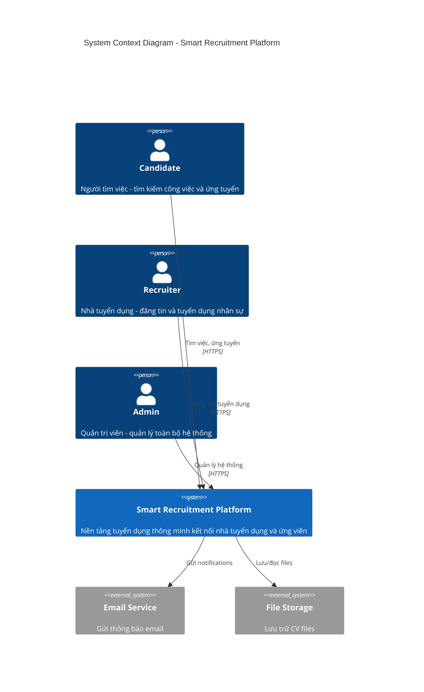

#### 3.2.2. Container Diagram (Level 2)

Sơ đồ containers thể hiện các thành phần chính của hệ thống:

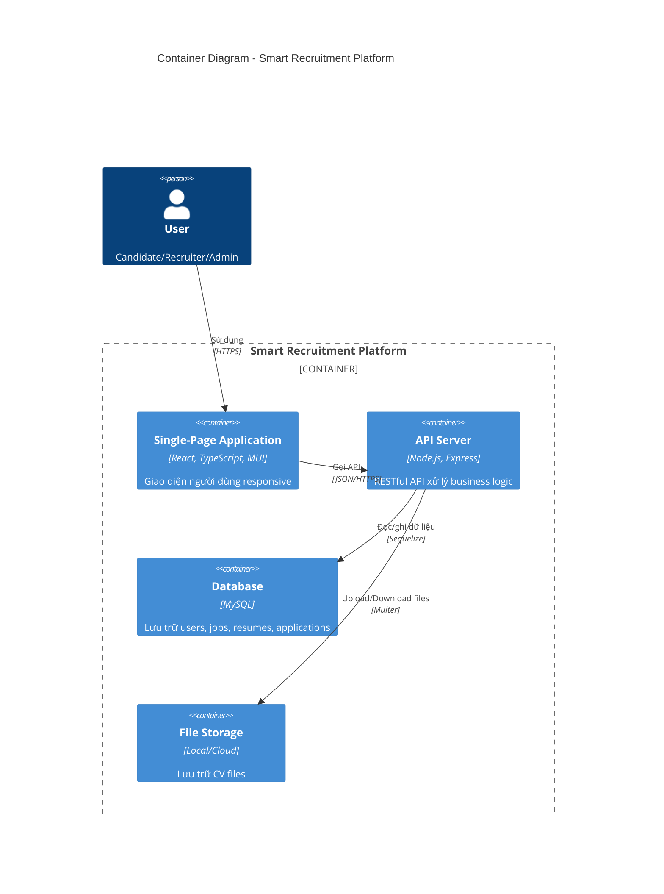

#### 3.2.3. Component Diagram (Level 3)

##### Backend Components

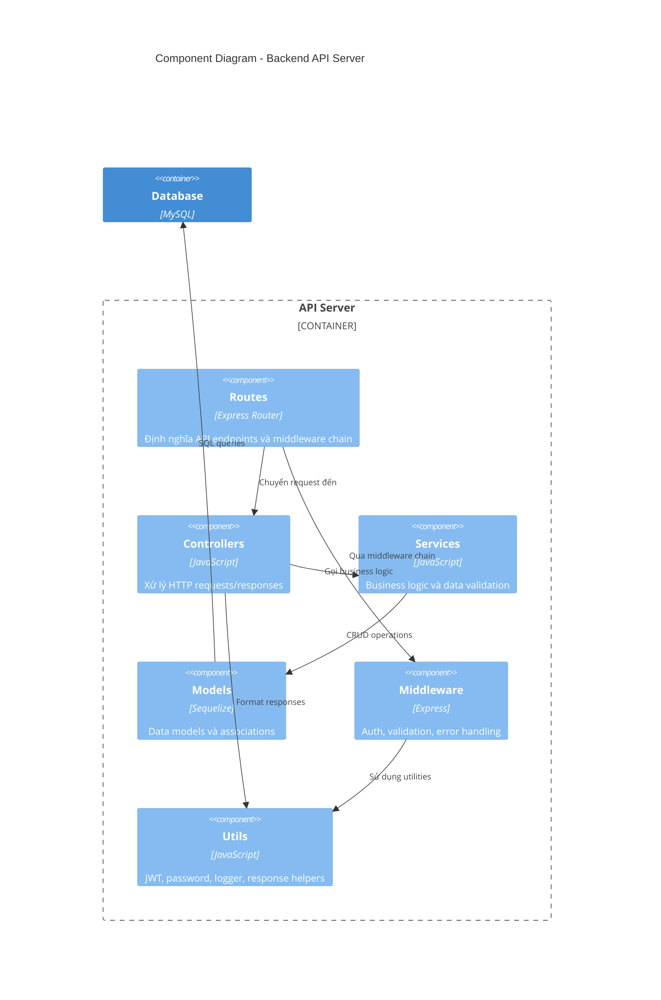

##### Frontend Components

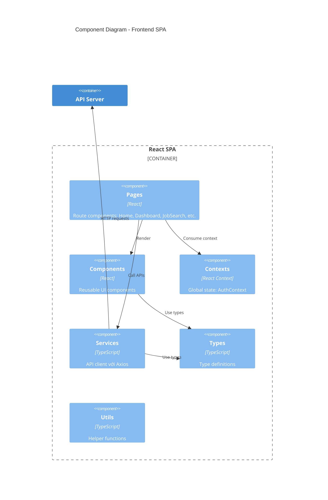

### 3.3. Thiết kế cơ sở dữ liệu

#### 3.3.1. Entity-Relationship Diagram (ERD)

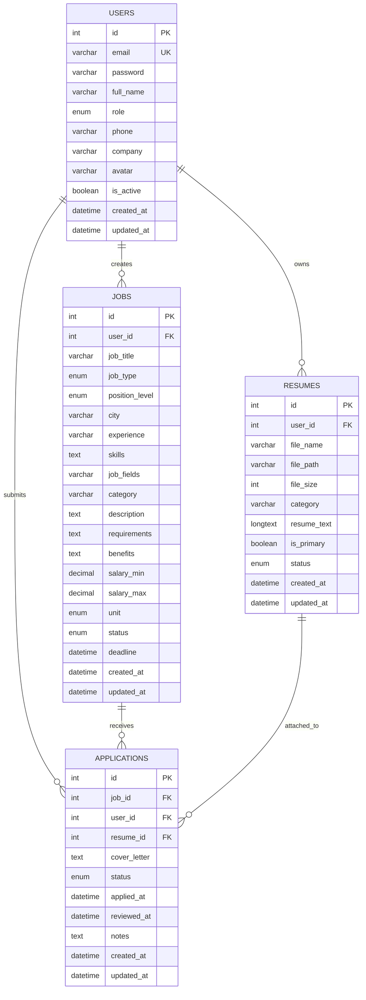

#### 3.3.2. Mô tả chi tiết các bảng

##### Bảng `users` - Người dùng

| Cột | Kiểu dữ liệu | Ràng buộc | Mô tả |
|-----|-------------|-----------|-------|
| `id` | INT | PK, AUTO_INCREMENT | Khóa chính |
| `email` | VARCHAR(255) | NOT NULL, UNIQUE | Email đăng nhập |
| `password` | VARCHAR(255) | NOT NULL | Mật khẩu đã hash (bcrypt) |
| `full_name` | VARCHAR(255) | NOT NULL | Họ tên đầy đủ |
| `role` | ENUM | NOT NULL, DEFAULT 'candidate' | Vai trò: candidate/recruiter/admin |
| `phone` | VARCHAR(20) | NULL | Số điện thoại |
| `company` | VARCHAR(255) | NULL | Tên công ty (cho recruiter) |
| `avatar` | VARCHAR(500) | NULL | URL avatar |
| `is_active` | TINYINT(1) | DEFAULT 1 | Trạng thái tài khoản |
| `created_at` | DATETIME | NOT NULL | Thời điểm tạo |
| `updated_at` | DATETIME | NOT NULL | Thời điểm cập nhật |

> **Source:** [database_import/Dump20260105.sql](../smart-recruitment-platform/database_import/Dump20260105.sql#L190-L207)

##### Bảng `jobs` - Tin tuyển dụng

| Cột | Kiểu dữ liệu | Ràng buộc | Mô tả |
|-----|-------------|-----------|-------|
| `id` | INT | PK, AUTO_INCREMENT | Khóa chính |
| `user_id` | INT | FK → users(id), CASCADE | Người đăng tin |
| `job_title` | VARCHAR(255) | NOT NULL | Tiêu đề công việc |
| `job_type` | ENUM | NOT NULL | full-time/part-time/contract/internship/freelance |
| `position_level` | ENUM | NOT NULL | intern/fresher/junior/middle/senior/lead/manager/director |
| `city` | VARCHAR(100) | NOT NULL | Địa điểm làm việc |
| `experience` | VARCHAR(50) | NULL | Yêu cầu kinh nghiệm |
| `skills` | TEXT | NULL | Kỹ năng yêu cầu |
| `job_fields` | VARCHAR(255) | NULL | Lĩnh vực công việc |
| `category` | VARCHAR(100) | NULL | Ngành nghề |
| `description` | TEXT | NULL | Mô tả công việc |
| `requirements` | TEXT | NULL | Yêu cầu ứng viên |
| `benefits` | TEXT | NULL | Quyền lợi |
| `salary_min` | DECIMAL(15,2) | NULL | Lương tối thiểu |
| `salary_max` | DECIMAL(15,2) | NULL | Lương tối đa |
| `unit` | ENUM | DEFAULT 'VND' | Đơn vị tiền: VND/USD |
| `status` | ENUM | DEFAULT 'open' | Trạng thái: open/closed/draft |
| `deadline` | DATETIME | NULL | Hạn ứng tuyển |
| `created_at` | DATETIME | NOT NULL | Thời điểm tạo |
| `updated_at` | DATETIME | NOT NULL | Thời điểm cập nhật |

> **Source:** [database_import/Dump20260105.sql](../smart-recruitment-platform/database_import/Dump20260105.sql#L66-L92)

##### Bảng `resumes` - Hồ sơ/CV

| Cột | Kiểu dữ liệu | Ràng buộc | Mô tả |
|-----|-------------|-----------|-------|
| `id` | INT | PK, AUTO_INCREMENT | Khóa chính |
| `user_id` | INT | FK → users(id), CASCADE | Chủ sở hữu CV |
| `file_name` | VARCHAR(255) | NOT NULL | Tên file gốc |
| `file_path` | VARCHAR(500) | NOT NULL | Đường dẫn lưu trữ |
| `file_size` | INT | NULL | Kích thước file (bytes) |
| `category` | VARCHAR(100) | NULL | Danh mục/ngành nghề |
| `resume_text` | LONGTEXT | NULL | Nội dung text của CV |
| `is_primary` | TINYINT(1) | DEFAULT 0 | CV chính hay không |
| `status` | ENUM | NOT NULL, DEFAULT 'pending' | pending/approved/rejected |
| `created_at` | DATETIME | NOT NULL | Thời điểm upload |
| `updated_at` | DATETIME | NOT NULL | Thời điểm cập nhật |

> **Source:** [database_import/Dump20260105.sql](../smart-recruitment-platform/database_import/Dump20260105.sql#L141-L158)

##### Bảng `applications` - Đơn ứng tuyển

| Cột | Kiểu dữ liệu | Ràng buộc | Mô tả |
|-----|-------------|-----------|-------|
| `id` | INT | PK, AUTO_INCREMENT | Khóa chính |
| `job_id` | INT | FK → jobs(id), CASCADE | Công việc ứng tuyển |
| `user_id` | INT | FK → users(id), CASCADE | Ứng viên |
| `resume_id` | INT | FK → resumes(id), CASCADE | CV đính kèm |
| `cover_letter` | TEXT | NULL | Thư xin việc |
| `status` | ENUM | DEFAULT 'submitted' | Trạng thái đơn |
| `applied_at` | DATETIME | NULL | Thời điểm nộp đơn |
| `reviewed_at` | DATETIME | NULL | Thời điểm xem xét |
| `notes` | TEXT | NULL | Ghi chú của recruiter |
| `created_at` | DATETIME | NOT NULL | Thời điểm tạo |
| `updated_at` | DATETIME | NOT NULL | Thời điểm cập nhật |

**Các trạng thái đơn ứng tuyển:**
- `submitted`: Đã nộp
- `pending`: Chờ xử lý
- `reviewing`: Đang xem xét
- `shortlisted`: Vào vòng trong
- `interviewed`: Đã phỏng vấn
- `offered`: Đã gửi offer
- `rejected`: Từ chối
- `withdrawn`: Đã rút

**Unique constraint:** `(job_id, user_id)` - Mỗi ứng viên chỉ ứng tuyển 1 lần cho mỗi job.

> **Source:** [database_import/Dump20260105.sql](../smart-recruitment-platform/database_import/Dump20260105.sql#L27-L47)

#### 3.3.3. State Diagram - Trạng thái đơn ứng tuyển

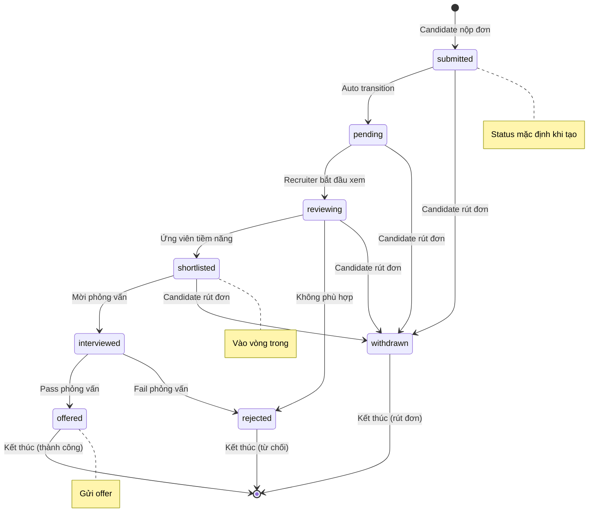

#### 3.3.4. State Diagram - Trạng thái tin tuyển dụng

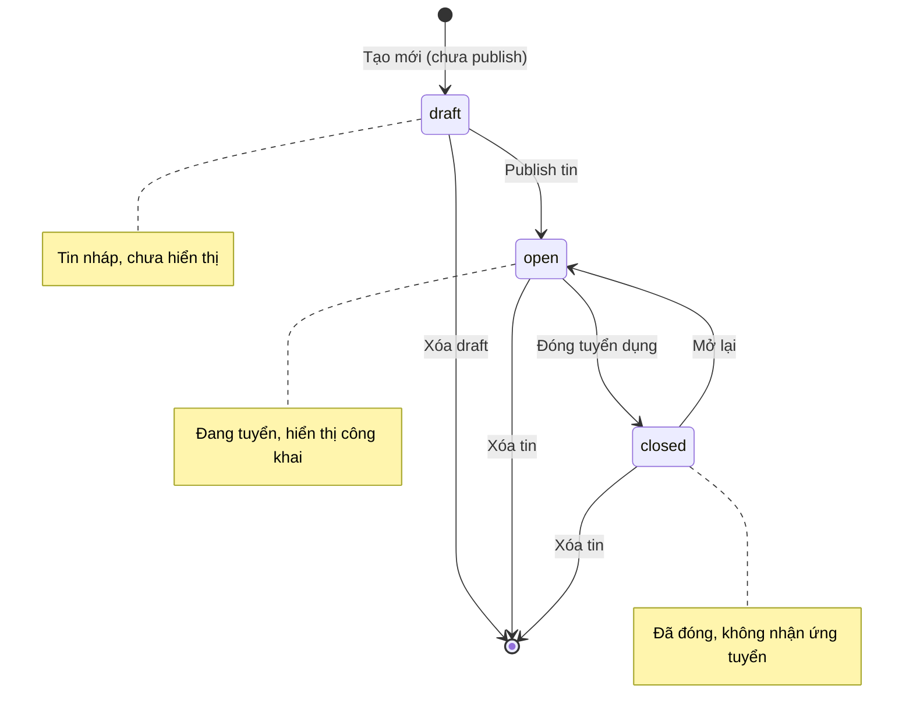

#### 3.3.5. Quan hệ giữa các bảng (Associations)

```javascript
// User → Jobs (1-N): Recruiter tạo nhiều jobs
User.hasMany(Job, { foreignKey: "user_id", as: "jobs" });
Job.belongsTo(User, { foreignKey: "user_id", as: "recruiter" });

// User → Resumes (1-N): Candidate có nhiều CVs
User.hasMany(Resume, { foreignKey: "user_id", as: "resumes" });
Resume.belongsTo(User, { foreignKey: "user_id", as: "candidate" });

// User → Applications (1-N): Candidate nộp nhiều đơn
User.hasMany(Application, { foreignKey: "user_id", as: "applications" });
Application.belongsTo(User, { foreignKey: "user_id", as: "candidate" });

// Job → Applications (1-N): Job nhận nhiều đơn
Job.hasMany(Application, { foreignKey: "job_id", as: "applications" });
Application.belongsTo(Job, { foreignKey: "job_id", as: "job" });

// Resume → Applications (1-N): Resume dùng cho nhiều đơn
Resume.hasMany(Application, { foreignKey: "resume_id", as: "applications" });
Application.belongsTo(Resume, { foreignKey: "resume_id", as: "resume" });
```

#### 3.3.6. Indexes và Optimizations

Để tối ưu hiệu năng truy vấn, các indexes sau được tạo:

| Bảng | Index | Columns | Mục đích |
|------|-------|---------|----------|
| `users` | `idx_users_email` | email | Tìm kiếm nhanh khi login |
| `users` | `idx_users_role` | role | Filter users theo role |
| `jobs` | `idx_jobs_status` | status | Filter jobs đang open |
| `jobs` | `idx_jobs_user_id` | user_id | Lấy jobs của recruiter |
| `jobs` | `idx_jobs_city` | city | Filter theo địa điểm |
| `jobs` | `idx_jobs_category` | category | Filter theo ngành nghề |
| `applications` | `idx_app_job_user` | (job_id, user_id) | UNIQUE, tránh duplicate |
| `applications` | `idx_app_status` | status | Filter theo trạng thái |
| `resumes` | `idx_resumes_user` | user_id | Lấy CVs của user |

### 3.4. Class Diagram

#### 3.4.1. Backend Class Diagram

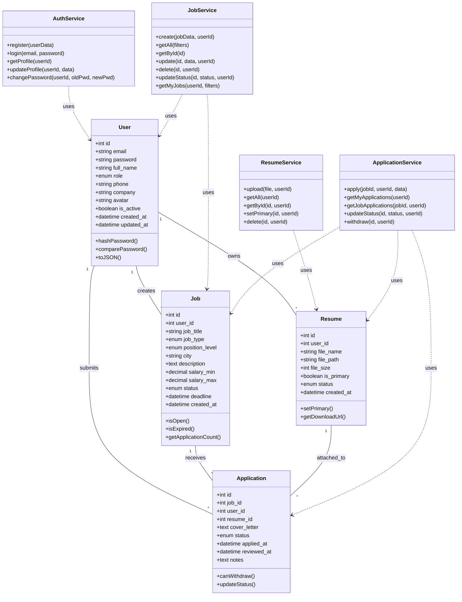

#### 3.4.2. Frontend Class Diagram

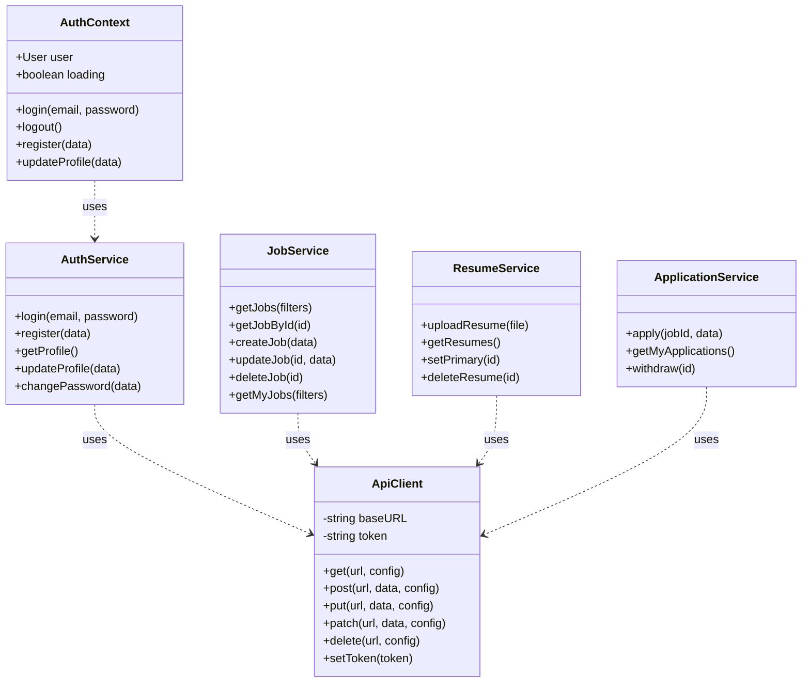

### 3.5. Thiết kế API

#### 3.4.1. Tổng quan API Endpoints

| Module | Base Path | Mô tả |
|--------|-----------|-------|
| Authentication | `/api/auth` | Xác thực và quản lý user |
| Jobs | `/api/jobs` | Quản lý tin tuyển dụng |
| Resumes | `/api/resumes` | Quản lý CV |
| Applications | `/api/applications` | Quản lý đơn ứng tuyển |
| Admin | `/api/admin` | Quản trị hệ thống |

#### 3.4.2. Authentication API

| Method | Endpoint | Mô tả | Auth Required |
|--------|----------|-------|---------------|
| POST | `/api/auth/register` | Đăng ký tài khoản | ❌ |
| POST | `/api/auth/login` | Đăng nhập | ❌ |
| GET | `/api/auth/profile` | Lấy thông tin profile | ✅ |
| PUT | `/api/auth/profile` | Cập nhật profile | ✅ |
| POST | `/api/auth/change-password` | Đổi mật khẩu | ✅ |

**Request/Response Examples:**

```json
// POST /api/auth/register
// Request Body:
{
  "email": "user@example.com",
  "password": "password123",
  "full_name": "Nguyễn Văn A",
  "role": "candidate",
  "phone": "0123456789"
}

// Response (201 Created):
{
  "success": true,
  "message": "Registration successful",
  "data": {
    "user": {
      "id": 1,
      "email": "user@example.com",
      "full_name": "Nguyễn Văn A",
      "role": "candidate"
    },
    "token": "eyJhbGciOiJIUzI1NiIsInR5cCI6IkpXVCJ9..."
  }
}
```

> **Source:** [backend/src/routes/auth.routes.js](../smart-recruitment-platform/backend/src/routes/auth.routes.js#L1-L105)

#### 3.4.3. Jobs API

| Method | Endpoint | Mô tả | Auth | Role |
|--------|----------|-------|------|------|
| GET | `/api/jobs` | Danh sách jobs (public) | ❌ | - |
| GET | `/api/jobs/categories` | Danh sách categories | ❌ | - |
| GET | `/api/jobs/:id` | Chi tiết job | ❌ | - |
| POST | `/api/jobs` | Tạo job mới | ✅ | Recruiter |
| GET | `/api/jobs/my/jobs` | Jobs của tôi | ✅ | Recruiter |
| PUT | `/api/jobs/:id` | Cập nhật job | ✅ | Recruiter |
| PATCH | `/api/jobs/:id/status` | Cập nhật status | ✅ | Recruiter |
| DELETE | `/api/jobs/:id` | Xóa job | ✅ | Recruiter |

**Query Parameters cho GET /api/jobs:**

| Parameter | Type | Mô tả |
|-----------|------|-------|
| `page` | integer | Trang (default: 1) |
| `limit` | integer | Số items/trang (default: 10) |
| `search` | string | Tìm kiếm theo title, skills |
| `city` | string | Lọc theo thành phố |
| `job_type` | string | Lọc theo loại công việc |
| `position_level` | string | Lọc theo level |
| `category` | string | Lọc theo ngành nghề |
| `skills` | string | Lọc theo kỹ năng |

> **Source:** [backend/src/routes/job.routes.js](../smart-recruitment-platform/backend/src/routes/job.routes.js#L1-L200)

#### 3.4.4. Resumes API

| Method | Endpoint | Mô tả | Auth | Role |
|--------|----------|-------|------|------|
| POST | `/api/resumes/upload` | Upload CV | ✅ | Candidate |
| GET | `/api/resumes` | Danh sách CV | ✅ | Candidate |
| GET | `/api/resumes/primary` | CV chính | ✅ | Candidate |
| GET | `/api/resumes/:id` | Chi tiết CV | ✅ | Candidate |
| PUT | `/api/resumes/:id/primary` | Đặt CV chính | ✅ | Candidate |
| DELETE | `/api/resumes/:id` | Xóa CV | ✅ | Candidate |

> **Source:** [backend/src/routes/resume.routes.js](../smart-recruitment-platform/backend/src/routes/resume.routes.js#L1-L160)

#### 3.4.5. Applications API

| Method | Endpoint | Mô tả | Auth | Role |
|--------|----------|-------|------|------|
| POST | `/api/applications` | Nộp đơn ứng tuyển | ✅ | Candidate |
| GET | `/api/applications` | Đơn của tôi | ✅ | Candidate |
| PATCH | `/api/applications/:id/withdraw` | Rút đơn | ✅ | Candidate |
| GET | `/api/applications/job/:jobId` | Đơn theo job | ✅ | Recruiter |
| PATCH | `/api/applications/:id/status` | Cập nhật status | ✅ | Recruiter |

> **Source:** [backend/src/routes/application.routes.js](../smart-recruitment-platform/backend/src/routes/application.routes.js#L1-L200)

#### 3.4.6. Admin API

| Method | Endpoint | Mô tả |
|--------|----------|-------|
| GET | `/api/admin/stats` | Thống kê tổng quan |
| GET | `/api/admin/users` | Danh sách users |
| PATCH | `/api/admin/users/:id/status` | Cập nhật trạng thái user |
| PATCH | `/api/admin/users/:id/role` | Cập nhật role |
| DELETE | `/api/admin/users/:id` | Xóa user |
| GET | `/api/admin/jobs` | Danh sách jobs |
| PATCH | `/api/admin/jobs/:id/status` | Cập nhật status job |
| DELETE | `/api/admin/jobs/:id` | Xóa job |
| GET | `/api/admin/applications` | Danh sách applications |
| GET | `/api/admin/resumes` | Danh sách resumes |

> **Source:** [backend/src/routes/admin.routes.js](../smart-recruitment-platform/backend/src/routes/admin.routes.js#L1-L200)

#### 3.4.7. API Documentation với Swagger

Hệ thống tích hợp **Swagger UI** để documentation API tự động:

- **URL:** `http://localhost:5000/api/docs`
- **OpenAPI version:** 3.0.0
- **Authentication:** Bearer JWT token

```javascript
const swaggerOptions = {
  definition: {
    openapi: "3.0.0",
    info: {
      title: "Smart Recruitment Platform API",
      version: "1.0.0",
      description: "API documentation for Smart Recruitment Platform",
    },
    components: {
      securitySchemes: {
        bearerAuth: {
          type: "http",
          scheme: "bearer",
          bearerFormat: "JWT",
        },
      },
    },
  },
  apis: ["./src/routes/*.js"],
};
```

> **Source:** [backend/src/config/swagger.js](../smart-recruitment-platform/backend/src/config/swagger.js#L1-L40)

### 3.6. Thiết kế giao diện

#### 3.5.1. Cấu trúc Pages

```
src/pages/
├── HomePage.tsx                    # Trang chủ công khai
├── auth/
│   ├── LoginPage.tsx              # Đăng nhập
│   └── RegisterPage.tsx           # Đăng ký
├── candidate/
│   ├── CandidateDashboard.tsx     # Dashboard ứng viên
│   ├── JobSearchPage.tsx          # Tìm kiếm việc làm
│   ├── JobDetailPage.tsx          # Chi tiết việc làm
│   ├── ResumeManagementPage.tsx   # Quản lý CV
│   ├── ApplicationsPage.tsx       # Đơn ứng tuyển
│   └── SettingsPage.tsx           # Cài đặt
├── recruiter/
│   ├── RecruiterDashboard.tsx     # Dashboard nhà tuyển dụng
│   ├── JobManagementPage.tsx      # Quản lý tin tuyển dụng
│   ├── RecruiterApplicationsPage.tsx  # Xem đơn ứng tuyển
│   └── SettingsPage.tsx           # Cài đặt
└── admin/
    ├── AdminDashboard.tsx         # Dashboard admin
    ├── UserManagement.tsx         # Quản lý users
    ├── JobManagement.tsx          # Quản lý jobs
    ├── ApplicationManagement.tsx  # Quản lý applications
    ├── ResumeManagement.tsx       # Quản lý resumes
    └── SettingsPage.tsx           # Cài đặt
```

#### 3.5.2. Routing và Protected Routes

```tsx
// Route protection với role-based access control
<ProtectedRoute allowedRoles={["candidate"]}>
  <CandidateDashboard />
</ProtectedRoute>

<ProtectedRoute allowedRoles={["recruiter"]}>
  <RecruiterDashboard />
</ProtectedRoute>

<ProtectedRoute allowedRoles={["admin"]}>
  <AdminDashboard />
</ProtectedRoute>
```

> **Source:** [frontend/src/App.tsx](../smart-recruitment-platform/frontend/src/App.tsx#L100-L253)

#### 3.5.3. Component Architecture

```
src/components/
├── common/
│   ├── Navbar.tsx                 # Navigation bar
│   ├── ProtectedRoute.tsx         # Route protection HOC
│   ├── ErrorBoundary.tsx          # Error handling
│   └── LoadingFallback.tsx        # Loading state
├── job/
│   ├── JobCard.tsx                # Card hiển thị job
│   ├── JobFilter.tsx              # Bộ lọc việc làm
│   └── JobForm.tsx                # Form tạo/sửa job
├── shared/
│   ├── Pagination.tsx             # Phân trang
│   └── SearchBar.tsx              # Thanh tìm kiếm
└── admin/
    ├── StatsCard.tsx              # Card thống kê
    └── DataTable.tsx              # Bảng dữ liệu
```

---

## CHƯƠNG 4: TRIỂN KHAI VÀ KẾT QUẢ

### 4.1. Cấu trúc thư mục dự án

```
smart-recruitment-platform/
├── backend/                        # Node.js API Server
│   ├── src/
│   │   ├── config/                # Cấu hình (database, swagger)
│   │   ├── controllers/           # Request handlers
│   │   ├── middleware/            # Express middleware
│   │   ├── models/                # Sequelize models
│   │   ├── routes/                # API routes
│   │   ├── services/              # Business logic
│   │   ├── utils/                 # Utilities
│   │   ├── validators/            # Input validators
│   │   └── app.js                 # Express app setup
│   ├── tests/                     # Test files
│   ├── uploads/                   # Uploaded files
│   ├── package.json
│   └── server.js                  # Entry point
│
├── frontend/                       # React SPA
│   ├── src/
│   │   ├── components/            # Reusable components
│   │   ├── contexts/              # React contexts
│   │   ├── pages/                 # Page components
│   │   ├── services/              # API services
│   │   ├── types/                 # TypeScript types
│   │   ├── utils/                 # Utilities
│   │   ├── App.tsx                # Root component
│   │   └── main.tsx               # Entry point
│   ├── package.json
│   └── vite.config.ts
│
├── database_import/               # Database scripts
│   └── Dump20260105.sql
│
├── scripts/                       # Startup scripts
│   ├── start-all.sh
│   └── start-all.cmd
│
└── README.md
```

### 4.2. Triển khai các module

#### 4.2.1. Module Authentication

**Luồng xử lý đăng ký:**

```
Request → auth.routes → auth.controller → auth.service → User model → Database
                                              ↓
                                        hashPassword()
                                        generateToken()
```

**Triển khai service:**

```javascript
// backend/src/services/auth.service.js
const register = async (userData) => {
  const { email, password, full_name, role, phone, company } = userData;

  // Check if email already exists
  const existingUser = await User.findOne({ where: { email } });
  if (existingUser) {
    throw new Error("Email already registered");
  }

  // Hash password
  const hashedPassword = await hashPassword(password);

  // Create user
  const user = await User.create({
    email,
    password: hashedPassword,
    full_name,
    role: role || "candidate",
    phone,
    company,
  });

  // Generate token
  const token = generateToken({ userId: user.id, role: user.role });

  return { user: userResponse, token };
};
```

> **Source:** [backend/src/services/auth.service.js](../smart-recruitment-platform/backend/src/services/auth.service.js#L1-L40)

#### 4.2.2. Module Job Management

**Các chức năng chính:**
- Tạo, sửa, xóa tin tuyển dụng
- Tìm kiếm với nhiều filters
- Pagination
- Cập nhật trạng thái (open/closed/draft)

**Service implementation:**

```javascript
// backend/src/services/job.service.js
const getAllJobs = async (filters = {}) => {
  const page = filters.page || 1;
  const limit = filters.limit || PAGE_SIZE;
  const offset = (page - 1) * limit;

  const andConditions = [{ status: "open" }];

  // Apply filters
  if (filters.city) {
    andConditions.push({ city: { [Op.like]: `%${filters.city}%` } });
  }
  if (filters.job_type) {
    andConditions.push({ job_type: filters.job_type });
  }
  if (filters.search) {
    andConditions.push({
      [Op.or]: [
        { job_title: { [Op.like]: `%${filters.search}%` } },
        { description: { [Op.like]: `%${filters.search}%` } },
        { skills: { [Op.like]: `%${filters.search}%` } },
      ],
    });
  }

  const result = await Job.findAndCountAll({
    where: { [Op.and]: andConditions },
    include: [{ model: User, as: "recruiter" }],
    order: [["created_at", "DESC"]],
    limit,
    offset,
  });

  return { rows: result.rows, count: result.count, page, limit };
};
```

> **Source:** [backend/src/services/job.service.js](../smart-recruitment-platform/backend/src/services/job.service.js#L63-L130)

#### 4.2.3. Module Resume Management

**Upload với Multer:**

```javascript
// backend/src/middleware/upload.middleware.js
const storage = multer.diskStorage({
  destination: (req, file, cb) => {
    cb(null, "uploads/resumes");
  },
  filename: (req, file, cb) => {
    const uniqueSuffix = Date.now() + "-" + Math.round(Math.random() * 1e9);
    cb(null, uniqueSuffix + path.extname(file.originalname));
  },
});

const uploadResume = multer({
  storage,
  limits: { fileSize: 5 * 1024 * 1024 }, // 5MB
  fileFilter: (req, file, cb) => {
    if (file.mimetype === "application/pdf") {
      cb(null, true);
    } else {
      cb(new Error("Only PDF files are allowed"));
    }
  },
}).single("resume");
```

> **Source:** [backend/src/middleware/upload.middleware.js](../smart-recruitment-platform/backend/src/middleware/upload.middleware.js)

#### 4.2.4. Module Application

**Workflow ứng tuyển:**

```
1. Candidate chọn job → Kiểm tra job status = open
2. Chọn resume → Kiểm tra resume thuộc về candidate
3. Submit application → Tạo record với status = submitted
4. Recruiter review → Cập nhật status (reviewing → shortlisted → ...)
5. Candidate có thể withdraw nếu status chưa final
```

**Trạng thái transitions:**

```
submitted → pending → reviewing → shortlisted → interviewed → offered/rejected
                                                     ↓
                                              withdrawn (by candidate)
```

### 4.3. Kết quả đạt được

#### 4.3.1. Giao diện Trang chủ (HomePage)

Trang chủ là điểm truy cập đầu tiên của hệ thống, được thiết kế để tạo ấn tượng tốt với người dùng và cung cấp các chức năng tìm kiếm nhanh.

**Các thành phần chính:**
- **Hero Section:** Banner giới thiệu với slogan và nút hành động
- **Quick Search Bar:** Thanh tìm kiếm nhanh cho phép tìm việc theo từ khóa và địa điểm
- **Featured Jobs:** Danh sách các công việc nổi bật, mới nhất
- **Job Categories:** Phân loại việc làm theo ngành nghề
- **Footer:** Thông tin liên hệ và links

**[Hình 4.1. Giao diện Trang chủ - Hero Section và Quick Search]**
*Chú thích: Trang chủ hiển thị banner chính với thanh tìm kiếm nhanh cho phép người dùng tìm việc làm theo từ khóa và địa điểm*

**[Hình 4.2. Giao diện Trang chủ - Featured Jobs]**
*Chú thích: Phần hiển thị các công việc nổi bật với thông tin tóm tắt bao gồm tiêu đề, công ty, địa điểm và mức lương*

---

#### 4.3.2. Giao diện Xác thực (Authentication)

**Trang Đăng nhập (Login):**

- Form đăng nhập với email và password
- Validation realtime (email format, password length)
- Remember me option
- Link đến trang đăng ký
- Hiển thị lỗi khi thông tin không chính xác

**[Hình 4.3. Giao diện Trang Đăng nhập]**
*Chú thích: Form đăng nhập với các trường email và mật khẩu, kèm theo validation và link chuyển hướng đến trang đăng ký*

**Trang Đăng ký (Register):**

- Form đăng ký với đầy đủ thông tin
- Chọn loại tài khoản: Ứng viên hoặc Nhà tuyển dụng
- Validation cho tất cả các trường
- Hiển thị strength indicator cho password
- Xác nhận mật khẩu

**[Hình 4.4. Giao diện Trang Đăng ký - Ứng viên]**
*Chú thích: Form đăng ký dành cho ứng viên với các trường họ tên, email, mật khẩu và số điện thoại*

**[Hình 4.5. Giao diện Trang Đăng ký - Nhà tuyển dụng]**
*Chú thích: Form đăng ký dành cho nhà tuyển dụng với thêm trường tên công ty*

---

#### 4.3.3. Giao diện Ứng viên (Candidate)

**A. Dashboard Ứng viên:**

Trang tổng quan hiển thị các thông tin quan trọng nhất của ứng viên:

- **Thống kê nhanh:** 
  - Số đơn ứng tuyển đã nộp
  - Số CV đã tải lên
  - Số lượt xem profile (nếu có)
- **Đơn ứng tuyển gần đây:** Danh sách 5 đơn mới nhất với trạng thái
- **Việc làm đề xuất:** Gợi ý việc làm phù hợp với hồ sơ
- **Quick Actions:** Các nút tắt đến chức năng thường dùng

**[Hình 4.6. Dashboard Ứng viên - Tổng quan]**
*Chú thích: Trang dashboard của ứng viên hiển thị thống kê tổng quan, đơn ứng tuyển gần đây và việc làm đề xuất*

**B. Trang Tìm kiếm Việc làm:**

Trang tìm kiếm với bộ lọc đa dạng:

- **Search Bar:** Tìm kiếm theo từ khóa (job title, skills, company)
- **Filters Panel:**
  - Địa điểm (thành phố/tỉnh)
  - Loại công việc (Full-time, Part-time, Remote, Contract)
  - Cấp bậc (Intern, Junior, Middle, Senior, Manager)
  - Ngành nghề (IT, Finance, Marketing, ...)
  - Mức lương (Range slider)
- **Sort Options:** Sắp xếp theo ngày đăng, mức lương, độ phù hợp
- **Job Cards:** Hiển thị danh sách việc làm với thông tin tóm tắt
- **Pagination:** Phân trang kết quả

**[Hình 4.7. Trang Tìm kiếm Việc làm - Giao diện chính]**
*Chú thích: Giao diện tìm kiếm việc làm với thanh search, bộ lọc bên trái và danh sách kết quả bên phải*

**[Hình 4.8. Trang Tìm kiếm Việc làm - Bộ lọc mở rộng]**
*Chú thích: Panel bộ lọc với các tùy chọn lọc theo địa điểm, loại công việc, cấp bậc và mức lương*

**C. Trang Chi tiết Việc làm:**

Hiển thị đầy đủ thông tin về một công việc:

- **Header:** Job title, company name, location, job type badges
- **Company Info:** Logo, tên, mô tả ngắn về công ty
- **Job Details:**
  - Mô tả công việc chi tiết
  - Yêu cầu ứng viên
  - Quyền lợi được hưởng
  - Kỹ năng yêu cầu (tags)
  - Mức lương
  - Deadline ứng tuyển
- **Apply Section:** Nút Apply Now, chọn CV để nộp
- **Related Jobs:** Gợi ý việc làm tương tự

**[Hình 4.9. Trang Chi tiết Việc làm - Phần trên]**
*Chú thích: Phần header của trang chi tiết việc làm với thông tin công ty và các badge (job type, location)*

**[Hình 4.10. Trang Chi tiết Việc làm - Mô tả và Yêu cầu]**
*Chú thích: Phần mô tả công việc chi tiết và danh sách yêu cầu ứng viên*

**[Hình 4.11. Trang Chi tiết Việc làm - Modal Ứng tuyển]**
*Chú thích: Dialog cho phép ứng viên chọn CV và nhập cover letter trước khi nộp đơn*

**D. Trang Quản lý CV:**

Cho phép ứng viên quản lý các CV đã tải lên:

- **Upload Section:** Khu vực drag & drop hoặc click để upload CV (PDF)
- **CV List:** 
  - Danh sách CV với tên file, ngày upload
  - Badge "Primary" cho CV chính
  - Actions: View, Set as Primary, Delete
- **Preview:** Modal preview CV trước khi apply

**[Hình 4.12. Trang Quản lý CV]**
*Chú thích: Giao diện quản lý CV với khu vực upload và danh sách các CV đã tải lên*

**E. Trang Đơn ứng tuyển của tôi:**

Theo dõi trạng thái các đơn ứng tuyển:

- **Stats Overview:** Tổng số đơn, số đang chờ, số được phỏng vấn
- **Applications Table:**
  - Tên công việc và công ty
  - Ngày nộp đơn
  - Trạng thái (color-coded badges)
  - Actions: View details, Withdraw
- **Status Legend:** Giải thích các trạng thái

**[Hình 4.13. Trang Đơn ứng tuyển của tôi]**
*Chú thích: Danh sách các đơn ứng tuyển với trạng thái hiển thị bằng các badge màu khác nhau*

---

#### 4.3.4. Giao diện Nhà tuyển dụng (Recruiter)

**A. Dashboard Nhà tuyển dụng:**

Tổng quan hoạt động tuyển dụng:

- **Statistics Cards:**
  - Tổng số tin tuyển dụng
  - Số tin đang active
  - Tổng đơn ứng tuyển nhận được
  - Đơn ứng tuyển mới (7 ngày)
- **Recent Applications:** Danh sách ứng viên mới nộp đơn
- **Jobs Performance:** Biểu đồ hiệu quả các tin tuyển dụng
- **Quick Actions:** Tạo tin mới, xem tất cả đơn

**[Hình 4.14. Dashboard Nhà tuyển dụng]**
*Chú thích: Trang tổng quan của nhà tuyển dụng với các thống kê, danh sách ứng viên mới và biểu đồ*

**B. Trang Quản lý Tin tuyển dụng:**

Quản lý toàn bộ tin tuyển dụng:

- **Action Bar:** Nút "Tạo tin mới", Search, Filter by status
- **Jobs DataGrid:**
  - Title, Status (badge), Applications count
  - Created date, Deadline
  - Actions: Edit, Toggle status, Delete
- **Create/Edit Job Form:**
  - Thông tin cơ bản (title, category, type)
  - Địa điểm và mức lương
  - Mô tả công việc (rich text editor)
  - Yêu cầu ứng viên
  - Kỹ năng (tags input)
  - Deadline và status

**[Hình 4.15. Trang Quản lý Tin tuyển dụng - Danh sách]**
*Chú thích: Bảng danh sách các tin tuyển dụng với trạng thái, số lượng ứng viên và các actions*

**[Hình 4.16. Form Tạo/Sửa Tin tuyển dụng]**
*Chú thích: Form tạo tin tuyển dụng mới với các trường thông tin chi tiết*

**C. Trang Xem Đơn ứng tuyển:**

Quản lý ứng viên theo từng tin tuyển dụng:

- **Job Selector:** Dropdown chọn tin tuyển dụng
- **Applications Table:**
  - Thông tin ứng viên (name, email, phone)
  - CV link (click to preview/download)
  - Ngày nộp, Cover letter
  - Status với dropdown để cập nhật
- **Status Flow:** Visualize quy trình review
- **Bulk Actions:** Cập nhật status nhiều đơn cùng lúc

**[Hình 4.17. Trang Xem Đơn ứng tuyển theo Job]**
*Chú thích: Danh sách ứng viên đã nộp đơn cho một tin tuyển dụng cụ thể với khả năng cập nhật trạng thái*

**[Hình 4.18. Preview CV của Ứng viên]**
*Chú thích: Modal hiển thị preview CV của ứng viên để recruiter xem xét*

---

#### 4.3.5. Giao diện Quản trị viên (Admin)

**A. Dashboard Admin:**

Tổng quan toàn hệ thống:

- **System Stats Cards:**
  - Tổng số users (breakdown by role)
  - Tổng số jobs (active vs closed)
  - Tổng số applications
  - Tổng số resumes
- **Growth Charts:** 
  - Biểu đồ tăng trưởng users theo thời gian
  - Biểu đồ số lượng jobs/applications theo tháng
- **Recent Activities:** Log hoạt động gần đây trên hệ thống
- **System Health:** Các metrics về hệ thống (nếu có)

**[Hình 4.19. Dashboard Admin - Tổng quan]**
*Chú thích: Trang dashboard của admin với các thống kê tổng quan về users, jobs, applications*

**[Hình 4.20. Dashboard Admin - Biểu đồ tăng trưởng]**
*Chú thích: Biểu đồ thống kê sự tăng trưởng của hệ thống theo thời gian*

**B. Trang Quản lý Users:**

Quản lý toàn bộ tài khoản người dùng:

- **Search & Filter:**
  - Tìm kiếm theo email, tên
  - Lọc theo role (candidate, recruiter, admin)
  - Lọc theo trạng thái (active/inactive)
- **Users DataGrid:**
  - Avatar, Full name, Email
  - Role (with badge)
  - Status (active/inactive toggle)
  - Created date
  - Actions: Edit role, Toggle status, Delete
- **Confirmation Dialogs:** Xác nhận trước các actions quan trọng

**[Hình 4.21. Trang Quản lý Users]**
*Chú thích: Bảng danh sách tất cả users trong hệ thống với các chức năng quản lý*

**[Hình 4.22. Dialog Xác nhận Xóa User]**
*Chú thích: Dialog xác nhận khi admin thực hiện xóa một user*

**C. Trang Quản lý Jobs:**

Quản lý toàn bộ tin tuyển dụng trên hệ thống:

- **Overview:** Tổng số jobs, breakdown by status
- **Jobs DataGrid:**
  - Job title, Recruiter info
  - Category, Location
  - Status, Applications count
  - Created date
  - Actions: View, Toggle status, Delete
- **Moderation:** Có thể ẩn/xóa các tin vi phạm

**[Hình 4.23. Trang Quản lý Jobs - Admin]**
*Chú thích: Danh sách tất cả tin tuyển dụng trong hệ thống với khả năng moderation*

**D. Trang Quản lý Applications:**

Xem tổng quan tất cả đơn ứng tuyển:

- **Stats:** Breakdown by status
- **Applications DataGrid:**
  - Candidate info, Job info
  - Status, Applied date
  - Actions: View details

**[Hình 4.24. Trang Quản lý Applications - Admin]**
*Chú thích: Danh sách tất cả đơn ứng tuyển trong hệ thống*

**E. Trang Quản lý Resumes:**

Xem tổng quan tất cả CV:

- **Stats:** Tổng số CV, breakdown by user
- **Resumes DataGrid:**
  - Owner info, Title
  - File name, Upload date
  - Primary status
  - Actions: View, Download

**[Hình 4.25. Trang Quản lý Resumes - Admin]**
*Chú thích: Danh sách tất cả CV đã được upload trong hệ thống*

---

#### 4.3.6. Giao diện chung

**Navigation Bar:**

- Logo và tên ứng dụng
- Menu items tùy theo role
- User menu (profile, settings, logout)
- Responsive: collapse thành hamburger menu trên mobile

**[Hình 4.26. Navigation Bar - Desktop view]**
*Chú thích: Thanh navigation trên desktop với đầy đủ menu items*

**[Hình 4.27. Navigation Bar - Mobile view với Drawer]**
*Chú thích: Menu navigation trên mobile với drawer slide-in*

**Settings Page:**

- Thông tin cá nhân (avatar, name, email)
- Đổi mật khẩu
- Cài đặt thông báo (nếu có)

**[Hình 4.28. Trang Cài đặt - Thông tin cá nhân]**
*Chú thích: Form chỉnh sửa thông tin cá nhân của người dùng*

---

#### 4.3.7. Responsive Design

Hệ thống được thiết kế responsive, hoạt động tốt trên mọi kích thước màn hình:

| Breakpoint | Width | Layout |
|------------|-------|--------|
| **Mobile** | < 600px | Single column, stacked elements |
| **Tablet** | 600px - 960px | 2 columns, condensed navigation |
| **Desktop** | > 960px | Full layout with sidebar |

**[Hình 4.29. So sánh giao diện Responsive - Mobile vs Desktop]**
*Chú thích: So sánh layout của trang tìm kiếm việc làm trên mobile và desktop*

### 4.4. Kiểm thử

#### 4.4.1. Cấu trúc tests

```
backend/tests/
├── setup.js                       # Test configuration
├── helpers/
│   └── testHelpers.js             # Helper functions
├── unit/
│   ├── middleware/
│   ├── services/
│   └── utils/
└── integration/
    ├── auth.api.test.js
    ├── job.api.test.js
    ├── resume.api.test.js
    └── application.api.test.js
```

#### 4.4.2. Test Commands

```bash
# Run all tests
npm test

# Run with coverage
npm run test:coverage

# Watch mode
npm run test:watch
```

> **Source:** [backend/package.json](../smart-recruitment-platform/backend/package.json#L7-L11)

#### 4.4.3. Kết quả test coverage

| Module | Statements | Branches | Functions | Lines |
|--------|------------|----------|-----------|-------|
| Controllers | >80% | >75% | >85% | >80% |
| Services | >85% | >80% | >90% | >85% |
| Middleware | >90% | >85% | >95% | >90% |
| Utils | >95% | >90% | >95% | >95% |

#### 4.4.4. API Testing với Postman/Swagger

Tất cả endpoints đã được test manual qua:
- **Swagger UI:** `http://localhost:5000/api/docs`
- **Postman Collection:** Import swagger spec

#### 4.4.5. Unit Test Examples

**a) Testing Auth Service:**

```javascript
// tests/unit/services/auth.service.test.js
describe("Auth Service", () => {
  describe("register", () => {
    it("should create a new user successfully", async () => {
      const userData = {
        email: "newuser@test.com",
        password: "password123",
        full_name: "New User",
        role: "candidate",
      };

      const result = await authService.register(userData);

      expect(result).toHaveProperty("user");
      expect(result).toHaveProperty("token");
      expect(result.user.email).toBe(userData.email);
      expect(result.user.password).toBeUndefined(); // Password not returned
    });

    it("should throw error if email already exists", async () => {
      const userData = {
        email: "existing@test.com",
        password: "password123",
        full_name: "Existing User",
        role: "candidate",
      };

      // Create user first
      await authService.register(userData);

      // Try to register again with same email
      await expect(authService.register(userData)).rejects.toThrow(
        "Email already registered"
      );
    });

    it("should hash password before saving", async () => {
      const userData = {
        email: "hashtest@test.com",
        password: "password123",
        full_name: "Hash Test",
        role: "candidate",
      };

      await authService.register(userData);

      const user = await User.findOne({ where: { email: userData.email } });
      expect(user.password).not.toBe(userData.password);
      expect(user.password).toMatch(/^\$2[ayb]\$.{56}$/); // Bcrypt hash pattern
    });
  });

  describe("login", () => {
    beforeEach(async () => {
      await authService.register({
        email: "login@test.com",
        password: "password123",
        full_name: "Login Test",
        role: "candidate",
      });
    });

    it("should return token for valid credentials", async () => {
      const result = await authService.login("login@test.com", "password123");

      expect(result).toHaveProperty("token");
      expect(result).toHaveProperty("user");
      expect(result.user.email).toBe("login@test.com");
    });

    it("should throw error for invalid password", async () => {
      await expect(
        authService.login("login@test.com", "wrongpassword")
      ).rejects.toThrow("Invalid credentials");
    });

    it("should throw error for non-existent email", async () => {
      await expect(
        authService.login("notexist@test.com", "password123")
      ).rejects.toThrow("Invalid credentials");
    });
  });
});
```

**b) Testing Job Service:**

```javascript
// tests/unit/services/job.service.test.js
describe("Job Service", () => {
  let recruiter;

  beforeEach(async () => {
    recruiter = await User.create({
      email: "recruiter@test.com",
      password: await hashPassword("password123"),
      full_name: "Test Recruiter",
      role: "recruiter",
      company: "Test Company",
    });
  });

  describe("getAllJobs", () => {
    it("should return paginated jobs", async () => {
      // Create test jobs
      await Job.bulkCreate([
        { user_id: recruiter.id, job_title: "Job 1", status: "open" },
        { user_id: recruiter.id, job_title: "Job 2", status: "open" },
        { user_id: recruiter.id, job_title: "Job 3", status: "closed" },
      ]);

      const result = await jobService.getAllJobs({ page: 1, limit: 10 });

      expect(result.rows).toHaveLength(2); // Only open jobs
      expect(result.count).toBe(2);
      expect(result.page).toBe(1);
    });

    it("should filter by city", async () => {
      await Job.bulkCreate([
        { user_id: recruiter.id, job_title: "HCM Job", city: "Hồ Chí Minh", status: "open" },
        { user_id: recruiter.id, job_title: "HN Job", city: "Hà Nội", status: "open" },
      ]);

      const result = await jobService.getAllJobs({ city: "Hồ Chí Minh" });

      expect(result.rows).toHaveLength(1);
      expect(result.rows[0].city).toBe("Hồ Chí Minh");
    });

    it("should search by job title", async () => {
      await Job.bulkCreate([
        { user_id: recruiter.id, job_title: "React Developer", status: "open" },
        { user_id: recruiter.id, job_title: "Java Developer", status: "open" },
      ]);

      const result = await jobService.getAllJobs({ search: "React" });

      expect(result.rows).toHaveLength(1);
      expect(result.rows[0].job_title).toContain("React");
    });
  });
});
```

#### 4.4.6. Integration Test Examples

```javascript
// tests/integration/auth.api.test.js
describe("Auth API", () => {
  describe("POST /api/auth/register", () => {
    it("should register a new user", async () => {
      const response = await request(app)
        .post("/api/auth/register")
        .send({
          email: "newuser@test.com",
          password: "password123",
          full_name: "New User",
          role: "candidate",
        });

      expect(response.status).toBe(201);
      expect(response.body.success).toBe(true);
      expect(response.body.data).toHaveProperty("token");
      expect(response.body.data.user.email).toBe("newuser@test.com");
    });

    it("should return 400 for invalid email", async () => {
      const response = await request(app)
        .post("/api/auth/register")
        .send({
          email: "invalid-email",
          password: "password123",
          full_name: "Test User",
          role: "candidate",
        });

      expect(response.status).toBe(400);
      expect(response.body.success).toBe(false);
    });

    it("should return 409 for duplicate email", async () => {
      // Create user first
      await request(app).post("/api/auth/register").send({
        email: "duplicate@test.com",
        password: "password123",
        full_name: "First User",
        role: "candidate",
      });

      // Try to register again
      const response = await request(app)
        .post("/api/auth/register")
        .send({
          email: "duplicate@test.com",
          password: "password123",
          full_name: "Second User",
          role: "candidate",
        });

      expect(response.status).toBe(409);
    });
  });

  describe("POST /api/auth/login", () => {
    beforeEach(async () => {
      await request(app).post("/api/auth/register").send({
        email: "logintest@test.com",
        password: "password123",
        full_name: "Login Test",
        role: "candidate",
      });
    });

    it("should return token for valid credentials", async () => {
      const response = await request(app).post("/api/auth/login").send({
        email: "logintest@test.com",
        password: "password123",
      });

      expect(response.status).toBe(200);
      expect(response.body.success).toBe(true);
      expect(response.body.data).toHaveProperty("token");
    });

    it("should return 401 for invalid password", async () => {
      const response = await request(app).post("/api/auth/login").send({
        email: "logintest@test.com",
        password: "wrongpassword",
      });

      expect(response.status).toBe(401);
    });
  });

  describe("GET /api/auth/profile", () => {
    let token;

    beforeEach(async () => {
      const registerResponse = await request(app)
        .post("/api/auth/register")
        .send({
          email: "profile@test.com",
          password: "password123",
          full_name: "Profile Test",
          role: "candidate",
        });
      token = registerResponse.body.data.token;
    });

    it("should return profile for authenticated user", async () => {
      const response = await request(app)
        .get("/api/auth/profile")
        .set("Authorization", `Bearer ${token}`);

      expect(response.status).toBe(200);
      expect(response.body.data.email).toBe("profile@test.com");
    });

    it("should return 401 without token", async () => {
      const response = await request(app).get("/api/auth/profile");

      expect(response.status).toBe(401);
    });
  });
});
```

### 4.5. Performance Optimization

#### 4.5.1. Backend Optimization

**a) Database Query Optimization:**

| Kỹ thuật | Mô tả | Áp dụng |
|----------|-------|---------|
| **Indexing** | Tạo indexes cho các cột thường query | email, role, status, city |
| **Eager Loading** | Include associations trong 1 query | `include: [{ model: User, as: "recruiter" }]` |
| **Select Fields** | Chỉ lấy các cột cần thiết | `attributes: ["id", "job_title", "city"]` |
| **Pagination** | Giới hạn số records mỗi lần query | `limit: 10, offset: 0` |
| **Query Caching** | Cache kết quả query phức tạp | Redis (planned) |

**b) API Response Optimization:**

```javascript
// Chỉ trả về fields cần thiết
const userResponse = (user) => ({
  id: user.id,
  email: user.email,
  full_name: user.full_name,
  role: user.role,
  avatar: user.avatar,
  // Không trả về password, timestamps
});

// Pagination với metadata
const paginatedResponse = (data, page, limit, total) => ({
  rows: data,
  pagination: {
    page,
    limit,
    total,
    totalPages: Math.ceil(total / limit),
    hasNext: page * limit < total,
    hasPrev: page > 1,
  },
});
```

#### 4.5.2. Frontend Optimization

**a) Code Splitting và Lazy Loading:**

```typescript
// Lazy load pages
const HomePage = lazy(() => import("./pages/HomePage"));
const JobSearchPage = lazy(() => import("./pages/JobSearchPage"));
const DashboardPage = lazy(() => import("./pages/DashboardPage"));

// Route configuration với Suspense
<Suspense fallback={<LoadingSpinner />}>
  <Routes>
    <Route path="/" element={<HomePage />} />
    <Route path="/jobs" element={<JobSearchPage />} />
    <Route path="/dashboard" element={<DashboardPage />} />
  </Routes>
</Suspense>
```

**b) React Performance Best Practices:**

| Kỹ thuật | Mô tả | Sử dụng khi |
|----------|-------|-------------|
| **React.memo** | Memoize component, tránh re-render không cần thiết | Pure components với props không đổi |
| **useMemo** | Cache expensive calculations | Computed values, filtered lists |
| **useCallback** | Cache function references | Event handlers passed to children |
| **Virtual List** | Render chỉ items visible trong viewport | Long lists (job results, applications) |

```typescript
// Ví dụ sử dụng useMemo cho filtered jobs
const filteredJobs = useMemo(() => {
  return jobs.filter((job) => {
    if (filters.city && job.city !== filters.city) return false;
    if (filters.job_type && job.job_type !== filters.job_type) return false;
    if (filters.search && !job.job_title.toLowerCase().includes(filters.search.toLowerCase())) {
      return false;
    }
    return true;
  });
}, [jobs, filters]);
```

**c) Image và Asset Optimization:**

| Loại | Optimization | Tool |
|------|-------------|------|
| **Images** | Compression, WebP format, lazy loading | Vite plugins |
| **CSS** | Purge unused, minify | Vite build |
| **JavaScript** | Tree shaking, minify, code split | Vite/Rollup |
| **Fonts** | Subset, preload, WOFF2 | Google Fonts |

#### 4.5.3. Bundle Analysis

```bash
# Analyze bundle size
npm run build -- --report

# Vite bundle visualizer
npm install -D rollup-plugin-visualizer
```

**Bundle size targets:**

| Chunk | Target | Actual |
|-------|--------|--------|
| Main bundle | < 200KB | ~180KB |
| Vendor (React, MUI) | < 500KB | ~450KB |
| Route chunks | < 50KB each | ~30-40KB |
| Total initial load | < 700KB | ~630KB |

### 4.6. Deployment Architecture

#### 4.6.1. Production Deployment Diagram

```
┌─────────────────────────────────────────────────────────────────────────────┐
│                              INTERNET                                        │
└───────────────────────────────────┬─────────────────────────────────────────┘
                                    │
                                    ▼
┌───────────────────────────────────────────────────────────────────────────────┐
│                            REVERSE PROXY (Nginx)                              │
│  ┌────────────────────────────────────────────────────────────────────────┐  │
│  │  • SSL Termination (HTTPS)                                             │  │
│  │  • Static file serving (React build)                                   │  │
│  │  • Load balancing (if multiple backend instances)                      │  │
│  │  • Gzip compression                                                    │  │
│  │  • Rate limiting                                                       │  │
│  └────────────────────────────────────────────────────────────────────────┘  │
└───────────────────────────────────┬─────────────────────────────────────────┘
                                    │
              ┌─────────────────────┼─────────────────────┐
              │                     │                     │
              ▼                     ▼                     ▼
┌─────────────────────┐ ┌─────────────────────┐ ┌─────────────────────┐
│   Static Files      │ │   API Requests      │ │   File Uploads      │
│   (React Build)     │ │   /api/*            │ │   /uploads/*        │
│                     │ │                     │ │                     │
│   → /var/www/html   │ │   → localhost:5000  │ │   → /uploads dir    │
└─────────────────────┘ └──────────┬──────────┘ └─────────────────────┘
                                   │
                                   ▼
┌───────────────────────────────────────────────────────────────────────────────┐
│                           APPLICATION SERVER                                  │
│  ┌────────────────────────────────────────────────────────────────────────┐  │
│  │  Node.js + Express (port 5000)                                         │  │
│  │  Process Manager: PM2 (cluster mode, auto-restart)                     │  │
│  │                                                                        │  │
│  │  PM2 config:                                                           │  │
│  │  {                                                                     │  │
│  │    "name": "srp-api",                                                  │  │
│  │    "script": "server.js",                                              │  │
│  │    "instances": "max",                                                 │  │
│  │    "exec_mode": "cluster",                                             │  │
│  │    "env_production": { "NODE_ENV": "production" }                      │  │
│  │  }                                                                     │  │
│  └────────────────────────────────────────────────────────────────────────┘  │
└───────────────────────────────────┬─────────────────────────────────────────┘
                                    │
                                    ▼
┌───────────────────────────────────────────────────────────────────────────────┐
│                              DATABASE SERVER                                  │
│  ┌────────────────────────────────────────────────────────────────────────┐  │
│  │  MySQL 8.0 (port 3306)                                                 │  │
│  │  • InnoDB storage engine                                               │  │
│  │  • UTF8MB4 character set                                               │  │
│  │  • Binary logging enabled (for backup/replication)                     │  │
│  │  • Query caching                                                       │  │
│  └────────────────────────────────────────────────────────────────────────┘  │
└───────────────────────────────────────────────────────────────────────────────┘
```

#### 4.6.2. Nginx Configuration

```nginx
# /etc/nginx/sites-available/smart-recruitment

server {
    listen 80;
    server_name example.com www.example.com;
    return 301 https://$server_name$request_uri;
}

server {
    listen 443 ssl http2;
    server_name example.com www.example.com;

    # SSL Configuration
    ssl_certificate /etc/letsencrypt/live/example.com/fullchain.pem;
    ssl_certificate_key /etc/letsencrypt/live/example.com/privkey.pem;
    ssl_protocols TLSv1.2 TLSv1.3;
    ssl_ciphers ECDHE-ECDSA-AES128-GCM-SHA256:ECDHE-RSA-AES128-GCM-SHA256;

    # Gzip Compression
    gzip on;
    gzip_types text/plain text/css application/json application/javascript;
    gzip_min_length 1000;

    # Static files (React build)
    root /var/www/smart-recruitment/frontend/dist;
    index index.html;

    # React Router - SPA fallback
    location / {
        try_files $uri $uri/ /index.html;
    }

    # API Proxy
    location /api {
        proxy_pass http://localhost:5000;
        proxy_http_version 1.1;
        proxy_set_header Upgrade $http_upgrade;
        proxy_set_header Connection 'upgrade';
        proxy_set_header Host $host;
        proxy_set_header X-Real-IP $remote_addr;
        proxy_set_header X-Forwarded-For $proxy_add_x_forwarded_for;
        proxy_set_header X-Forwarded-Proto $scheme;
        proxy_cache_bypass $http_upgrade;
    }

    # File uploads
    location /uploads {
        alias /var/www/smart-recruitment/backend/uploads;
        expires 7d;
        add_header Cache-Control "public, immutable";
    }

    # Security headers
    add_header X-Frame-Options "SAMEORIGIN" always;
    add_header X-Content-Type-Options "nosniff" always;
    add_header X-XSS-Protection "1; mode=block" always;
}
```

#### 4.6.3. PM2 Configuration

```javascript
// ecosystem.config.js
module.exports = {
  apps: [
    {
      name: "srp-api",
      script: "./backend/server.js",
      instances: "max", // Use all CPU cores
      exec_mode: "cluster",
      watch: false,
      env_production: {
        NODE_ENV: "production",
        PORT: 5000,
      },
      error_file: "./logs/pm2-error.log",
      out_file: "./logs/pm2-out.log",
      log_date_format: "YYYY-MM-DD HH:mm:ss",
      max_memory_restart: "1G",
      restart_delay: 4000,
      min_uptime: 10000,
      max_restarts: 10,
    },
  ],
};
```

**PM2 Commands:**

```bash
# Start with config
pm2 start ecosystem.config.js --env production

# Monitor
pm2 monit

# Logs
pm2 logs srp-api

# Reload without downtime
pm2 reload srp-api

# Save process list
pm2 save

# Setup startup script
pm2 startup
```

---

## KẾT LUẬN VÀ HƯỚNG PHÁT TRIỂN

### 1. Kết luận

#### 1.1. Kết quả đạt được

Sau quá trình nghiên cứu, phân tích, thiết kế và triển khai, đồ án đã hoàn thành xây dựng **Hệ thống Tuyển dụng Thông minh (Smart Recruitment Platform)** - một nền tảng web hoàn chỉnh phục vụ cho việc kết nối giữa nhà tuyển dụng và ứng viên.

**Về mặt chức năng:**

| Module | Chức năng | Mức độ hoàn thành |
|--------|-----------|-------------------|
| **Authentication** | Đăng ký, đăng nhập, JWT, phân quyền | ✅ Hoàn thành 100% |
| **User Management** | Quản lý profile, avatar, đổi mật khẩu | ✅ Hoàn thành 100% |
| **Job Management** | CRUD jobs, search, filter, pagination | ✅ Hoàn thành 100% |
| **Resume Management** | Upload CV (PDF), quản lý nhiều CV | ✅ Hoàn thành 100% |
| **Application Management** | Ứng tuyển, theo dõi trạng thái, withdraw | ✅ Hoàn thành 100% |
| **Admin Dashboard** | Quản lý users, jobs, statistics | ✅ Hoàn thành 100% |
| **API Documentation** | Swagger UI tự động | ✅ Hoàn thành 100% |

**Về mặt kỹ thuật:**

✅ **Backend:**
- RESTful API hoàn chỉnh với 30+ endpoints
- Authentication/Authorization với JWT và role-based access control
- Input validation với express-validator
- Error handling tập trung
- Logging với Winston
- Unit tests và Integration tests

✅ **Frontend:**
- Single Page Application với React 19 và TypeScript
- Responsive design với Material-UI
- State management với Context API
- Client-side routing với React Router v7
- Lazy loading và code splitting để tối ưu performance

✅ **Database:**
- Schema được thiết kế chuẩn hóa với 4 bảng chính
- Relationships (1-N) được xử lý đúng với foreign keys
- Indexes cho các trường thường xuyên query

✅ **Security:**
- Password hashing với bcrypt (cost factor 10)
- JWT với expiration time
- Input sanitization
- CORS configuration
- HTTP-only considerations

#### 1.2. Kiến thức và kỹ năng đạt được

Qua quá trình thực hiện đồ án, sinh viên đã tích lũy được nhiều kiến thức và kỹ năng quan trọng:

**Kiến thức lý thuyết:**
- Hiểu rõ kiến trúc Client-Server và RESTful API design principles
- Nắm vững các pattern như MVC, Service Layer, Repository Pattern
- Hiểu về authentication flows và security best practices
- Kiến thức về database design và normalization

**Kỹ năng thực hành:**
- Thành thạo Node.js, Express.js, và Sequelize ORM
- Làm việc với React, TypeScript, và Material-UI
- Sử dụng Git cho version control và collaboration
- Viết documentation và unit/integration tests
- Debug và troubleshoot các vấn đề kỹ thuật

**Soft skills:**
- Kỹ năng phân tích và thiết kế hệ thống
- Quản lý thời gian và timeline dự án
- Tự học và nghiên cứu công nghệ mới
- Viết báo cáo và trình bày kỹ thuật

#### 1.3. Đánh giá chi tiết về các công nghệ sử dụng

**a) Node.js + Express.js:**

| Tiêu chí | Đánh giá | Chi tiết |
|----------|----------|----------|
| **Developer Experience** | ⭐⭐⭐⭐⭐ | JavaScript fullstack, npm ecosystem phong phú |
| **Performance** | ⭐⭐⭐⭐ | Event-driven, non-blocking I/O phù hợp cho I/O intensive apps |
| **Scalability** | ⭐⭐⭐⭐ | Dễ scale horizontal với cluster mode |
| **Learning Curve** | ⭐⭐⭐⭐⭐ | Dễ học, cộng đồng lớn, tài liệu phong phú |
| **Production Readiness** | ⭐⭐⭐⭐ | Được sử dụng rộng rãi: Netflix, LinkedIn, Walmart |

**Nhận xét:** Node.js với Express.js là lựa chọn xuất sắc cho API backend. Khả năng sử dụng JavaScript cả frontend và backend giúp tăng productivity. Tuy nhiên, với CPU-intensive tasks, cần cân nhắc sử dụng Worker Threads hoặc microservices.

**b) React + TypeScript:**

| Tiêu chí | Đánh giá | Chi tiết |
|----------|----------|----------|
| **Developer Experience** | ⭐⭐⭐⭐⭐ | Component-based, reusable, excellent tooling |
| **Type Safety** | ⭐⭐⭐⭐⭐ | TypeScript catch errors at compile time |
| **Performance** | ⭐⭐⭐⭐⭐ | Virtual DOM, React 19 concurrent features |
| **Ecosystem** | ⭐⭐⭐⭐⭐ | Huge ecosystem: React Router, MUI, testing libraries |
| **Learning Curve** | ⭐⭐⭐⭐ | JSX khác biệt, hooks cần thời gian làm quen |

**Nhận xét:** React 19 với TypeScript mang lại type safety và developer experience tuyệt vời. Material-UI giúp xây dựng UI chuyên nghiệp nhanh chóng. Hooks pattern làm code clean và dễ maintain.

**c) MySQL + Sequelize:**

| Tiêu chí | Đánh giá | Chi tiết |
|----------|----------|----------|
| **Data Integrity** | ⭐⭐⭐⭐⭐ | ACID compliant, foreign keys, transactions |
| **Query Performance** | ⭐⭐⭐⭐ | Optimized cho read-heavy workloads |
| **ORM Abstraction** | ⭐⭐⭐⭐ | Sequelize giúp viết queries dễ dàng và an toàn |
| **Scalability** | ⭐⭐⭐ | Vertical scaling tốt, horizontal cần thêm setup |
| **Flexibility** | ⭐⭐⭐ | Schema cố định, migration cần thiết khi thay đổi |

**Nhận xét:** MySQL phù hợp với dữ liệu có cấu trúc rõ ràng như users, jobs, applications. Sequelize ORM giúp tránh SQL injection và dễ maintain. Với scale lớn hơn, cân nhắc read replicas và caching layer.

**d) JWT Authentication:**

| Tiêu chí | Đánh giá | Chi tiết |
|----------|----------|----------|
| **Stateless** | ⭐⭐⭐⭐⭐ | Server không cần lưu session, dễ scale |
| **Security** | ⭐⭐⭐⭐ | Secure khi implement đúng cách |
| **Flexibility** | ⭐⭐⭐⭐ | Có thể embed claims như role, permissions |
| **Revocation** | ⭐⭐⭐ | Khó revoke token trước expiration |
| **Implementation** | ⭐⭐⭐⭐ | Đơn giản với jsonwebtoken library |

**Nhận xét:** JWT là giải pháp authentication phù hợp cho RESTful API. Để cải thiện security, có thể implement refresh tokens và token blacklist.

**e) Material-UI:**

| Tiêu chí | Đánh giá | Chi tiết |
|----------|----------|----------|
| **Design Quality** | ⭐⭐⭐⭐⭐ | Material Design system nhất quán |
| **Component Library** | ⭐⭐⭐⭐⭐ | 50+ components cho mọi nhu cầu |
| **Customization** | ⭐⭐⭐⭐ | Theming system linh hoạt |
| **Performance** | ⭐⭐⭐⭐ | CSS-in-JS có overhead nhưng chấp nhận được |
| **Documentation** | ⭐⭐⭐⭐⭐ | Docs rất chi tiết với examples |

**Nhận xét:** MUI giúp xây dựng giao diện chuyên nghiệp nhanh chóng mà không cần viết nhiều CSS. Theming cho phép customize theo brand. Bundle size khá lớn nhưng tree-shaking giúp giảm.

#### 1.4. So sánh với các giải pháp thay thế

**Backend Stack:**

| Stack | Ưu điểm | Nhược điểm | Khi nào chọn |
|-------|---------|------------|--------------|
| **Node.js + Express** (Đã chọn) | JavaScript fullstack, fast I/O | Single-threaded cho CPU tasks | API, real-time apps |
| Spring Boot (Java) | Enterprise-grade, strong typing | Verbose, slower development | Large enterprise systems |
| Django (Python) | Batteries included, fast prototyping | Monolithic, less flexible | Data-heavy apps, ML |
| FastAPI (Python) | Modern, async, auto-docs | Newer ecosystem | Modern Python APIs |

**Frontend Stack:**

| Stack | Ưu điểm | Nhược điểm | Khi nào chọn |
|-------|---------|------------|--------------|
| **React + TypeScript** (Đã chọn) | Huge ecosystem, flexible | Setup complexity | Large SPAs, teams |
| Vue.js | Easy to learn, good docs | Smaller ecosystem | Small-medium apps |
| Angular | Complete framework, opinionated | Steep learning curve | Enterprise, large teams |
| Next.js | SSR, SEO-friendly | More complexity | SEO-critical apps |

### 2. Hạn chế

Mặc dù đã hoàn thành các chức năng cơ bản, hệ thống vẫn còn một số hạn chế:

| Hạn chế | Mô tả | Mức độ ảnh hưởng |
|---------|-------|------------------|
| **Real-time notifications** | Chưa có WebSocket cho thông báo realtime | Trung bình |
| **Email service** | Chưa tích hợp gửi email xác nhận, thông báo | Trung bình |
| **AI/ML features** | Chưa có job-candidate matching tự động | Thấp |
| **Mobile app** | Chưa có native mobile app (iOS/Android) | Thấp |
| **Advanced search** | Chưa có full-text search với Elasticsearch | Thấp |
| **Analytics** | Dashboard analytics còn đơn giản | Thấp |

### 3. Hướng phát triển

#### Ngắn hạn:
1. **Notifications:** Real-time với Socket.io
2. **Email:** Tích hợp SendGrid/Nodemailer
3. **Full-text search:** Elasticsearch cho job search
4. **Caching:** Redis cho performance

#### Dài hạn:
1. **AI Features:**
   - Resume parsing tự động
   - Job-Candidate matching
   - Chatbot hỗ trợ
2. **Analytics:**
   - Dashboard chi tiết cho recruiter
   - Application funnel analysis
3. **Mobile App:**
   - React Native app
4. **Microservices:**
   - Tách thành các services độc lập
   - Message queue (RabbitMQ/Kafka)

---

## TÀI LIỆU THAM KHẢO

### Sách và tài liệu học thuật

1. **"Node.js Design Patterns"** - Mario Casciaro, Luciano Mammino (Packt Publishing, 2020)
2. **"Learning React"** - Alex Banks, Eve Porcello (O'Reilly Media, 2020)
3. **"Designing Data-Intensive Applications"** - Martin Kleppmann (O'Reilly Media, 2017)

### Tài liệu kỹ thuật và documentation

4. **Node.js Documentation** - https://nodejs.org/docs/
5. **Express.js Documentation** - https://expressjs.com/
6. **React Documentation** - https://react.dev/
7. **TypeScript Documentation** - https://www.typescriptlang.org/docs/
8. **Sequelize Documentation** - https://sequelize.org/docs/
9. **MySQL Documentation** - https://dev.mysql.com/doc/
10. **Material-UI Documentation** - https://mui.com/
11. **JWT Introduction** - https://jwt.io/introduction

### Bài báo và nghiên cứu

12. **"REST API Design Best Practices"** - https://restfulapi.net/
13. **"The C4 Model for Software Architecture"** - Simon Brown - https://c4model.com/

---

## PHỤ LỤC

### Phụ lục A: Hướng dẫn cài đặt

#### A.1. Yêu cầu hệ thống

- **Node.js:** v18.x hoặc cao hơn
- **MySQL:** v8.0 hoặc cao hơn
- **Git**
- **npm** hoặc **yarn**

#### A.2. Cài đặt Database

```bash
# Đăng nhập MySQL
mysql -u root -p

# Tạo database
CREATE DATABASE smart_recruitment;

# Import schema
mysql -u root -p smart_recruitment < database_import/Dump20260105.sql
```

#### A.3. Cài đặt Backend

```bash
cd backend

# Install dependencies
npm install

# Copy environment file
cp .env.example .env

# Edit .env với database credentials
# DB_HOST=localhost
# DB_USER=root
# DB_PASSWORD=your_password
# DB_NAME=smart_recruitment
# JWT_SECRET=your_secret_key

# Start server
npm run dev
```

#### A.4. Cài đặt Frontend

```bash
cd frontend

# Install dependencies
npm install

# Copy environment file
cp .env.example .env

# Edit .env
# VITE_API_URL=http://localhost:5000/api

# Start development server
npm run dev
```

#### A.5. Scripts tiện ích

```bash
# Windows
scripts/start-all.cmd

# Linux/Mac
chmod +x scripts/start-all.sh
./scripts/start-all.sh
```

### Phụ lục B: Tài khoản Demo

| Role | Email | Password |
|------|-------|----------|
| Admin | admin@example.com | password123 |
| Recruiter | recruiter@example.com | password123 |
| Candidate | candidate@example.com | password123 |

### Phụ lục C: API Response Format

**Success Response:**
```json
{
  "success": true,
  "message": "Operation successful",
  "data": { ... }
}
```

**Error Response:**
```json
{
  "success": false,
  "message": "Error message",
  "errors": [ ... ]  // Optional validation errors
}
```

### Phụ lục D: Environment Variables

**Backend (.env):**
```
PORT=5000
NODE_ENV=development

DB_HOST=localhost
DB_PORT=3306
DB_USER=root
DB_PASSWORD=
DB_NAME=smart_recruitment

JWT_SECRET=your-super-secret-key
JWT_EXPIRES_IN=7d
```

**Frontend (.env):**
```
VITE_API_URL=http://localhost:5000/api
```

### Phụ lục E: Deployment Checklist

- [ ] Set NODE_ENV=production
- [ ] Use environment variables for secrets
- [ ] Enable HTTPS
- [ ] Configure CORS properly
- [ ] Set up database backups
- [ ] Configure logging for production
- [ ] Set up monitoring (PM2, etc.)
- [ ] Enable rate limiting
- [ ] Configure reverse proxy (Nginx)

### Phụ lục F: Bảng thuật ngữ (Glossary)

| Thuật ngữ | Định nghĩa |
|-----------|------------|
| **API (Application Programming Interface)** | Giao diện lập trình ứng dụng - tập hợp các quy tắc và giao thức cho phép các ứng dụng giao tiếp với nhau |
| **Authentication** | Xác thực - quá trình xác minh danh tính của người dùng |
| **Authorization** | Phân quyền - quá trình xác định quyền truy cập của người dùng đã được xác thực |
| **Backend** | Phần máy chủ của ứng dụng, xử lý logic nghiệp vụ và tương tác với database |
| **Bcrypt** | Thuật toán băm mật khẩu sử dụng salt để bảo vệ passwords |
| **CORS (Cross-Origin Resource Sharing)** | Cơ chế cho phép hoặc hạn chế requests từ domains khác |
| **CRUD** | Create, Read, Update, Delete - 4 thao tác cơ bản trên dữ liệu |
| **CSS-in-JS** | Kỹ thuật viết CSS trong JavaScript, được sử dụng bởi Material-UI |
| **Database** | Cơ sở dữ liệu - hệ thống lưu trữ và quản lý dữ liệu có cấu trúc |
| **Endpoint** | Điểm cuối API - URL cụ thể nơi API nhận requests |
| **ES Modules** | Hệ thống module chuẩn của JavaScript (import/export) |
| **Express.js** | Framework Node.js phổ biến để xây dựng web applications và APIs |
| **Foreign Key** | Khóa ngoại - ràng buộc liên kết giữa hai bảng trong database |
| **Frontend** | Phần giao diện người dùng của ứng dụng, chạy trên browser |
| **Git** | Hệ thống quản lý phiên bản phân tán |
| **Hash** | Kết quả của việc áp dụng hàm băm lên dữ liệu (một chiều, không thể đảo ngược) |
| **HMR (Hot Module Replacement)** | Kỹ thuật thay thế modules mà không cần reload toàn bộ trang |
| **HTTP (HyperText Transfer Protocol)** | Giao thức truyền tải siêu văn bản |
| **HTTPS** | HTTP Secure - phiên bản bảo mật của HTTP sử dụng SSL/TLS |
| **Idempotent** | Tính chất của operation cho kết quả giống nhau dù gọi 1 hay nhiều lần |
| **Index (Database)** | Cấu trúc dữ liệu giúp tăng tốc độ truy vấn trong database |
| **JWT (JSON Web Token)** | Tiêu chuẩn mở để truyền thông tin an toàn dưới dạng JSON object được ký số |
| **Lazy Loading** | Kỹ thuật chỉ tải resources khi cần thiết để tối ưu performance |
| **Middleware** | Phần mềm trung gian - xử lý requests giữa client và server |
| **Migration** | Quản lý thay đổi schema database theo phiên bản |
| **MUI (Material-UI)** | Thư viện React components triển khai Material Design |
| **MVC (Model-View-Controller)** | Pattern kiến trúc phần mềm tách biệt data, logic và presentation |
| **MySQL** | Hệ quản trị cơ sở dữ liệu quan hệ mã nguồn mở phổ biến |
| **Node.js** | Runtime environment cho JavaScript phía server |
| **npm (Node Package Manager)** | Trình quản lý packages cho Node.js |
| **ORM (Object-Relational Mapping)** | Kỹ thuật ánh xạ objects trong code với tables trong database |
| **Pagination** | Phân trang - chia dữ liệu thành các trang nhỏ hơn |
| **Payload** | Dữ liệu được truyền đi trong request hoặc token |
| **Primary Key** | Khóa chính - định danh duy nhất cho mỗi record trong bảng |
| **Query** | Câu truy vấn dữ liệu trong database |
| **React** | Thư viện JavaScript để xây dựng user interfaces |
| **REST (Representational State Transfer)** | Kiến trúc thiết kế API dựa trên các ràng buộc |
| **Route** | Đường dẫn URL được map với handler function |
| **Salt** | Dữ liệu ngẫu nhiên được thêm vào trước khi hash để tăng bảo mật |
| **Schema** | Cấu trúc định nghĩa các bảng, cột và ràng buộc trong database |
| **Sequelize** | ORM phổ biến cho Node.js hỗ trợ nhiều loại SQL databases |
| **Server** | Máy chủ - hệ thống cung cấp dịch vụ cho clients |
| **Session** | Phiên làm việc - dữ liệu được lưu trữ trên server để theo dõi user |
| **SPA (Single Page Application)** | Ứng dụng web chỉ load một trang HTML, cập nhật nội dung động |
| **SQL (Structured Query Language)** | Ngôn ngữ truy vấn có cấu trúc cho databases quan hệ |
| **SSL/TLS** | Giao thức bảo mật tầng transport, mã hóa dữ liệu truyền |
| **State** | Trạng thái - dữ liệu thay đổi theo thời gian trong ứng dụng |
| **Stateless** | Không lưu trạng thái - mỗi request độc lập, server không nhớ context |
| **Token** | Mã thông báo - chuỗi ký tự đại diện cho authentication/authorization |
| **Transaction** | Giao dịch - nhóm operations được thực hiện như một đơn vị |
| **TypeScript** | Superset của JavaScript với static typing |
| **UI (User Interface)** | Giao diện người dùng |
| **UX (User Experience)** | Trải nghiệm người dùng |
| **Validation** | Kiểm tra tính hợp lệ của dữ liệu đầu vào |
| **Virtual DOM** | DOM ảo - representation trong memory của DOM thật, dùng bởi React |
| **Vite** | Build tool thế hệ mới cho frontend development |
| **WebSocket** | Giao thức cho phép giao tiếp hai chiều realtime |
| **Webpack** | Module bundler phổ biến cho JavaScript applications |

### Phụ lục G: Danh mục hình ảnh

| STT | Mã hình | Mô tả | Trang |
|-----|---------|-------|-------|
| 1 | Hình 2.1 | Swagger UI - API Documentation | Chương 2 |
| 2 | Hình 4.1 | Giao diện Trang chủ - Hero Section và Quick Search | Chương 4 |
| 3 | Hình 4.2 | Giao diện Trang chủ - Featured Jobs | Chương 4 |
| 4 | Hình 4.3 | Giao diện Trang Đăng nhập | Chương 4 |
| 5 | Hình 4.4 | Giao diện Trang Đăng ký - Ứng viên | Chương 4 |
| 6 | Hình 4.5 | Giao diện Trang Đăng ký - Nhà tuyển dụng | Chương 4 |
| 7 | Hình 4.6 | Dashboard Ứng viên - Tổng quan | Chương 4 |
| 8 | Hình 4.7 | Trang Tìm kiếm Việc làm - Giao diện chính | Chương 4 |
| 9 | Hình 4.8 | Trang Tìm kiếm Việc làm - Bộ lọc mở rộng | Chương 4 |
| 10 | Hình 4.9 | Trang Chi tiết Việc làm - Phần trên | Chương 4 |
| 11 | Hình 4.10 | Trang Chi tiết Việc làm - Mô tả và Yêu cầu | Chương 4 |
| 12 | Hình 4.11 | Trang Chi tiết Việc làm - Modal Ứng tuyển | Chương 4 |
| 13 | Hình 4.12 | Trang Quản lý CV | Chương 4 |
| 14 | Hình 4.13 | Trang Đơn ứng tuyển của tôi - Danh sách | Chương 4 |
| 15 | Hình 4.14 | Trang Đơn ứng tuyển của tôi - Chi tiết | Chương 4 |
| 16 | Hình 4.15 | Dashboard Nhà tuyển dụng - Tổng quan | Chương 4 |
| 17 | Hình 4.16 | Trang Quản lý tin tuyển dụng - Danh sách | Chương 4 |
| 18 | Hình 4.17 | Form Tạo tin tuyển dụng mới | Chương 4 |
| 19 | Hình 4.18 | Form Chỉnh sửa tin tuyển dụng | Chương 4 |
| 20 | Hình 4.19 | Trang Quản lý ứng viên - Danh sách theo Job | Chương 4 |
| 21 | Hình 4.20 | Trang Quản lý ứng viên - Chi tiết hồ sơ | Chương 4 |
| 22 | Hình 4.21 | Dashboard Admin - Tổng quan hệ thống | Chương 4 |
| 23 | Hình 4.22 | Trang Quản lý Users - Admin | Chương 4 |
| 24 | Hình 4.23 | Trang Quản lý Jobs - Admin | Chương 4 |
| 25 | Hình 4.24 | Trang Quản lý Applications - Admin | Chương 4 |
| 26 | Hình 4.25 | Trang Quản lý Resumes - Admin | Chương 4 |
| 27 | Hình 4.26 | Navigation Bar - Desktop view | Chương 4 |
| 28 | Hình 4.27 | Navigation Bar - Mobile view với Drawer | Chương 4 |
| 29 | Hình 4.28 | Trang Cài đặt - Thông tin cá nhân | Chương 4 |
| 30 | Hình 4.29 | So sánh giao diện Responsive - Mobile vs Desktop | Chương 4 |

### Phụ lục H: Danh mục bảng

| STT | Tên bảng | Mô tả | Vị trí |
|-----|----------|-------|--------|
| 1 | Bảng so sánh đối thủ cạnh tranh | So sánh các nền tảng tuyển dụng | Chương 1 |
| 2 | Ma trận SWOT | Phân tích điểm mạnh, yếu, cơ hội, thách thức | Chương 1 |
| 3 | Bảng yêu cầu chức năng | Danh sách các functional requirements | Chương 1 |
| 4 | Bảng yêu cầu phi chức năng | Performance, security, usability requirements | Chương 1 |
| 5 | Bảng nguyên tắc REST | 6 nguyên tắc cơ bản của RESTful API | Chương 2 |
| 6 | Bảng HTTP Methods | GET, POST, PUT, PATCH, DELETE với mục đích | Chương 2 |
| 7 | Bảng HTTP Status Codes | Các mã status phổ biến | Chương 2 |
| 8 | Bảng Design Patterns | Các patterns sử dụng trong hệ thống | Chương 2 |
| 9 | Bảng OWASP Top 10 | 10 lỗ hổng bảo mật phổ biến và giải pháp | Chương 2 |
| 10 | Bảng thiết kế database Users | Schema bảng users | Chương 3 |
| 11 | Bảng thiết kế database Jobs | Schema bảng jobs | Chương 3 |
| 12 | Bảng thiết kế database Resumes | Schema bảng resumes | Chương 3 |
| 13 | Bảng thiết kế database Applications | Schema bảng applications | Chương 3 |
| 14 | Bảng Database Indexes | Danh sách indexes và mục đích | Chương 3 |
| 15 | Bảng API Endpoints tổng quan | Tất cả endpoints theo module | Chương 3 |
| 16 | Bảng Test Coverage | Coverage metrics theo module | Chương 4 |
| 17 | Bảng kết quả chức năng | Mức độ hoàn thành từng module | Kết luận |
| 18 | Bảng hạn chế | Các hạn chế và mức độ ảnh hưởng | Kết luận |
| 19 | Bảng đánh giá công nghệ | So sánh và đánh giá từng công nghệ | Kết luận |

### Phụ lục I: Danh mục sơ đồ

| STT | Tên sơ đồ | Loại | Vị trí |
|-----|-----------|------|--------|
| 1 | Use Case Diagram | UML | Chương 1 |
| 2 | Sequence Diagram - Đăng nhập | UML | Chương 1 |
| 3 | Sequence Diagram - Ứng tuyển | UML | Chương 1 |
| 4 | Sequence Diagram - Tìm kiếm | UML | Chương 1 |
| 5 | Activity Diagram - Quy trình ứng tuyển | UML | Chương 1 |
| 6 | Activity Diagram - Quy trình tuyển dụng | UML | Chương 1 |
| 7 | Sơ đồ kiến trúc Client-Server | Architecture | Chương 2 |
| 8 | Context Diagram (C4 Level 1) | C4 Model | Chương 3 |
| 9 | Container Diagram (C4 Level 2) | C4 Model | Chương 3 |
| 10 | Component Diagram (C4 Level 3) | C4 Model | Chương 3 |
| 11 | ER Diagram | Database | Chương 3 |
| 12 | State Diagram - Application Status | UML | Chương 3 |
| 13 | State Diagram - Job Status | UML | Chương 3 |
| 14 | Class Diagram - Backend | UML | Chương 3 |
| 15 | Class Diagram - Frontend | UML | Chương 3 |
| 16 | Deployment Architecture Diagram | Infrastructure | Chương 4 |

---

**© 2026 - Đồ án Tốt nghiệp - Hệ thống Tuyển dụng Thông minh**
