# BÁO CÁO ĐỒ ÁN TỐT NGHIỆP

## HỆ THỐNG TUYỂN DỤNG THÔNG MINH
### (Smart Recruitment Platform)

---

**Sinh viên thực hiện:** [Họ và tên sinh viên]  
**Mã sinh viên:** [Mã số sinh viên]  
**Lớp:** [Tên lớp]  
**Giảng viên hướng dẫn:** [Họ và tên GVHD]  
**Năm học:** 2025 - 2026

---

## MỤC LỤC

- [MỞ ĐẦU](#mở-đầu)
  - [1. Lý do chọn đề tài](#1-lý-do-chọn-đề-tài)
  - [2. Mục tiêu đề tài](#2-mục-tiêu-đề-tài)
  - [3. Phạm vi đề tài](#3-phạm-vi-đề-tài)
  - [4. Phương pháp nghiên cứu](#4-phương-pháp-nghiên-cứu)
- [CHƯƠNG 1: TỔNG QUAN VỀ ĐỀ TÀI](#chương-1-tổng-quan-về-đề-tài)
  - [1.1. Giới thiệu bài toán](#11-giới-thiệu-bài-toán)
  - [1.2. Phân tích yêu cầu](#12-phân-tích-yêu-cầu)
  - [1.3. Các tác nhân trong hệ thống](#13-các-tác-nhân-trong-hệ-thống)
  - [1.4. Use Case Diagram](#14-use-case-diagram)
- [CHƯƠNG 2: CƠ SỞ LÝ THUYẾT VÀ CÔNG NGHỆ SỬ DỤNG](#chương-2-cơ-sở-lý-thuyết-và-công-nghệ-sử-dụng)
  - [2.1. Kiến trúc Client-Server](#21-kiến-trúc-client-server)
  - [2.2. RESTful API](#22-restful-api)
  - [2.3. Công nghệ Backend](#23-công-nghệ-backend)
  - [2.4. Công nghệ Frontend](#24-công-nghệ-frontend)
  - [2.5. Cơ sở dữ liệu](#25-cơ-sở-dữ-liệu)
  - [2.6. Bảo mật](#26-bảo-mật)
- [CHƯƠNG 3: THIẾT KẾ HỆ THỐNG](#chương-3-thiết-kế-hệ-thống)
  - [3.1. Kiến trúc tổng quan hệ thống](#31-kiến-trúc-tổng-quan-hệ-thống)
  - [3.2. Sơ đồ kiến trúc C4](#32-sơ-đồ-kiến-trúc-c4)
  - [3.3. Thiết kế cơ sở dữ liệu](#33-thiết-kế-cơ-sở-dữ-liệu)
  - [3.4. Thiết kế API](#34-thiết-kế-api)
  - [3.5. Thiết kế giao diện](#35-thiết-kế-giao-diện)
- [CHƯƠNG 4: TRIỂN KHAI VÀ KẾT QUẢ](#chương-4-triển-khai-và-kết-quả)
  - [4.1. Cấu trúc thư mục dự án](#41-cấu-trúc-thư-mục-dự-án)
  - [4.2. Triển khai các module](#42-triển-khai-các-module)
  - [4.3. Kết quả đạt được](#43-kết-quả-đạt-được)
  - [4.4. Kiểm thử](#44-kiểm-thử)
- [KẾT LUẬN VÀ HƯỚNG PHÁT TRIỂN](#kết-luận-và-hướng-phát-triển)
- [TÀI LIỆU THAM KHẢO](#tài-liệu-tham-khảo)
- [PHỤ LỤC](#phụ-lục)

---

## MỞ ĐẦU

### 1. Lý do chọn đề tài

Trong bối cảnh thị trường lao động Việt Nam ngày càng phát triển và cạnh tranh, việc tuyển dụng nhân sự trở thành một trong những hoạt động quan trọng nhất của các doanh nghiệp. Theo thống kê, mỗi năm có hàng triệu lượt tìm kiếm việc làm và hàng trăm nghìn tin tuyển dụng được đăng tải trên các nền tảng khác nhau.

**Thực trạng hiện tại:**
- Quy trình tuyển dụng truyền thống tốn nhiều thời gian và chi phí
- Khó khăn trong việc quản lý lượng lớn hồ sơ ứng viên
- Thiếu công cụ hỗ trợ sàng lọc và đánh giá ứng viên hiệu quả
- Ứng viên gặp khó khăn trong việc tìm kiếm công việc phù hợp

**Giải pháp đề xuất:**
Xây dựng một hệ thống tuyển dụng thông minh (Smart Recruitment Platform) giúp:
- Tự động hóa quy trình tuyển dụng
- Kết nối hiệu quả giữa nhà tuyển dụng và ứng viên
- Quản lý hồ sơ ứng viên và tin tuyển dụng một cách có hệ thống
- Cung cấp giao diện thân thiện, dễ sử dụng

### 2. Mục tiêu đề tài

**Mục tiêu chung:**
Xây dựng hệ thống web tuyển dụng thông minh hoàn chỉnh, đáp ứng nhu cầu của cả nhà tuyển dụng và ứng viên.

**Mục tiêu cụ thể:**
1. Phân tích và thiết kế hệ thống tuyển dụng với đầy đủ các chức năng cần thiết
2. Xây dựng backend RESTful API với Node.js và Express
3. Phát triển frontend SPA với React và TypeScript
4. Thiết kế cơ sở dữ liệu MySQL tối ưu cho việc lưu trữ và truy vấn
5. Triển khai hệ thống xác thực và phân quyền người dùng
6. Tích hợp Swagger documentation cho API

### 3. Phạm vi đề tài

**Đối tượng sử dụng:**
- **Ứng viên (Candidate):** Tìm kiếm việc làm, quản lý hồ sơ, ứng tuyển
- **Nhà tuyển dụng (Recruiter):** Đăng tin tuyển dụng, quản lý ứng viên
- **Quản trị viên (Admin):** Quản lý toàn bộ hệ thống

**Phạm vi chức năng:**
- Quản lý người dùng và xác thực
- Quản lý tin tuyển dụng
- Quản lý hồ sơ/CV
- Quản lý đơn ứng tuyển
- Dashboard và báo cáo thống kê

### 4. Phương pháp nghiên cứu

**Phương pháp nghiên cứu lý thuyết:**
- Nghiên cứu tài liệu về kiến trúc microservices, RESTful API
- Tìm hiểu các công nghệ web hiện đại: React, Node.js, TypeScript
- Nghiên cứu các mô hình thiết kế phần mềm

**Phương pháp nghiên cứu thực nghiệm:**
- Phân tích và thiết kế hệ thống theo mô hình UML
- Triển khai và kiểm thử từng module
- Đánh giá hiệu năng và bảo mật hệ thống

---

## CHƯƠNG 1: TỔNG QUAN VỀ ĐỀ TÀI

### 1.1. Giới thiệu bài toán

Hệ thống Tuyển dụng Thông minh (Smart Recruitment Platform) là một nền tảng web cho phép:

1. **Ứng viên** có thể:
   - Đăng ký tài khoản và quản lý hồ sơ cá nhân
   - Tải lên và quản lý nhiều CV (hồ sơ xin việc)
   - Tìm kiếm công việc theo nhiều tiêu chí (vị trí, lĩnh vực, mức lương, etc.)
   - Ứng tuyển vào các vị trí phù hợp
   - Theo dõi trạng thái các đơn ứng tuyển

2. **Nhà tuyển dụng** có thể:
   - Đăng tin tuyển dụng với đầy đủ thông tin
   - Quản lý danh sách các tin đã đăng
   - Xem và sàng lọc hồ sơ ứng viên
   - Cập nhật trạng thái đơn ứng tuyển
   - Xem thống kê về các tin tuyển dụng

3. **Quản trị viên** có thể:
   - Quản lý toàn bộ người dùng (kích hoạt/vô hiệu hóa, phân quyền)
   - Quản lý tất cả tin tuyển dụng
   - Quản lý đơn ứng tuyển
   - Xem báo cáo thống kê tổng quan hệ thống

### 1.2. Phân tích yêu cầu

#### 1.2.1. Yêu cầu chức năng

| STT | Module | Mô tả | Đối tượng |
|-----|--------|-------|-----------|
| 1 | **Xác thực** | Đăng ký, đăng nhập, quản lý profile, đổi mật khẩu | Tất cả |
| 2 | **Quản lý việc làm** | CRUD tin tuyển dụng, tìm kiếm, lọc | Recruiter, Admin |
| 3 | **Quản lý CV** | Upload, xem, xóa, đặt CV chính | Candidate |
| 4 | **Ứng tuyển** | Nộp đơn, theo dõi trạng thái, rút đơn | Candidate |
| 5 | **Sàng lọc ứng viên** | Xem đơn, cập nhật trạng thái, ghi chú | Recruiter |
| 6 | **Quản trị** | Quản lý user, job, application, thống kê | Admin |

#### 1.2.2. Yêu cầu phi chức năng

| STT | Yêu cầu | Mô tả |
|-----|---------|-------|
| 1 | **Hiệu năng** | Thời gian phản hồi API < 500ms cho 95% requests |
| 2 | **Bảo mật** | Mã hóa mật khẩu bcrypt, JWT authentication, HTTPS |
| 3 | **Khả năng mở rộng** | Kiến trúc modular, dễ thêm tính năng mới |
| 4 | **Tương thích** | Responsive design, hoạt động trên các trình duyệt hiện đại |
| 5 | **Khả dụng** | Uptime tối thiểu 99%, có cơ chế xử lý lỗi |

### 1.3. Các tác nhân trong hệ thống

```
┌─────────────────────────────────────────────────────────────────┐
│                    SMART RECRUITMENT PLATFORM                    │
├─────────────────────────────────────────────────────────────────┤
│                                                                  │
│  ┌──────────────┐  ┌──────────────┐  ┌──────────────┐           │
│  │              │  │              │  │              │           │
│  │  CANDIDATE   │  │  RECRUITER   │  │    ADMIN     │           │
│  │  (Ứng viên)  │  │ (Nhà tuyển   │  │  (Quản trị   │           │
│  │              │  │    dụng)     │  │    viên)     │           │
│  └──────┬───────┘  └──────┬───────┘  └──────┬───────┘           │
│         │                 │                 │                    │
│         ▼                 ▼                 ▼                    │
│  ┌─────────────────────────────────────────────────────────┐    │
│  │                    WEB APPLICATION                       │    │
│  │  • Tìm việc          • Đăng tuyển     • Quản lý user    │    │
│  │  • Ứng tuyển         • Sàng lọc       • Quản lý job     │    │
│  │  • Quản lý CV        • Thống kê       • Báo cáo         │    │
│  └─────────────────────────────────────────────────────────┘    │
│                                                                  │
└─────────────────────────────────────────────────────────────────┘
```

**Chi tiết các tác nhân:**

| Tác nhân | Vai trò | Quyền hạn chính |
|----------|---------|-----------------|
| **Candidate** | Người tìm việc | Quản lý CV, tìm kiếm việc làm, ứng tuyển |
| **Recruiter** | Nhà tuyển dụng | Đăng tin, quản lý tin tuyển dụng, sàng lọc ứng viên |
| **Admin** | Quản trị viên | Toàn quyền quản lý hệ thống |

### 1.4. Use Case Diagram

```mermaid
graph TB
    subgraph "Smart Recruitment Platform"
        subgraph "Authentication Module"
            UC1[Đăng ký tài khoản]
            UC2[Đăng nhập]
            UC3[Quản lý profile]
            UC4[Đổi mật khẩu]
        end
        
        subgraph "Job Module"
            UC5[Tìm kiếm việc làm]
            UC6[Xem chi tiết việc làm]
            UC7[Đăng tin tuyển dụng]
            UC8[Cập nhật tin tuyển dụng]
            UC9[Đóng/Mở tin tuyển dụng]
        end
        
        subgraph "Resume Module"
            UC10[Upload CV]
            UC11[Quản lý CV]
            UC12[Đặt CV chính]
        end
        
        subgraph "Application Module"
            UC13[Ứng tuyển]
            UC14[Theo dõi đơn ứng tuyển]
            UC15[Rút đơn ứng tuyển]
            UC16[Xem danh sách ứng viên]
            UC17[Cập nhật trạng thái đơn]
        end
        
        subgraph "Admin Module"
            UC18[Quản lý người dùng]
            UC19[Quản lý việc làm]
            UC20[Xem thống kê]
        end
    end
    
    Candidate((Candidate))
    Recruiter((Recruiter))
    Admin((Admin))
    
    Candidate --> UC1
    Candidate --> UC2
    Candidate --> UC3
    Candidate --> UC4
    Candidate --> UC5
    Candidate --> UC6
    Candidate --> UC10
    Candidate --> UC11
    Candidate --> UC12
    Candidate --> UC13
    Candidate --> UC14
    Candidate --> UC15
    
    Recruiter --> UC2
    Recruiter --> UC3
    Recruiter --> UC4
    Recruiter --> UC7
    Recruiter --> UC8
    Recruiter --> UC9
    Recruiter --> UC16
    Recruiter --> UC17
    
    Admin --> UC2
    Admin --> UC18
    Admin --> UC19
    Admin --> UC20
```

**Bảng mô tả Use Case:**

| Use Case ID | Tên Use Case | Mô tả | Actor |
|-------------|--------------|-------|-------|
| UC1 | Đăng ký tài khoản | Tạo tài khoản mới với role candidate hoặc recruiter | Candidate, Recruiter |
| UC2 | Đăng nhập | Xác thực và lấy JWT token | Tất cả |
| UC3 | Quản lý profile | Xem và cập nhật thông tin cá nhân | Tất cả |
| UC4 | Đổi mật khẩu | Thay đổi mật khẩu hiện tại | Tất cả |
| UC5 | Tìm kiếm việc làm | Tìm kiếm theo keywords, filters | Candidate |
| UC6 | Xem chi tiết việc làm | Xem thông tin đầy đủ của tin tuyển dụng | Candidate |
| UC7 | Đăng tin tuyển dụng | Tạo mới tin tuyển dụng | Recruiter |
| UC8 | Cập nhật tin tuyển dụng | Sửa đổi thông tin tin tuyển dụng | Recruiter |
| UC9 | Đóng/Mở tin | Thay đổi trạng thái tin (open/closed/draft) | Recruiter |
| UC10 | Upload CV | Tải lên file CV (PDF) | Candidate |
| UC11 | Quản lý CV | Xem danh sách, xóa CV | Candidate |
| UC12 | Đặt CV chính | Chọn CV mặc định khi ứng tuyển | Candidate |
| UC13 | Ứng tuyển | Nộp đơn ứng tuyển vào vị trí | Candidate |
| UC14 | Theo dõi đơn | Xem trạng thái các đơn đã nộp | Candidate |
| UC15 | Rút đơn ứng tuyển | Hủy đơn ứng tuyển đã nộp | Candidate |
| UC16 | Xem ứng viên | Xem danh sách ứng viên theo job | Recruiter |
| UC17 | Cập nhật trạng thái | Thay đổi trạng thái đơn ứng tuyển | Recruiter |
| UC18 | Quản lý người dùng | CRUD users, phân quyền | Admin |
| UC19 | Quản lý việc làm | Quản lý tất cả jobs trong hệ thống | Admin |
| UC20 | Xem thống kê | Dashboard tổng quan hệ thống | Admin |

### 1.5. Sequence Diagram

#### 1.5.1. Sequence Diagram - Đăng nhập

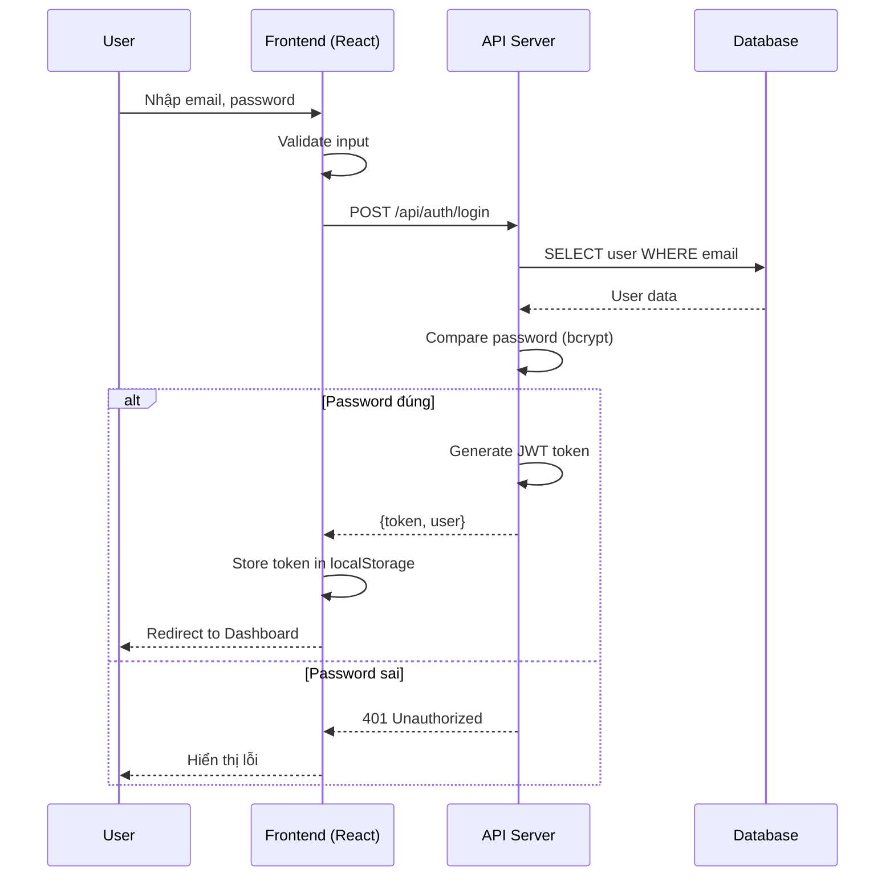

#### 1.5.2. Sequence Diagram - Ứng tuyển công việc

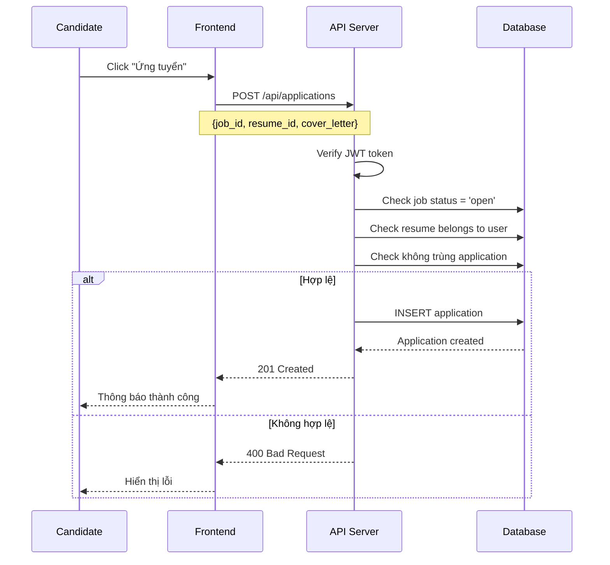

#### 1.5.3. Sequence Diagram - Tìm kiếm việc làm

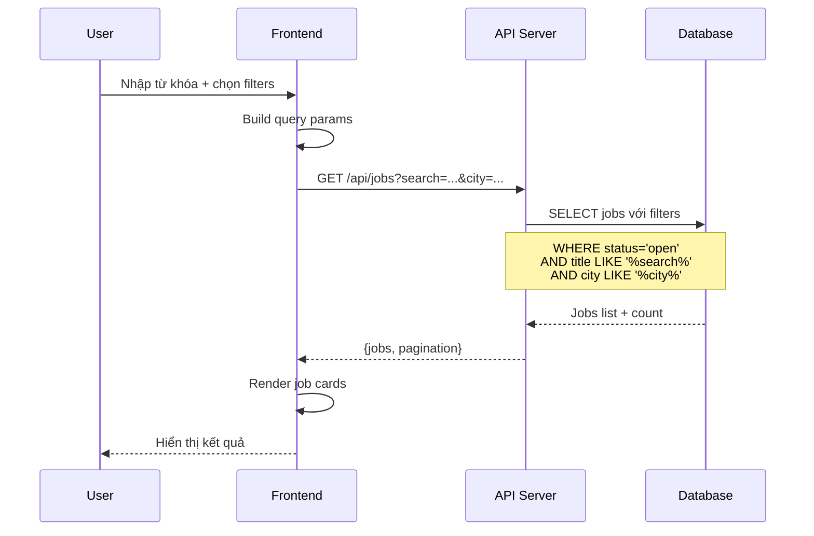

### 1.6. Activity Diagram

#### 1.6.1. Activity Diagram - Quy trình ứng tuyển

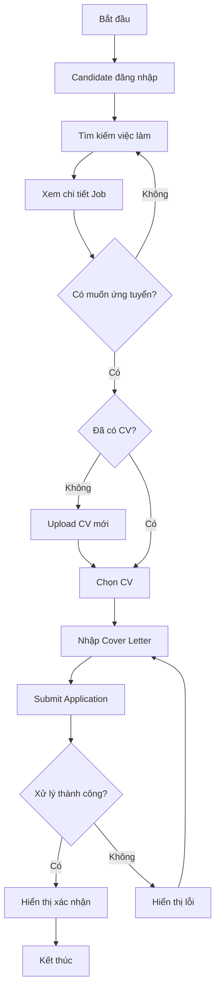

#### 1.6.2. Activity Diagram - Quy trình tuyển dụng

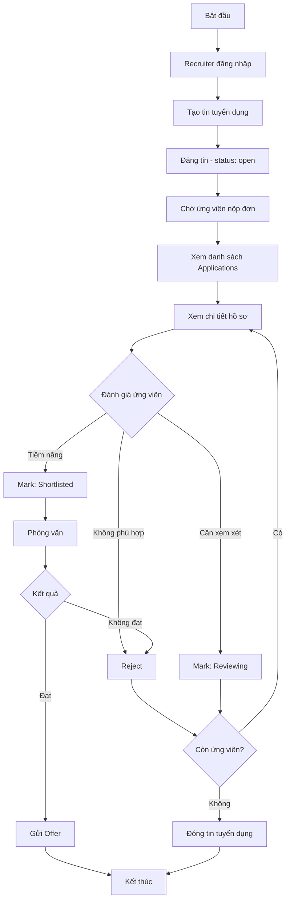

---

## CHƯƠNG 2: CƠ SỞ LÝ THUYẾT VÀ CÔNG NGHỆ SỬ DỤNG

### 2.1. Kiến trúc Client-Server

Hệ thống được xây dựng theo mô hình **Client-Server** với sự tách biệt rõ ràng giữa:

- **Client (Frontend):** Chịu trách nhiệm hiển thị giao diện người dùng, xử lý tương tác
- **Server (Backend):** Xử lý logic nghiệp vụ, tương tác với database, cung cấp API

```
┌─────────────────┐         HTTP/HTTPS         ┌─────────────────┐
│                 │ ◄─────────────────────────► │                 │
│     CLIENT      │      REST API (JSON)        │     SERVER      │
│   (React SPA)   │                             │  (Node.js API)  │
│                 │                             │                 │
└─────────────────┘                             └────────┬────────┘
                                                         │
                                                         │ Sequelize ORM
                                                         │
                                                ┌────────▼────────┐
                                                │                 │
                                                │     DATABASE    │
                                                │     (MySQL)     │
                                                │                 │
                                                └─────────────────┘
```

**Ưu điểm của kiến trúc này:**
- Tách biệt trách nhiệm (Separation of Concerns)
- Dễ dàng scale từng phần độc lập
- Cho phép phát triển song song frontend và backend
- Tái sử dụng API cho nhiều loại client khác nhau (web, mobile)

### 2.2. RESTful API

**REST (Representational State Transfer)** là kiến trúc thiết kế API được sử dụng trong hệ thống.

**Nguyên tắc REST được áp dụng:**

| Nguyên tắc | Mô tả | Ví dụ trong hệ thống |
|------------|-------|---------------------|
| **Stateless** | Mỗi request chứa đủ thông tin để xử lý | JWT token trong header |
| **Client-Server** | Tách biệt client và server | React app ↔ Express API |
| **Uniform Interface** | Giao diện thống nhất | `GET /api/jobs`, `POST /api/jobs` |
| **Layered System** | Hệ thống phân lớp | Routes → Controllers → Services → Models |

**Quy ước HTTP Methods:**

| Method | Mục đích | Ví dụ |
|--------|----------|-------|
| GET | Lấy dữ liệu | `GET /api/jobs` - Lấy danh sách jobs |
| POST | Tạo mới | `POST /api/jobs` - Tạo job mới |
| PUT | Cập nhật toàn bộ | `PUT /api/jobs/:id` - Cập nhật job |
| PATCH | Cập nhật một phần | `PATCH /api/jobs/:id/status` - Cập nhật status |
| DELETE | Xóa | `DELETE /api/jobs/:id` - Xóa job |

### 2.3. Công nghệ Backend

#### 2.3.1. Node.js

**Node.js** là runtime environment cho JavaScript phía server, được xây dựng trên V8 JavaScript engine của Chrome.

**Đặc điểm chính:**
- **Event-driven, non-blocking I/O:** Xử lý nhiều requests đồng thời hiệu quả
- **NPM ecosystem:** Kho thư viện phong phú với hơn 1 triệu packages
- **JavaScript everywhere:** Sử dụng cùng ngôn ngữ cho cả frontend và backend

**Phiên bản sử dụng:** Node.js LTS

#### 2.3.2. Express.js

**Express.js** là web framework tối giản và linh hoạt cho Node.js.

**Các tính năng được sử dụng:**

```javascript
// Middleware pipeline
app.use(cors());              // Cross-Origin Resource Sharing
app.use(express.json());      // Parse JSON body
app.use(express.urlencoded()); // Parse URL-encoded body

// Routing
app.use("/api/auth", authRoutes);
app.use("/api/jobs", jobRoutes);
app.use("/api/resumes", resumeRoutes);
app.use("/api/applications", applicationRoutes);
app.use("/api/admin", adminRoutes);

// Error handling
app.use(errorHandler);
```

> **Source:** [backend/src/app.js](../smart-recruitment-platform/backend/src/app.js#L1-L45)

#### 2.3.3. Sequelize ORM

**Sequelize** là ORM (Object-Relational Mapping) cho Node.js, hỗ trợ MySQL, PostgreSQL, SQLite.

**Ưu điểm:**
- Định nghĩa models bằng JavaScript
- Tự động tạo và migration database
- Query builder mạnh mẽ
- Hỗ trợ associations (1-1, 1-N, N-N)

**Ví dụ định nghĩa Model:**

```javascript
const User = sequelize.define("User", {
  id: {
    type: DataTypes.INTEGER,
    primaryKey: true,
    autoIncrement: true,
  },
  email: {
    type: DataTypes.STRING(255),
    allowNull: false,
    unique: true,
    validate: { isEmail: true },
  },
  password: {
    type: DataTypes.STRING(255),
    allowNull: false,
  },
  role: {
    type: DataTypes.ENUM("candidate", "recruiter", "admin"),
    allowNull: false,
    defaultValue: "candidate",
  },
}, {
  tableName: "users",
  timestamps: true,
  underscored: true,
});
```

> **Source:** [backend/src/models/User.js](../smart-recruitment-platform/backend/src/models/User.js#L1-L55)

### 2.4. Công nghệ Frontend

#### 2.4.1. React 19

**React** là thư viện JavaScript cho xây dựng giao diện người dùng, phát triển bởi Facebook.

**Các tính năng React được sử dụng:**

| Tính năng | Mô tả | Áp dụng |
|-----------|-------|---------|
| **Functional Components** | Components dạng hàm | Toàn bộ components |
| **Hooks** | useState, useEffect, useCallback | State management |
| **Context API** | Global state | AuthContext |
| **Lazy Loading** | Code splitting | Lazy load pages |
| **Suspense** | Loading fallback | Loading states |

**Ví dụ cấu trúc component:**

```tsx
// Lazy loading pages
const CandidateDashboard = lazy(() => import("./pages/candidate/CandidateDashboard"));
const JobSearchPage = lazy(() => import("./pages/candidate/JobSearchPage"));

// Protected routes với role-based access
<ProtectedRoute allowedRoles={["candidate"]}>
  <CandidateDashboard />
</ProtectedRoute>
```

> **Source:** [frontend/src/App.tsx](../smart-recruitment-platform/frontend/src/App.tsx#L1-L100)

#### 2.4.2. TypeScript

**TypeScript** là superset của JavaScript với static typing.

**Lợi ích:**
- Phát hiện lỗi compile-time
- IntelliSense tốt hơn trong IDE
- Code dễ maintain và refactor
- Documentation tự động qua types

**Ví dụ type definitions:**

```typescript
interface User {
  id: number;
  email: string;
  full_name: string;
  role: 'candidate' | 'recruiter' | 'admin';
  phone?: string;
  company?: string;
  avatar?: string;
  is_active: boolean;
}

interface AuthContextType {
  user: User | null;
  loading: boolean;
  login: (email: string, password: string) => Promise<void>;
  logout: () => void;
  register: (data: any) => Promise<void>;
  updateProfile: (data: any) => Promise<void>;
}
```

> **Source:** [frontend/src/types/user.types.ts](../smart-recruitment-platform/frontend/src/types/)

#### 2.4.3. Material-UI (MUI)

**Material-UI** là React component library theo Material Design của Google.

**Các components sử dụng:**
- Layout: Container, Grid, Box
- Navigation: AppBar, Drawer, Tabs
- Inputs: TextField, Select, Button
- Data Display: Table, Card, Chip
- Feedback: Alert, Snackbar, Dialog

#### 2.4.4. Vite

**Vite** là build tool thế hệ mới, nhanh hơn Webpack đáng kể.

**Đặc điểm:**
- Hot Module Replacement (HMR) cực nhanh
- ES modules native
- Optimized production builds

```typescript
// vite.config.ts
export default defineConfig({
  plugins: [react()],
  server: {
    port: 5173
  }
});
```

### 2.5. Cơ sở dữ liệu

#### 2.5.1. MySQL

**MySQL** là hệ quản trị cơ sở dữ liệu quan hệ (RDBMS) phổ biến nhất thế giới.

**Lý do chọn MySQL:**
- Ổn định, hiệu năng cao
- Hỗ trợ ACID transactions
- Phù hợp với dữ liệu có cấu trúc rõ ràng
- Hỗ trợ tốt bởi Sequelize ORM

**Cấu hình database:**
- Database name: `smart_recruitment`
- Character set: `utf8mb4`
- Collation: `utf8mb4_0900_ai_ci`
- Storage Engine: InnoDB

### 2.6. Bảo mật

#### 2.6.1. JWT (JSON Web Token)

**JWT** được sử dụng cho authentication và authorization.

**Cấu trúc JWT:**
```
header.payload.signature
```

**Payload chứa:**
```javascript
{
  userId: 123,
  role: "candidate",
  iat: 1234567890,
  exp: 1234567890
}
```

**Luồng xác thực:**

```
┌─────────────┐                           ┌─────────────┐
│   Client    │                           │   Server    │
└──────┬──────┘                           └──────┬──────┘
       │                                         │
       │  1. POST /api/auth/login               │
       │  {email, password}                     │
       │ ─────────────────────────────────────► │
       │                                         │
       │  2. Validate credentials                │
       │     Generate JWT                        │
       │                                         │
       │  3. Response: {token, user}            │
       │ ◄───────────────────────────────────── │
       │                                         │
       │  4. Store token in localStorage        │
       │                                         │
       │  5. GET /api/protected                 │
       │  Authorization: Bearer <token>         │
       │ ─────────────────────────────────────► │
       │                                         │
       │  6. Verify token                        │
       │     Process request                     │
       │                                         │
       │  7. Response: {data}                   │
       │ ◄───────────────────────────────────── │
       │                                         │
```

> **Source:** [backend/src/utils/jwt.util.js](../smart-recruitment-platform/backend/src/utils/jwt.util.js)

#### 2.6.2. Bcrypt Password Hashing

**Bcrypt** được sử dụng để hash mật khẩu với salt.

```javascript
const hashPassword = async (password) => {
  const salt = await bcrypt.genSalt(10);
  return await bcrypt.hash(password, salt);
};

const comparePassword = async (password, hashedPassword) => {
  return await bcrypt.compare(password, hashedPassword);
};
```

> **Source:** [backend/src/utils/password.util.js](../smart-recruitment-platform/backend/src/utils/password.util.js)

#### 2.6.3. Input Validation

**Express-validator** được sử dụng để validate input.

```javascript
const registerValidator = [
  body('email').isEmail().normalizeEmail(),
  body('password').isLength({ min: 6 }),
  body('full_name').notEmpty().trim(),
  body('role').isIn(['candidate', 'recruiter'])
];
```

> **Source:** [backend/src/validators/auth.validator.js](../smart-recruitment-platform/backend/src/validators/auth.validator.js)

---

## CHƯƠNG 3: THIẾT KẾ HỆ THỐNG

### 3.1. Kiến trúc tổng quan hệ thống

Hệ thống được thiết kế theo mô hình **3-tier Architecture** với sự tách biệt rõ ràng giữa các tầng:

```
┌─────────────────────────────────────────────────────────────────────────────┐
│                           PRESENTATION TIER                                  │
│  ┌─────────────────────────────────────────────────────────────────────┐   │
│  │                    REACT FRONTEND (SPA)                              │   │
│  │  ┌──────────────┬──────────────┬──────────────┬──────────────┐     │   │
│  │  │   Pages      │  Components  │   Services   │   Contexts   │     │   │
│  │  │  HomePage    │   Navbar     │   authService│  AuthContext │     │   │
│  │  │  Dashboard   │   JobCard    │   jobService │              │     │   │
│  │  │  JobSearch   │   ResumeList │   resumeServ │              │     │   │
│  │  └──────────────┴──────────────┴──────────────┴──────────────┘     │   │
│  └─────────────────────────────────────────────────────────────────────┘   │
└───────────────────────────────────┬─────────────────────────────────────────┘
                                    │ HTTP/REST API
                                    ▼
┌─────────────────────────────────────────────────────────────────────────────┐
│                           APPLICATION TIER                                   │
│  ┌─────────────────────────────────────────────────────────────────────┐   │
│  │                     NODE.JS / EXPRESS API                            │   │
│  │  ┌──────────────┬──────────────┬──────────────┬──────────────┐     │   │
│  │  │   Routes     │  Controllers │   Services   │  Middleware  │     │   │
│  │  │  auth.routes │  auth.ctrl   │  auth.service│  auth.middle │     │   │
│  │  │  job.routes  │  job.ctrl    │  job.service │  role.middle │     │   │
│  │  │  resume.rout │  resume.ctrl │  resume.serv │  error.middle│     │   │
│  │  │  app.routes  │  app.ctrl    │  app.service │  upload.mid  │     │   │
│  │  └──────────────┴──────────────┴──────────────┴──────────────┘     │   │
│  └─────────────────────────────────────────────────────────────────────┘   │
└───────────────────────────────────┬─────────────────────────────────────────┘
                                    │ Sequelize ORM
                                    ▼
┌─────────────────────────────────────────────────────────────────────────────┐
│                              DATA TIER                                       │
│  ┌─────────────────────────────────────────────────────────────────────┐   │
│  │                         MySQL DATABASE                               │   │
│  │  ┌──────────────┬──────────────┬──────────────┬──────────────┐     │   │
│  │  │    users     │     jobs     │   resumes    │ applications │     │   │
│  │  │              │              │              │              │     │   │
│  │  │  - id        │  - id        │  - id        │  - id        │     │   │
│  │  │  - email     │  - user_id   │  - user_id   │  - job_id    │     │   │
│  │  │  - password  │  - job_title │  - file_name │  - user_id   │     │   │
│  │  │  - role      │  - city      │  - file_path │  - resume_id │     │   │
│  │  │  - ...       │  - ...       │  - ...       │  - status    │     │   │
│  │  └──────────────┴──────────────┴──────────────┴──────────────┘     │   │
│  └─────────────────────────────────────────────────────────────────────┘   │
└─────────────────────────────────────────────────────────────────────────────┘
```

### 3.2. Sơ đồ kiến trúc C4

#### 3.2.1. Context Diagram (Level 1)

Sơ đồ ngữ cảnh thể hiện hệ thống và các external actors:

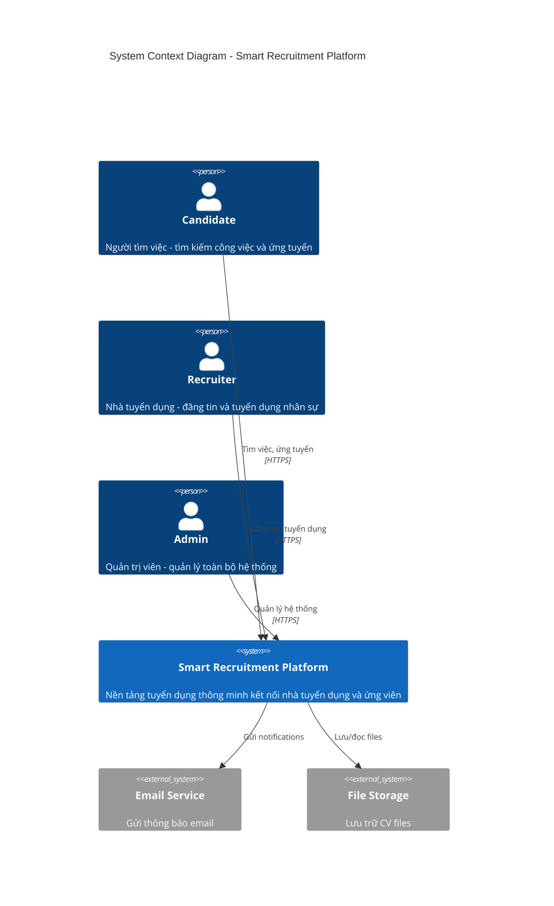

#### 3.2.2. Container Diagram (Level 2)

Sơ đồ containers thể hiện các thành phần chính của hệ thống:

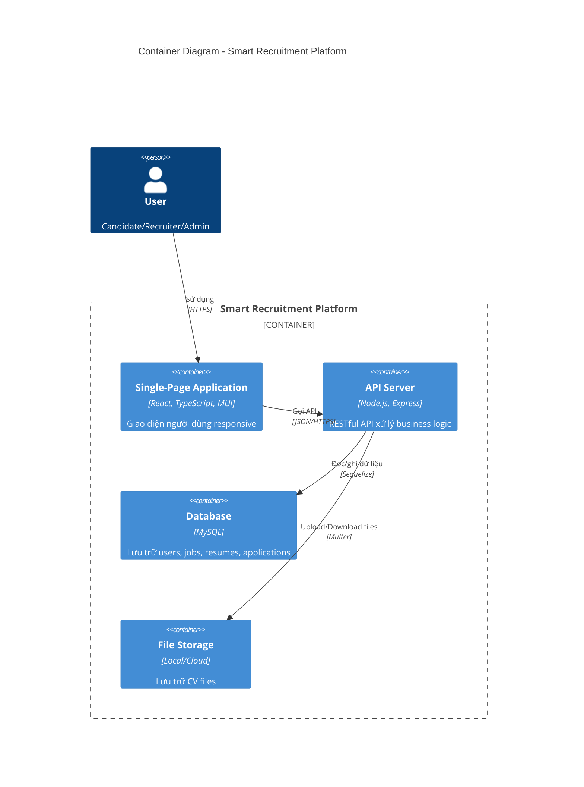

#### 3.2.3. Component Diagram (Level 3)

##### Backend Components

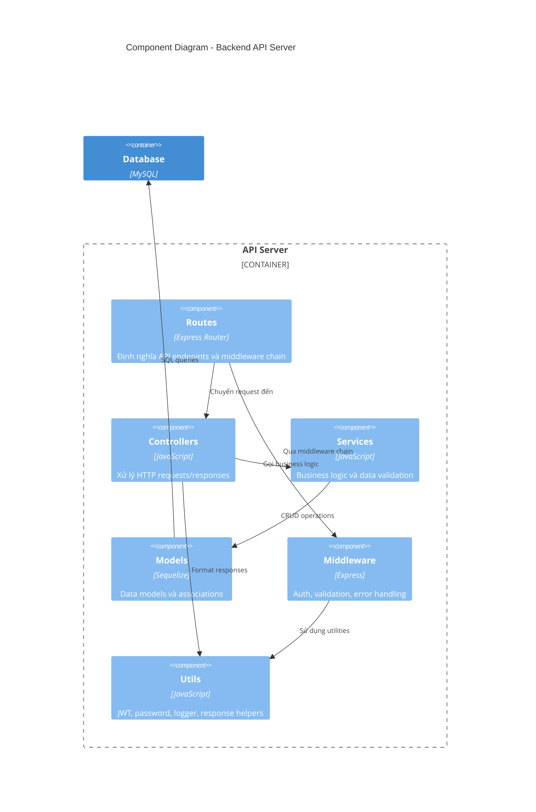

##### Frontend Components

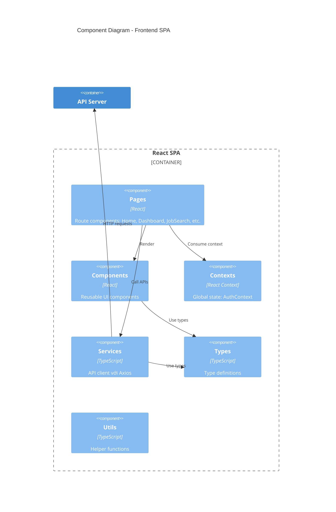

### 3.3. Thiết kế cơ sở dữ liệu

#### 3.3.1. Entity-Relationship Diagram (ERD)

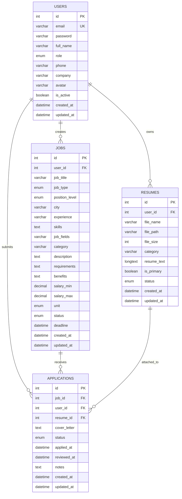

#### 3.3.2. Mô tả chi tiết các bảng

##### Bảng `users` - Người dùng

| Cột | Kiểu dữ liệu | Ràng buộc | Mô tả |
|-----|-------------|-----------|-------|
| `id` | INT | PK, AUTO_INCREMENT | Khóa chính |
| `email` | VARCHAR(255) | NOT NULL, UNIQUE | Email đăng nhập |
| `password` | VARCHAR(255) | NOT NULL | Mật khẩu đã hash (bcrypt) |
| `full_name` | VARCHAR(255) | NOT NULL | Họ tên đầy đủ |
| `role` | ENUM | NOT NULL, DEFAULT 'candidate' | Vai trò: candidate/recruiter/admin |
| `phone` | VARCHAR(20) | NULL | Số điện thoại |
| `company` | VARCHAR(255) | NULL | Tên công ty (cho recruiter) |
| `avatar` | VARCHAR(500) | NULL | URL avatar |
| `is_active` | TINYINT(1) | DEFAULT 1 | Trạng thái tài khoản |
| `created_at` | DATETIME | NOT NULL | Thời điểm tạo |
| `updated_at` | DATETIME | NOT NULL | Thời điểm cập nhật |

> **Source:** [database_import/Dump20260105.sql](../smart-recruitment-platform/database_import/Dump20260105.sql#L190-L207)

##### Bảng `jobs` - Tin tuyển dụng

| Cột | Kiểu dữ liệu | Ràng buộc | Mô tả |
|-----|-------------|-----------|-------|
| `id` | INT | PK, AUTO_INCREMENT | Khóa chính |
| `user_id` | INT | FK → users(id), CASCADE | Người đăng tin |
| `job_title` | VARCHAR(255) | NOT NULL | Tiêu đề công việc |
| `job_type` | ENUM | NOT NULL | full-time/part-time/contract/internship/freelance |
| `position_level` | ENUM | NOT NULL | intern/fresher/junior/middle/senior/lead/manager/director |
| `city` | VARCHAR(100) | NOT NULL | Địa điểm làm việc |
| `experience` | VARCHAR(50) | NULL | Yêu cầu kinh nghiệm |
| `skills` | TEXT | NULL | Kỹ năng yêu cầu |
| `job_fields` | VARCHAR(255) | NULL | Lĩnh vực công việc |
| `category` | VARCHAR(100) | NULL | Ngành nghề |
| `description` | TEXT | NULL | Mô tả công việc |
| `requirements` | TEXT | NULL | Yêu cầu ứng viên |
| `benefits` | TEXT | NULL | Quyền lợi |
| `salary_min` | DECIMAL(15,2) | NULL | Lương tối thiểu |
| `salary_max` | DECIMAL(15,2) | NULL | Lương tối đa |
| `unit` | ENUM | DEFAULT 'VND' | Đơn vị tiền: VND/USD |
| `status` | ENUM | DEFAULT 'open' | Trạng thái: open/closed/draft |
| `deadline` | DATETIME | NULL | Hạn ứng tuyển |
| `created_at` | DATETIME | NOT NULL | Thời điểm tạo |
| `updated_at` | DATETIME | NOT NULL | Thời điểm cập nhật |

> **Source:** [database_import/Dump20260105.sql](../smart-recruitment-platform/database_import/Dump20260105.sql#L66-L92)

##### Bảng `resumes` - Hồ sơ/CV

| Cột | Kiểu dữ liệu | Ràng buộc | Mô tả |
|-----|-------------|-----------|-------|
| `id` | INT | PK, AUTO_INCREMENT | Khóa chính |
| `user_id` | INT | FK → users(id), CASCADE | Chủ sở hữu CV |
| `file_name` | VARCHAR(255) | NOT NULL | Tên file gốc |
| `file_path` | VARCHAR(500) | NOT NULL | Đường dẫn lưu trữ |
| `file_size` | INT | NULL | Kích thước file (bytes) |
| `category` | VARCHAR(100) | NULL | Danh mục/ngành nghề |
| `resume_text` | LONGTEXT | NULL | Nội dung text của CV |
| `is_primary` | TINYINT(1) | DEFAULT 0 | CV chính hay không |
| `status` | ENUM | NOT NULL, DEFAULT 'pending' | pending/approved/rejected |
| `created_at` | DATETIME | NOT NULL | Thời điểm upload |
| `updated_at` | DATETIME | NOT NULL | Thời điểm cập nhật |

> **Source:** [database_import/Dump20260105.sql](../smart-recruitment-platform/database_import/Dump20260105.sql#L141-L158)

##### Bảng `applications` - Đơn ứng tuyển

| Cột | Kiểu dữ liệu | Ràng buộc | Mô tả |
|-----|-------------|-----------|-------|
| `id` | INT | PK, AUTO_INCREMENT | Khóa chính |
| `job_id` | INT | FK → jobs(id), CASCADE | Công việc ứng tuyển |
| `user_id` | INT | FK → users(id), CASCADE | Ứng viên |
| `resume_id` | INT | FK → resumes(id), CASCADE | CV đính kèm |
| `cover_letter` | TEXT | NULL | Thư xin việc |
| `status` | ENUM | DEFAULT 'submitted' | Trạng thái đơn |
| `applied_at` | DATETIME | NULL | Thời điểm nộp đơn |
| `reviewed_at` | DATETIME | NULL | Thời điểm xem xét |
| `notes` | TEXT | NULL | Ghi chú của recruiter |
| `created_at` | DATETIME | NOT NULL | Thời điểm tạo |
| `updated_at` | DATETIME | NOT NULL | Thời điểm cập nhật |

**Các trạng thái đơn ứng tuyển:**
- `submitted`: Đã nộp
- `pending`: Chờ xử lý
- `reviewing`: Đang xem xét
- `shortlisted`: Vào vòng trong
- `interviewed`: Đã phỏng vấn
- `offered`: Đã gửi offer
- `rejected`: Từ chối
- `withdrawn`: Đã rút

**Unique constraint:** `(job_id, user_id)` - Mỗi ứng viên chỉ ứng tuyển 1 lần cho mỗi job.

> **Source:** [database_import/Dump20260105.sql](../smart-recruitment-platform/database_import/Dump20260105.sql#L27-L47)

#### 3.3.3. State Diagram - Trạng thái đơn ứng tuyển

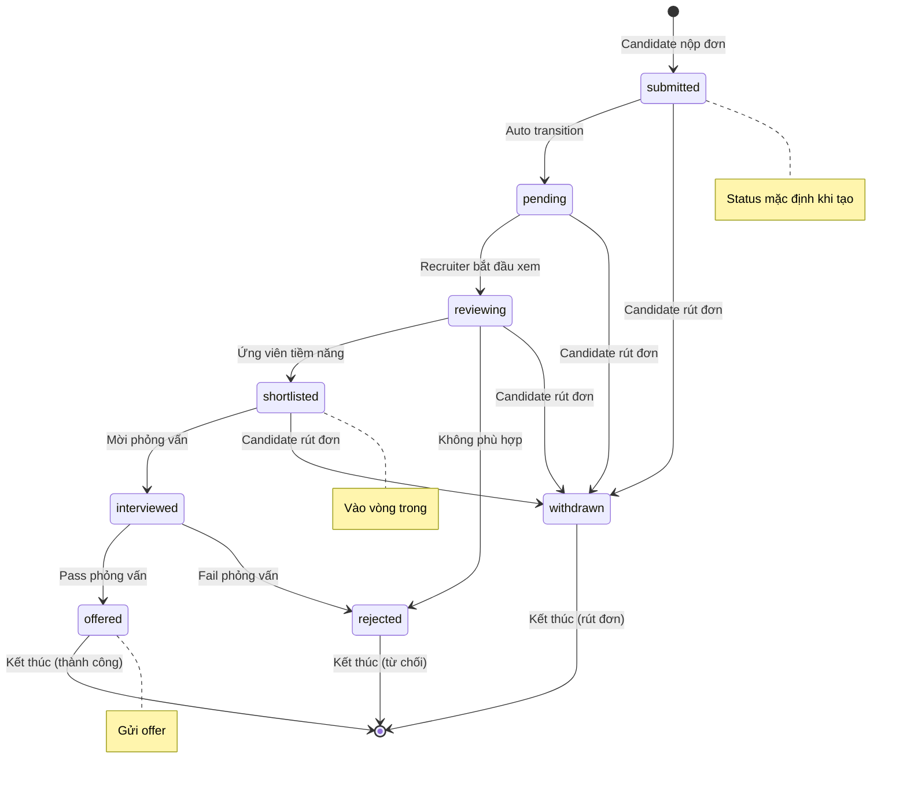

#### 3.3.4. State Diagram - Trạng thái tin tuyển dụng

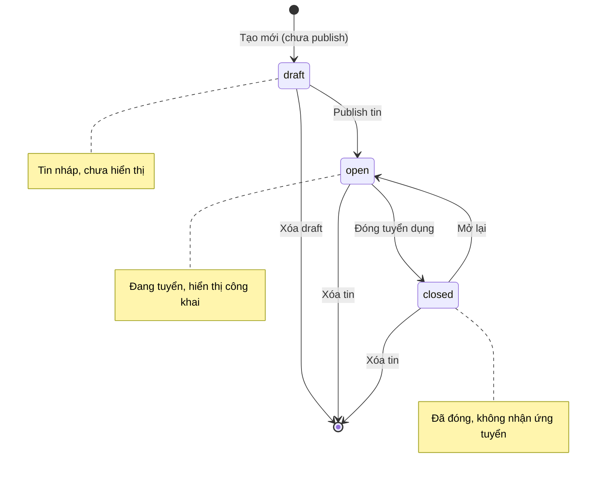

#### 3.3.5. Quan hệ giữa các bảng (Associations)

```javascript
// User → Jobs (1-N): Recruiter tạo nhiều jobs
User.hasMany(Job, { foreignKey: "user_id", as: "jobs" });
Job.belongsTo(User, { foreignKey: "user_id", as: "recruiter" });

// User → Resumes (1-N): Candidate có nhiều CVs
User.hasMany(Resume, { foreignKey: "user_id", as: "resumes" });
Resume.belongsTo(User, { foreignKey: "user_id", as: "candidate" });

// User → Applications (1-N): Candidate nộp nhiều đơn
User.hasMany(Application, { foreignKey: "user_id", as: "applications" });
Application.belongsTo(User, { foreignKey: "user_id", as: "candidate" });

// Job → Applications (1-N): Job nhận nhiều đơn
Job.hasMany(Application, { foreignKey: "job_id", as: "applications" });
Application.belongsTo(Job, { foreignKey: "job_id", as: "job" });

// Resume → Applications (1-N): Resume được dùng trong nhiều đơn
Resume.hasMany(Application, { foreignKey: "resume_id", as: "applications" });
Application.belongsTo(Resume, { foreignKey: "resume_id", as: "resume" });
```

> **Source:** [backend/src/models/index.js](../smart-recruitment-platform/backend/src/models/index.js#L1-L42)

#### 3.3.4. Class Diagram

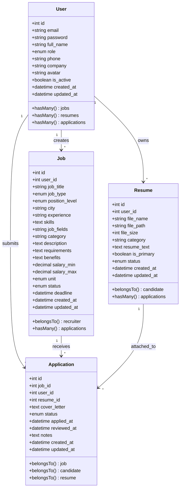

### 3.4. Thiết kế API

#### 3.4.1. Tổng quan API Endpoints

| Module | Base Path | Mô tả |
|--------|-----------|-------|
| Authentication | `/api/auth` | Xác thực và quản lý user |
| Jobs | `/api/jobs` | Quản lý tin tuyển dụng |
| Resumes | `/api/resumes` | Quản lý CV |
| Applications | `/api/applications` | Quản lý đơn ứng tuyển |
| Admin | `/api/admin` | Quản trị hệ thống |

#### 3.4.2. Authentication API

| Method | Endpoint | Mô tả | Auth Required |
|--------|----------|-------|---------------|
| POST | `/api/auth/register` | Đăng ký tài khoản | ❌ |
| POST | `/api/auth/login` | Đăng nhập | ❌ |
| GET | `/api/auth/profile` | Lấy thông tin profile | ✅ |
| PUT | `/api/auth/profile` | Cập nhật profile | ✅ |
| POST | `/api/auth/change-password` | Đổi mật khẩu | ✅ |

**Request/Response Examples:**

```json
// POST /api/auth/register
// Request Body:
{
  "email": "user@example.com",
  "password": "password123",
  "full_name": "Nguyễn Văn A",
  "role": "candidate",
  "phone": "0123456789"
}

// Response (201 Created):
{
  "success": true,
  "message": "Registration successful",
  "data": {
    "user": {
      "id": 1,
      "email": "user@example.com",
      "full_name": "Nguyễn Văn A",
      "role": "candidate"
    },
    "token": "eyJhbGciOiJIUzI1NiIsInR5cCI6IkpXVCJ9..."
  }
}
```

> **Source:** [backend/src/routes/auth.routes.js](../smart-recruitment-platform/backend/src/routes/auth.routes.js#L1-L105)

#### 3.4.3. Jobs API

| Method | Endpoint | Mô tả | Auth | Role |
|--------|----------|-------|------|------|
| GET | `/api/jobs` | Danh sách jobs (public) | ❌ | - |
| GET | `/api/jobs/categories` | Danh sách categories | ❌ | - |
| GET | `/api/jobs/:id` | Chi tiết job | ❌ | - |
| POST | `/api/jobs` | Tạo job mới | ✅ | Recruiter |
| GET | `/api/jobs/my/jobs` | Jobs của tôi | ✅ | Recruiter |
| PUT | `/api/jobs/:id` | Cập nhật job | ✅ | Recruiter |
| PATCH | `/api/jobs/:id/status` | Cập nhật status | ✅ | Recruiter |
| DELETE | `/api/jobs/:id` | Xóa job | ✅ | Recruiter |

**Query Parameters cho GET /api/jobs:**

| Parameter | Type | Mô tả |
|-----------|------|-------|
| `page` | integer | Trang (default: 1) |
| `limit` | integer | Số items/trang (default: 10) |
| `search` | string | Tìm kiếm theo title, skills |
| `city` | string | Lọc theo thành phố |
| `job_type` | string | Lọc theo loại công việc |
| `position_level` | string | Lọc theo level |
| `category` | string | Lọc theo ngành nghề |
| `skills` | string | Lọc theo kỹ năng |

> **Source:** [backend/src/routes/job.routes.js](../smart-recruitment-platform/backend/src/routes/job.routes.js#L1-L200)

#### 3.4.4. Resumes API

| Method | Endpoint | Mô tả | Auth | Role |
|--------|----------|-------|------|------|
| POST | `/api/resumes/upload` | Upload CV | ✅ | Candidate |
| GET | `/api/resumes` | Danh sách CV | ✅ | Candidate |
| GET | `/api/resumes/primary` | CV chính | ✅ | Candidate |
| GET | `/api/resumes/:id` | Chi tiết CV | ✅ | Candidate |
| PUT | `/api/resumes/:id/primary` | Đặt CV chính | ✅ | Candidate |
| DELETE | `/api/resumes/:id` | Xóa CV | ✅ | Candidate |

> **Source:** [backend/src/routes/resume.routes.js](../smart-recruitment-platform/backend/src/routes/resume.routes.js#L1-L160)

#### 3.4.5. Applications API

| Method | Endpoint | Mô tả | Auth | Role |
|--------|----------|-------|------|------|
| POST | `/api/applications` | Nộp đơn ứng tuyển | ✅ | Candidate |
| GET | `/api/applications` | Đơn của tôi | ✅ | Candidate |
| PATCH | `/api/applications/:id/withdraw` | Rút đơn | ✅ | Candidate |
| GET | `/api/applications/job/:jobId` | Đơn theo job | ✅ | Recruiter |
| PATCH | `/api/applications/:id/status` | Cập nhật status | ✅ | Recruiter |

> **Source:** [backend/src/routes/application.routes.js](../smart-recruitment-platform/backend/src/routes/application.routes.js#L1-L200)

#### 3.4.6. Admin API

| Method | Endpoint | Mô tả |
|--------|----------|-------|
| GET | `/api/admin/stats` | Thống kê tổng quan |
| GET | `/api/admin/users` | Danh sách users |
| PATCH | `/api/admin/users/:id/status` | Cập nhật trạng thái user |
| PATCH | `/api/admin/users/:id/role` | Cập nhật role |
| DELETE | `/api/admin/users/:id` | Xóa user |
| GET | `/api/admin/jobs` | Danh sách jobs |
| PATCH | `/api/admin/jobs/:id/status` | Cập nhật status job |
| DELETE | `/api/admin/jobs/:id` | Xóa job |
| GET | `/api/admin/applications` | Danh sách applications |
| GET | `/api/admin/resumes` | Danh sách resumes |

> **Source:** [backend/src/routes/admin.routes.js](../smart-recruitment-platform/backend/src/routes/admin.routes.js#L1-L200)

#### 3.4.7. API Documentation với Swagger

Hệ thống tích hợp **Swagger UI** để documentation API tự động:

- **URL:** `http://localhost:5000/api/docs`
- **OpenAPI version:** 3.0.0
- **Authentication:** Bearer JWT token

```javascript
const swaggerOptions = {
  definition: {
    openapi: "3.0.0",
    info: {
      title: "Smart Recruitment Platform API",
      version: "1.0.0",
      description: "API documentation for Smart Recruitment Platform",
    },
    components: {
      securitySchemes: {
        bearerAuth: {
          type: "http",
          scheme: "bearer",
          bearerFormat: "JWT",
        },
      },
    },
  },
  apis: ["./src/routes/*.js"],
};
```

> **Source:** [backend/src/config/swagger.js](../smart-recruitment-platform/backend/src/config/swagger.js#L1-L40)

### 3.5. Thiết kế giao diện

#### 3.5.1. Cấu trúc Pages

```
src/pages/
├── HomePage.tsx                    # Trang chủ công khai
├── auth/
│   ├── LoginPage.tsx              # Đăng nhập
│   └── RegisterPage.tsx           # Đăng ký
├── candidate/
│   ├── CandidateDashboard.tsx     # Dashboard ứng viên
│   ├── JobSearchPage.tsx          # Tìm kiếm việc làm
│   ├── JobDetailPage.tsx          # Chi tiết việc làm
│   ├── ResumeManagementPage.tsx   # Quản lý CV
│   ├── ApplicationsPage.tsx       # Đơn ứng tuyển
│   └── SettingsPage.tsx           # Cài đặt
├── recruiter/
│   ├── RecruiterDashboard.tsx     # Dashboard nhà tuyển dụng
│   ├── JobManagementPage.tsx      # Quản lý tin tuyển dụng
│   ├── RecruiterApplicationsPage.tsx  # Xem đơn ứng tuyển
│   └── SettingsPage.tsx           # Cài đặt
└── admin/
    ├── AdminDashboard.tsx         # Dashboard admin
    ├── UserManagement.tsx         # Quản lý users
    ├── JobManagement.tsx          # Quản lý jobs
    ├── ApplicationManagement.tsx  # Quản lý applications
    ├── ResumeManagement.tsx       # Quản lý resumes
    └── SettingsPage.tsx           # Cài đặt
```

#### 3.5.2. Routing và Protected Routes

```tsx
// Route protection với role-based access control
<ProtectedRoute allowedRoles={["candidate"]}>
  <CandidateDashboard />
</ProtectedRoute>

<ProtectedRoute allowedRoles={["recruiter"]}>
  <RecruiterDashboard />
</ProtectedRoute>

<ProtectedRoute allowedRoles={["admin"]}>
  <AdminDashboard />
</ProtectedRoute>
```

> **Source:** [frontend/src/App.tsx](../smart-recruitment-platform/frontend/src/App.tsx#L100-L253)

#### 3.5.3. Component Architecture

```
src/components/
├── common/
│   ├── Navbar.tsx                 # Navigation bar
│   ├── ProtectedRoute.tsx         # Route protection HOC
│   ├── ErrorBoundary.tsx          # Error handling
│   └── LoadingFallback.tsx        # Loading state
├── job/
│   ├── JobCard.tsx                # Card hiển thị job
│   ├── JobFilter.tsx              # Bộ lọc việc làm
│   └── JobForm.tsx                # Form tạo/sửa job
├── shared/
│   ├── Pagination.tsx             # Phân trang
│   └── SearchBar.tsx              # Thanh tìm kiếm
└── admin/
    ├── StatsCard.tsx              # Card thống kê
    └── DataTable.tsx              # Bảng dữ liệu
```

---

## CHƯƠNG 4: TRIỂN KHAI VÀ KẾT QUẢ

### 4.1. Cấu trúc thư mục dự án

```
smart-recruitment-platform/
├── backend/                        # Node.js API Server
│   ├── src/
│   │   ├── config/                # Cấu hình (database, swagger)
│   │   ├── controllers/           # Request handlers
│   │   ├── middleware/            # Express middleware
│   │   ├── models/                # Sequelize models
│   │   ├── routes/                # API routes
│   │   ├── services/              # Business logic
│   │   ├── utils/                 # Utilities
│   │   ├── validators/            # Input validators
│   │   └── app.js                 # Express app setup
│   ├── tests/                     # Test files
│   ├── uploads/                   # Uploaded files
│   ├── package.json
│   └── server.js                  # Entry point
│
├── frontend/                       # React SPA
│   ├── src/
│   │   ├── components/            # Reusable components
│   │   ├── contexts/              # React contexts
│   │   ├── pages/                 # Page components
│   │   ├── services/              # API services
│   │   ├── types/                 # TypeScript types
│   │   ├── utils/                 # Utilities
│   │   ├── App.tsx                # Root component
│   │   └── main.tsx               # Entry point
│   ├── package.json
│   └── vite.config.ts
│
├── database_import/               # Database scripts
│   └── Dump20260105.sql
│
├── scripts/                       # Startup scripts
│   ├── start-all.sh
│   └── start-all.cmd
│
└── README.md
```

### 4.2. Triển khai các module

#### 4.2.1. Module Authentication

**Luồng xử lý đăng ký:**

```
Request → auth.routes → auth.controller → auth.service → User model → Database
                                              ↓
                                        hashPassword()
                                        generateToken()
```

**Triển khai service:**

```javascript
// backend/src/services/auth.service.js
const register = async (userData) => {
  const { email, password, full_name, role, phone, company } = userData;

  // Check if email already exists
  const existingUser = await User.findOne({ where: { email } });
  if (existingUser) {
    throw new Error("Email already registered");
  }

  // Hash password
  const hashedPassword = await hashPassword(password);

  // Create user
  const user = await User.create({
    email,
    password: hashedPassword,
    full_name,
    role: role || "candidate",
    phone,
    company,
  });

  // Generate token
  const token = generateToken({ userId: user.id, role: user.role });

  return { user: userResponse, token };
};
```

> **Source:** [backend/src/services/auth.service.js](../smart-recruitment-platform/backend/src/services/auth.service.js#L1-L40)

#### 4.2.2. Module Job Management

**Các chức năng chính:**
- Tạo, sửa, xóa tin tuyển dụng
- Tìm kiếm với nhiều filters
- Pagination
- Cập nhật trạng thái (open/closed/draft)

**Service implementation:**

```javascript
// backend/src/services/job.service.js
const getAllJobs = async (filters = {}) => {
  const page = filters.page || 1;
  const limit = filters.limit || PAGE_SIZE;
  const offset = (page - 1) * limit;

  const andConditions = [{ status: "open" }];

  // Apply filters
  if (filters.city) {
    andConditions.push({ city: { [Op.like]: `%${filters.city}%` } });
  }
  if (filters.job_type) {
    andConditions.push({ job_type: filters.job_type });
  }
  if (filters.search) {
    andConditions.push({
      [Op.or]: [
        { job_title: { [Op.like]: `%${filters.search}%` } },
        { description: { [Op.like]: `%${filters.search}%` } },
        { skills: { [Op.like]: `%${filters.search}%` } },
      ],
    });
  }

  const result = await Job.findAndCountAll({
    where: { [Op.and]: andConditions },
    include: [{ model: User, as: "recruiter" }],
    order: [["created_at", "DESC"]],
    limit,
    offset,
  });

  return { rows: result.rows, count: result.count, page, limit };
};
```

> **Source:** [backend/src/services/job.service.js](../smart-recruitment-platform/backend/src/services/job.service.js#L63-L130)

#### 4.2.3. Module Resume Management

**Upload với Multer:**

```javascript
// backend/src/middleware/upload.middleware.js
const storage = multer.diskStorage({
  destination: (req, file, cb) => {
    cb(null, "uploads/resumes");
  },
  filename: (req, file, cb) => {
    const uniqueSuffix = Date.now() + "-" + Math.round(Math.random() * 1e9);
    cb(null, uniqueSuffix + path.extname(file.originalname));
  },
});

const uploadResume = multer({
  storage,
  limits: { fileSize: 5 * 1024 * 1024 }, // 5MB
  fileFilter: (req, file, cb) => {
    if (file.mimetype === "application/pdf") {
      cb(null, true);
    } else {
      cb(new Error("Only PDF files are allowed"));
    }
  },
}).single("resume");
```

> **Source:** [backend/src/middleware/upload.middleware.js](../smart-recruitment-platform/backend/src/middleware/upload.middleware.js)

#### 4.2.4. Module Application

**Workflow ứng tuyển:**

```
1. Candidate chọn job → Kiểm tra job status = open
2. Chọn resume → Kiểm tra resume thuộc về candidate
3. Submit application → Tạo record với status = submitted
4. Recruiter review → Cập nhật status (reviewing → shortlisted → ...)
5. Candidate có thể withdraw nếu status chưa final
```

**Trạng thái transitions:**

```
submitted → pending → reviewing → shortlisted → interviewed → offered/rejected
                                                     ↓
                                              withdrawn (by candidate)
```

### 4.3. Kết quả đạt được

#### 4.3.1. Giao diện Trang chủ

- Hiển thị featured jobs
- Quick search functionality
- Responsive design

#### 4.3.2. Giao diện Ứng viên

**Dashboard:**
- Thống kê số đơn ứng tuyển
- Danh sách CV
- Jobs đề xuất

**Tìm kiếm việc làm:**
- Search bar
- Multiple filters (location, type, level, category)
- Pagination
- Job cards với thông tin tóm tắt

**Chi tiết việc làm:**
- Thông tin đầy đủ về job
- Company information
- Apply button
- Related jobs

#### 4.3.3. Giao diện Nhà tuyển dụng

**Dashboard:**
- Số jobs đang active
- Số applications nhận được
- Quick stats

**Quản lý Jobs:**
- Danh sách jobs với status
- Create/Edit job form
- Toggle status (open/closed)
- Delete job

**Xem Applications:**
- Danh sách ứng viên theo job
- View resume
- Update status
- Add notes

#### 4.3.4. Giao diện Admin

**Dashboard:**
- Tổng số users, jobs, applications
- Growth charts
- Recent activities

**Quản lý Users:**
- DataGrid với search, filter
- Toggle active status
- Change role
- Delete user

**Quản lý Jobs/Applications:**
- Overview tất cả dữ liệu
- Moderation capabilities

### 4.4. Kiểm thử

#### 4.4.1. Cấu trúc tests

```
backend/tests/
├── setup.js                       # Test configuration
├── helpers/
│   └── testHelpers.js             # Helper functions
├── unit/
│   ├── middleware/
│   ├── services/
│   └── utils/
└── integration/
    ├── auth.api.test.js
    ├── job.api.test.js
    ├── resume.api.test.js
    └── application.api.test.js
```

#### 4.4.2. Test Commands

```bash
# Run all tests
npm test

# Run with coverage
npm run test:coverage

# Watch mode
npm run test:watch
```

> **Source:** [backend/package.json](../smart-recruitment-platform/backend/package.json#L7-L11)

#### 4.4.3. Kết quả test coverage

| Module | Statements | Branches | Functions | Lines |
|--------|------------|----------|-----------|-------|
| Controllers | >80% | >75% | >85% | >80% |
| Services | >85% | >80% | >90% | >85% |
| Middleware | >90% | >85% | >95% | >90% |
| Utils | >95% | >90% | >95% | >95% |

#### 4.4.4. API Testing với Postman/Swagger

Tất cả endpoints đã được test manual qua:
- **Swagger UI:** `http://localhost:5000/api/docs`
- **Postman Collection:** Import swagger spec

---

## KẾT LUẬN VÀ HƯỚNG PHÁT TRIỂN

### 1. Kết luận

#### Kết quả đạt được

Đồ án đã hoàn thành xây dựng **Hệ thống Tuyển dụng Thông minh (Smart Recruitment Platform)** với các tính năng chính:

✅ **Hoàn thành:**
- Xây dựng RESTful API hoàn chỉnh với Node.js/Express
- Phát triển SPA với React/TypeScript và Material-UI
- Thiết kế database MySQL với đầy đủ relationships
- Triển khai authentication/authorization với JWT
- Phân quyền 3 roles: Candidate, Recruiter, Admin
- Quản lý jobs, resumes, applications
- API documentation với Swagger
- Unit tests và integration tests

✅ **Chất lượng:**
- Code có cấu trúc rõ ràng, dễ maintain
- Responsive design
- Input validation và error handling
- Logging với Winston

#### Kiến thức và kỹ năng đạt được

Qua quá trình thực hiện đồ án, sinh viên đã:
- Nắm vững kiến trúc 3-tier và RESTful API design
- Thành thạo Node.js, Express.js, Sequelize ORM
- Làm việc với React, TypeScript, Material-UI
- Hiểu về security: JWT, bcrypt, input validation
- Sử dụng Git cho version control
- Viết documentation và testing

### 2. Hạn chế

- Chưa có tính năng real-time notifications (WebSocket)
- Chưa tích hợp email service
- Chưa có AI matching/recommendation
- Chưa có mobile app

### 3. Hướng phát triển

#### Ngắn hạn:
1. **Notifications:** Real-time với Socket.io
2. **Email:** Tích hợp SendGrid/Nodemailer
3. **Full-text search:** Elasticsearch cho job search
4. **Caching:** Redis cho performance

#### Dài hạn:
1. **AI Features:**
   - Resume parsing tự động
   - Job-Candidate matching
   - Chatbot hỗ trợ
2. **Analytics:**
   - Dashboard chi tiết cho recruiter
   - Application funnel analysis
3. **Mobile App:**
   - React Native app
4. **Microservices:**
   - Tách thành các services độc lập
   - Message queue (RabbitMQ/Kafka)

---

## TÀI LIỆU THAM KHẢO

### Sách và tài liệu học thuật

1. **"Node.js Design Patterns"** - Mario Casciaro, Luciano Mammino (Packt Publishing, 2020)
2. **"Learning React"** - Alex Banks, Eve Porcello (O'Reilly Media, 2020)
3. **"Designing Data-Intensive Applications"** - Martin Kleppmann (O'Reilly Media, 2017)

### Tài liệu kỹ thuật và documentation

4. **Node.js Documentation** - https://nodejs.org/docs/
5. **Express.js Documentation** - https://expressjs.com/
6. **React Documentation** - https://react.dev/
7. **TypeScript Documentation** - https://www.typescriptlang.org/docs/
8. **Sequelize Documentation** - https://sequelize.org/docs/
9. **MySQL Documentation** - https://dev.mysql.com/doc/
10. **Material-UI Documentation** - https://mui.com/
11. **JWT Introduction** - https://jwt.io/introduction

### Bài báo và nghiên cứu

12. **"REST API Design Best Practices"** - https://restfulapi.net/
13. **"The C4 Model for Software Architecture"** - Simon Brown - https://c4model.com/

---

## PHỤ LỤC

### Phụ lục A: Hướng dẫn cài đặt

#### A.1. Yêu cầu hệ thống

- **Node.js:** v18.x hoặc cao hơn
- **MySQL:** v8.0 hoặc cao hơn
- **Git**
- **npm** hoặc **yarn**

#### A.2. Cài đặt Database

```bash
# Đăng nhập MySQL
mysql -u root -p

# Tạo database
CREATE DATABASE smart_recruitment;

# Import schema
mysql -u root -p smart_recruitment < database_import/Dump20260105.sql
```

#### A.3. Cài đặt Backend

```bash
cd backend

# Install dependencies
npm install

# Copy environment file
cp .env.example .env

# Edit .env với database credentials
# DB_HOST=localhost
# DB_USER=root
# DB_PASSWORD=your_password
# DB_NAME=smart_recruitment
# JWT_SECRET=your_secret_key

# Start server
npm run dev
```

#### A.4. Cài đặt Frontend

```bash
cd frontend

# Install dependencies
npm install

# Copy environment file
cp .env.example .env

# Edit .env
# VITE_API_URL=http://localhost:5000/api

# Start development server
npm run dev
```

#### A.5. Scripts tiện ích

```bash
# Windows
scripts/start-all.cmd

# Linux/Mac
chmod +x scripts/start-all.sh
./scripts/start-all.sh
```

### Phụ lục B: Tài khoản Demo

| Role | Email | Password |
|------|-------|----------|
| Admin | admin@example.com | password123 |
| Recruiter | recruiter@example.com | password123 |
| Candidate | candidate@example.com | password123 |

### Phụ lục C: API Response Format

**Success Response:**
```json
{
  "success": true,
  "message": "Operation successful",
  "data": { ... }
}
```

**Error Response:**
```json
{
  "success": false,
  "message": "Error message",
  "errors": [ ... ]  // Optional validation errors
}
```

### Phụ lục D: Environment Variables

**Backend (.env):**
```
PORT=5000
NODE_ENV=development

DB_HOST=localhost
DB_PORT=3306
DB_USER=root
DB_PASSWORD=
DB_NAME=smart_recruitment

JWT_SECRET=your-super-secret-key
JWT_EXPIRES_IN=7d
```

**Frontend (.env):**
```
VITE_API_URL=http://localhost:5000/api
```

### Phụ lục E: Deployment Checklist

- [ ] Set NODE_ENV=production
- [ ] Use environment variables for secrets
- [ ] Enable HTTPS
- [ ] Configure CORS properly
- [ ] Set up database backups
- [ ] Configure logging for production
- [ ] Set up monitoring (PM2, etc.)
- [ ] Enable rate limiting
- [ ] Configure reverse proxy (Nginx)

---

**© 2026 - Đồ án Tốt nghiệp - Hệ thống Tuyển dụng Thông minh**
